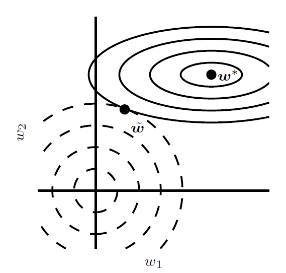
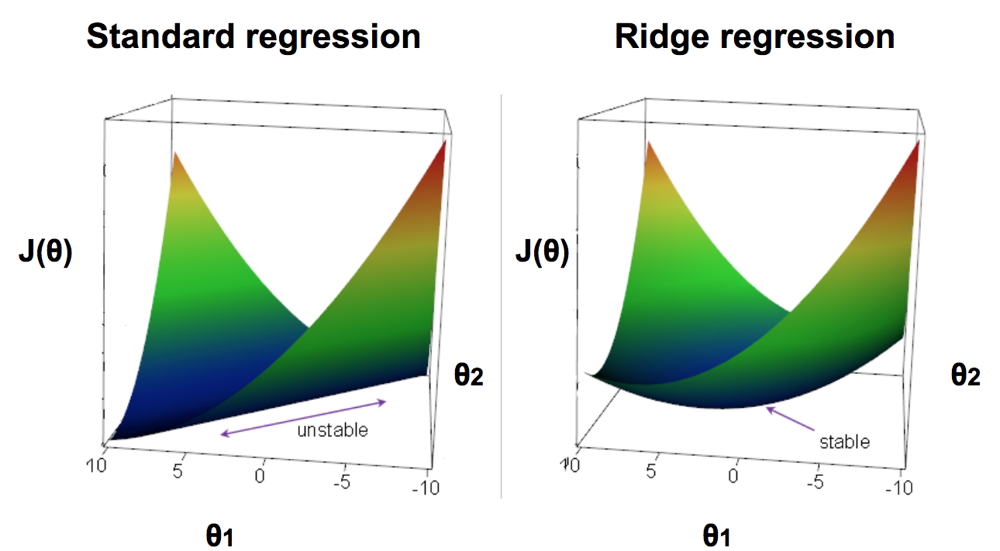

# 怎么理解L2正则



实线椭圆表示没有正则化目标的等值线, 虚线圆圈表示$L^2$正则化项的等值线, 在$\tilde w$ 点, 这两个竞争目标达到平衡。从趋势上来看, $w*$的值在加入正则化之后会趋向于小

为什么趋于0就会对泛化能力有加强?怎么理解?

假设有以下两个样本点:
```
  x1      x2      y
 1.0    -1.0      5
-1.0     1.0      5
```

假设函数为以下形式:
$f(x) = \theta_0 + \theta_1x_1 + \theta_2x_2$

其中一个可行解是:
$\theta = [\theta_0,\theta_1,\theta_2] = [5,1,1]$
但也有其他可行解:
$\theta = [\theta_0,\theta_1,\theta_2] = [5,10000,10000]$

在加入正则项之后, 则更趋向于取前一个解, 即加入正则项后, 问题变成凸问题, 更容易求解, 如下图所示



## 参考

* [neural network - Understanding regularisation and a preference for small weights - Data Science Stack Exchange](https://datascience.stackexchange.com/questions/29682/understanding-regularisation-and-a-preference-for-small-weights)