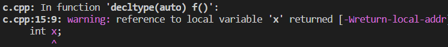
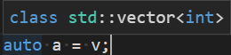
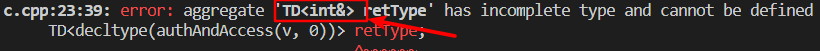

# Effective Modern C++

<<Effective Modern C++: 42招独家技巧助你改善C++11和C++14的高效用法>> 的阅读笔记

## 型别推导

> C++98 仅有一套型别推导规则, 用于函数模板
> C++11对这套规则进行了一些改动
> , 并增加了两套规则, 一套用于 `auto`, 一套用于 `decltype`
> C++14又扩展了能够运用 `auto` 和 `decltype` 的语境

### 模板型别推导理解

函数模板基本形式:

```cpp
template<typename T>
void f(ParamType param);
```

一次调用形式为:

```cpp
f(expr);
```

后续用到的变量定义:

```cpp
int x = 27;
const int cx = x;
const int & rx = x;
const int *px = &x;
const char * const ptr = "Fun with pointers";
const char name[] = "J. P. Briggs"; //name的型别是 cosnt char[13]
const char *ptrToName = name;       //数组退化成指针
```

直觉上, `x` 的型别是 `int`, `T`的型别也推导成 `int`, 这一点并不总是成立的. `T`的型别推导结果, 不仅仅依赖 `expr` 的型别, 还依赖 `ParamType` 的形式

1. 在模板型别 `T` 推导的过程中, 具有引用型别的实参 `expr` 会被当成非引用型别来处理, 即引用性会被忽略.
    ```cpp
    template<typename T>
    void f(T& param);

    f(x);   //T的型别是 int, param的型别是int &
    f(cx);  //T的型别是 const int, param的型别是const int &
    f(rx);  //T的型别是 const int, param的型别是const int &
    ```
    在`f(rx)`中, `rx`的型别是 `const int &`, 而 `T`的型别却是 `const int`, 引用性 `&` 被忽略了.

2. 对万能引用形参进行推导时, 左值实参会进行特殊处理.
    > 左值指的是字面值或者常量值?
    > `ParamType` 是个万能引用, 此类形参的声明方式类似右值引用(即在函数模板中持有型别形参`T`时, 万能引用的声明写别写作`T&&`)

    当遇到万能引用时, 型别推导规则会区分实参是左值还是右值, 而非万能引用时从来不会作这样的区分的

    ```cpp
    template<typename T>
    void f(T&& parm);

    f(x);       // x 是个左值, T的型别是 int&, param的型别是 int&
    f(cx);      //cx 是个左值, T的型别是 const int&, param的型别是 const int&
    f(rx);      //rx 是个左值, T的型别是 const int&, param的型别是 const int&
    f(27);      //27 是个右值, T的型别是 int, param的型别是 int&&
    ```

    当遇到万能引用时

3. 对按值传递的形参进行推导时, 若实参的 `const` 和 `volatile` 性会被忽略.
    ```cpp
    template<typename T>
    void f(T param);

    f(x);   //T 和 param 的型别都是 int
    f(cx);  //T 和 param 的型别还都是 int
    f(rx);  //T 和 parma 的型别仍都是 int
    ```
    `cx` 和 `rx` 都是 `const`, 而 `T` 的型别是 `int`, `const`被忽略了. `volatile` 同理.
    这是合理的, 因为 `param` 是个完全独立于 `cx` 和 `rx` 存在的对象, 是它们的副本, 从而 `rx` 和 `cx` 的不可修改性并不是说明 `param`是否可以修改.

    注: `const` 和 `volatile` 仅会在 **按值** 形参处被忽略.
    ```cpp
    f(ptr);  //T和param的型别是 const char *
    ```
    传递性质为 `const char* const` 的形参 `ptr`, 而 `param` 被推导为 `const char *`, 其自身的常量性会在以复制方式创建新的指针 `param` 的过程中被忽略. 而指针指向的内容的常量性会被保留.

4. 若 `ParamType` 包含实参 `expr` 型别的部分, 那么 `T`的推导结果就不需要包含该部分
    - `param` 具有 `const` 引用型别, 那么 `T` 的型别推导结果就不需要包含 `const`
        ```cpp
        template<typename T>
        void f(const T param);

        f(x);   // T 的型别是 int, param 的型别是 const int
        f(cx);  // T 的型别是 int, param 的型别是 const int
        f(rx);  // T 的型别是 int, param 的型别是 const int
        ```
        `cx` 型别为 `const int`, 而 `T`的型别是 `int`, 其 `const` 出现在 `const T` 这里.
    - `param` 是指针而非引用, 也同理
        ```cpp
        template<typename T>
        void f(T* param);

        f(&x);   // T 的型别是 int, param 的型别是 int *
        f(px);   // T 的型别是 const int, param 的型别是 const int *
        ```
        `px` 型别为 `const int *`, 而 `T`的型别是 `const int`, 其 `*` 出现在 `T*` 这里.

    综合二者:
    ```cpp
    template<typename T>
    void f(const T* param);

    f(&x);   // T 的型别是 int, param 的型别是 const int *
    f(px);   // T 的型别是 int, param 的型别是 const int *
    ```

5. 在模板型别推导过程中, 数组或函数型别的实参会退化成对应的指针.
    ```cpp
    template<typename t>
    void f(T param);

    f(name);    //T和param的型别是 const char *
    ```
    `name` 的型别是 `const char[13]`, `T` 被推导成 `const char *`

    在引用方式传递实参, 则可以保留 `[13]`
    ```cpp
    template<typename param>
    void f(T& param);

    f(name); //T 的型别是 const char[13], param的型别是 const char (&)[13]
    ```

    可以利用声明数组引用这一能力创造出一个模板, 用来推导出数据含有的元素个数:
    ```cpp
    template<typename T, std::size_t N>
    constexpr std::size_t arraySize(T (&)[N]) noexcept {
        return N;
    }
    ```
    > 该函数声明为 `constexpr`, 能够使得其返回值在编译期间就可用.

    函数型别也同样会退化函数指针, 和数组类似.

### auto 型别推导

为auto推导型别, 除了在一个例外情况, 其余和为模板推导型别一模一样

区别: `auto` 会嘉定用大括号括起来的初始化表达式代表一个`std::initializer_list`, 但模板却不会

C++ 11 为了支持统一初始化(uniform initialization), 增加了下面的语法选项:

```cpp
int x3 = {27};
int x4{27};
```

对于此种语法:

```cpp
auto x3 = {27}; //型别是 std::initializer_list<int>
auto x4{27};
```

此处包含两重推导,

1. auto关于`{}`的推导: `std::initializer_list<T>`
2. `std::initializer_list<T>`中`T`的模板型别推导

若`{}`内型别不一致, 即

```cpp
auto x = {1.0,2}
```

则 `T`的推导失败

---

C++14中, 允许使用 `auto` 来说明函数的返回值需要推导, 此时 `auto` 的用法是在使用模板型别推导而非 `auto` 型别推导

### decltype

`decltype`(declared type): 返回给定的名字或表达式的确切型别, 在C++11中主要用于声明返回值依赖于形参型别的 **函数模板**

- 对于型别为`T`的左值**表达式**, 除非该表达式仅有一个名字, `decltype`总是得到型别 `T&`

---
返回值型别尾序语法(trailing return type syntax):

```cpp
template <typename Container, typename Index>
auto authAndAccess(Container& c, Index i) -> decltype(c[i]) {
    // auth...
    return c[i];
}
```

此种方式可以使用函数形参来指定返回值型别(因为`c[i]`要出现在`c`和`i`的后面)

---
在C++14中可以去掉返回值型别尾序语法

```cpp
//这个不是我们想要的
template <typename Container, typename Index>
auto authAndAccess(Container& c, Index i) {
    // auth...
    return c[i];
}
```

这个语法和我们的期望是不同的, 我们期望返回的是和`c[i]`完全相同的型别, 比如`int&`, 原本带有`decltype`尾序语法可以达到目的,
而上述的代码则仅仅按照模板型别推导来推导类型, 此时会忽略类型的引用性, 即返回的不会是 `int`
因而, 就无法有以下赋值用法: `authAndAccess(v, 0) = 1;`

要达到上述目的, C++14的语法应该如下:

```cpp
template <typename Container, typename Index>
decltype(auto) authAndAccess(Container& c, Index i) {
    // auth...
    return c[i];
}
```

使用`decltype(auto)`替换`auto`, `auto`表明需要进行型别推导, `decltype`则表明使用 `decltype` 的推导规则来进行型别推导

---

不过, 形参部分`Container& c`也意味着无法向该函数传递右值容器, 右值是不能保定到左值引用的.

即不支持以下用法:

```cpp
//authAndAccess(vector<int>(), 0); //error
```

因此考虑万能引用`&&`, 同时对万能引用要应用`std::forward`, 因此:

```cpp
template <typename Container, typename Index>
decltype(auto) authAndAccess(Container&& c, Index i) {
    // auth...
    return std::forward<Container>(c)[i];
}
```

---

对于`int x = 0;`, `decltype(x)` 是 `int`, 但对于一个更复杂的表达式`(x)`(该表达式的值是`int`), `decltype( (x) )`的结果是 `int&`

因此, 可能会导致返回一个局部变量的引用的错误:

```cpp
decltype(auto) f() {
    int x;
    return (x);//`decltype( (x) )`的结果是 `int&`, 所以f返回的是 int&
}
```



### 如何查看型别推导的结果?

IDE编辑器: 把鼠标指针悬停到某个程序实体, 如变量、形参、函数等


---

编译器诊断信息:

1. 声明一个类模板, 但不去定义它
    ```cpp
    template<typename T> class TD;
    ```

2. 结合`decltype`试图具现该模板, 然后诱发一个错误消息, 原因是找不到具体模板的定义
    ```cpp
    TD<decltype(authAndAccess(v, 0))> vType;
    ```
    

## auto

使用 `auto` 可以少打一些字, 同时还能阻止那些由于手动执行型别带来的潜在错误和性能问题, 但, 某些 auto 型别推导结果尽管是按部就班地符合标准规定的推导算法, 然而从程序员的视角来看却是错误的, 此时需要正确地引导 auto 得到正确结果

---

优先使用 `auto` 而非显示型别声明

看以下代码:

```cpp
std::unordered_map<std::string, int> m;
for (const std::pair<std::string, int> &p : m) {
    //实际这里不是引用, 还是会每次都复制一份
    //...
}
```

m的一个元素实际上是 `std::pair<const std::string, int>`, 因此, 通过一次复制操作, 把`std::pair<const std::string, int>`(哈希表中的元素)对象转换成`std::pair<const std::string, int>`(p的型别)

但使用`auto`可以轻松化解该问题

```cpp
for (const auto &p : m) {
    //...
}
```

---

当 `auto` 推导的型别不符合要求时, 使用带显式型别的初始化物习惯用法

看以下代码:

```cpp
vector<bool> vb;
auto flag = vb[5];
```

`flag` 的型别是 `std::_Bit_reference` 而不是我们所期望的 `bool`
> 对于其他型别`T`, 比如`int`, `vector` 的 `operator[]` 操作总是返回 `T&`(auto推导出为`T`)
> 而唯独 `bool` 不是, `vector` 对 `bool` 类型作了特化, 采用 `bit` 数组来表示真假, 而不是采用 `bool` 数组

因为对`vector`对`bool`的特化实现, 导致了`auto`并不是我们所期望的`bool`

在 `bool` 这个例子中, 真正的危害是`flag`可能包含一个空悬的指针, 从而导致未定义的行为.

---

## 现代C++

创建对象时注意区分 `()`, `{}`, 有3三种初始化方式:

```cpp
int x(0);
int y = 0;
int z {0};
```

- 可以使用 `{}` 和 `=` 来给非静态成员指定默认初始化值, 但不能用 `()`
- 不可复制对象不能使用 `=` 进行初始化
- `()` 会把 `默认构造函数` 的方式构造对象解析成函数的声明

    ```cpp
    Widget w2();
    ```

    > C++规定任何能够解析为声明的都要解析为声明

- `{}` 适合所有场景, 但会存在 `std::initializer_list` 和 构造函数重载之间决议的问题
    如果采用了 `{}` 的初始化语法, 会优先选择带有 `std::initializer_list`型别形参的重载版本
    除了, 空大括号的情况, **空大括号表示没有实参**, 即空大括号会被即使成执行默认构造而不是一个不含元素的`std::initializer_list`
    若想传入一个空的`std::initializer_list`. 可以把大括号作为构造函数实参

    ```cpp
    Widget w{{}};
    ```

- `{}` 适合用于所有场景, `{}` 禁止内建型别之间进行窄化型别转换

---

优先使用 `nullptr` 而非 `0` 或 `NULL`
