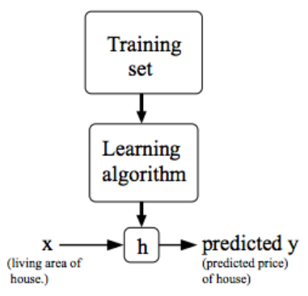
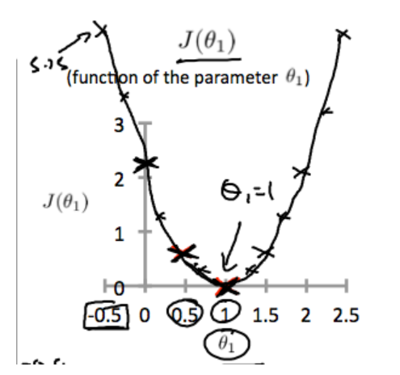
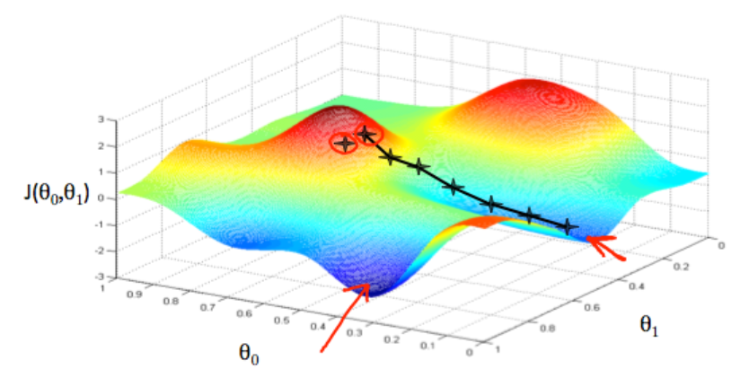
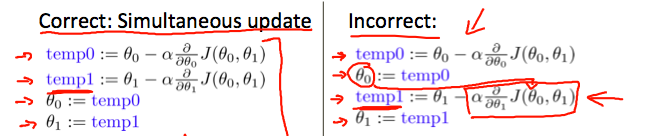
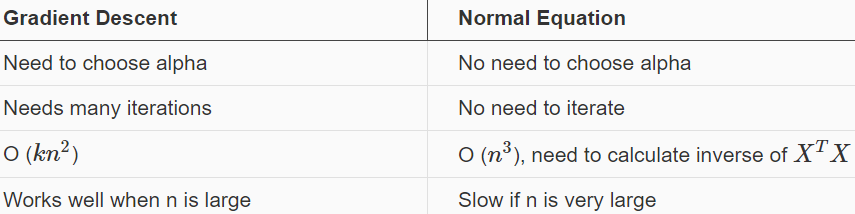
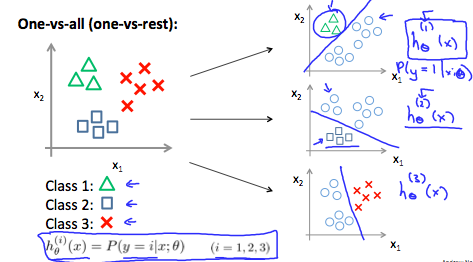
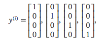

# Machine Learnining ANG

## Model and Cost Function

### Model Repression

$x$经过$h$的映射后得到输出$y$



### Cost Function

为衡量$h(x)$的好坏 , 需要计算$Cost$

比如:Squared error function
$$J(\theta_0, \theta_1) = \dfrac {1}{2m} \displaystyle \sum _{i=1}^m \left ( \hat{y}_{i}- y_{i} \right)^2 = \dfrac {1}{2m} \displaystyle \sum _{i=1}^m \left (h_\theta (x_{i}) - y_{i} \right)^2$$
其中,$\frac{1}{2}$ 是为了在计算微分的时候消除$2$

对于损失函数 ,我们需要找到使得损失最小的$h(x|\theta)$的参数$\theta$


### Parameter Learning - Gradient Descent



随机取一个起点 , 要达到cost function最小的点,就需要往值减小的方向走,而值减小最快的方向 , 就是梯度的负方向

$$\theta_j := \theta_j - \alpha \frac{\partial}{\partial \theta_j} J(\theta_0, \theta_1)$$

需要注意 : 所有的参数需要同时更新,因为梯度在参数更新之后会发生变化



学习率过大的话可能导致波动,而学习率过小则收敛慢


寻找到的解可能是局部最小值而不是最优解,因为梯度为0(极点)的时候,参数不在变化
$$\theta_1:=\theta_1-\alpha * 0$$

### Feature Scaling

对于不同大小范围的特征 , 在相同的学习速率下 , 范围大的特征可能学习得慢

为了加快学习过程 , 有两种可行的办法

1. feature scaling

    使得特征的范围在1以内

2. mean normalization

    使得特征的均值为0

下面这个公式可以达到上面两种目的
$$x_i := \dfrac{x_i - \mu_i}{s_i}$$
其中,$mu_i$是均值 , $s_i$是标准差

### Polynomial Regression

基于$x_1$产生更多的特征,比如平方 , 立方:
$$h_\theta(x) = \theta_0 + \theta_1 x_1 + \theta_2 x_1^2 + \theta_3 x_1^3 =^{def} \theta_0 + \theta_1 x_1 + \theta_2 x_2 + \theta_3 x_3 $$

> 实际上就是 核技巧
> $$x' = \left ( \begin{array}{c}1 \\ x \\x^2 \end{array} \right )$$

### Normal Equation

目标:
$$minimize \quad J(\theta_0, \theta_1)$$

为求解这个问题:
$$\frac{\partial J}{\partial \theta} = 0$$

有解析解:
$$\theta = (X^T X)^{-1}X^T y$$

和梯度下降的对比:



$X^TX$可能是非半正定(非满秩)的,可能原因如下:

1. 数据冗余 , 存在两种特别相近的特征
2. 过多的特征 , 即特征数目大于样本数

## classification

We could approach the classification problem ignoring the fact that **y is discrete-valued**, and use our old linear regression algorithm to try to predict y given x. However, it is easy to construct examples where this method **performs very poorly**.

### Hypothesis Representation

$$\begin{array}{rl}
h_\theta(x) &= g(\theta^Tx)\\
z &= \theta^Tx\\
g(x) &= \frac{1}{1 + e^{-z}}
\end{array}$$

label:$y\in \{0 , 1\}$

$h_\theta(x)$ will give us the probability that our output is 1.

$$\begin{align*}& h_\theta(x) = P(y=1 | x ; \theta) = 1 - P(y=0 | x ; \theta) \newline& P(y = 0 | x;\theta) + P(y = 1 | x ; \theta) = 1\end{align*}$$

### Decision Boundary

$$\begin{align*}& h_\theta(x) \geq 0.5 \rightarrow y = 1 \newline& h_\theta(x) < 0.5 \rightarrow y = 0 \newline\end{align*}$$
即
$$\begin{align*}& \theta^T x \geq 0 \Rightarrow y = 1 \newline& \theta^T x < 0 \Rightarrow y = 0 \newline\end{align*}$$

### Cost Function for Logistic regression

$$\begin{align*}& J(\theta) = \dfrac{1}{m} \sum_{i=1}^m \mathrm{Cost}(h_\theta(x^{(i)}),y^{(i)}) \newline & \mathrm{Cost}(h_\theta(x),y) = -\log(h_\theta(x)) \; & \text{if y = 1} \newline & \mathrm{Cost}(h_\theta(x),y) = -\log(1-h_\theta(x)) \; & \text{if y = 0}\end{align*}$$

$$J(\theta) = - \frac{1}{m} \displaystyle \sum_{i=1}^m [y^{(i)}\log (h_\theta (x^{(i)})) + (1 - y^{(i)})\log (1 - h_\theta(x^{(i)}))]$$

矩阵形式:
$$\begin{align*} & h = g(X\theta)\newline & J(\theta) = \frac{1}{m} \cdot \left(-y^{T}\log(h)-(1-y)^{T}\log(1-h)\right) \end{align*}$$

梯度下降:
$$\begin{align*}& Repeat \; \lbrace \newline & \; \theta_j := \theta_j - \alpha \dfrac{\partial}{\partial \theta_j}J(\theta) \newline & \rbrace\end{align*}$$

$$\begin{align*} & Repeat \; \lbrace \newline & \; \theta_j := \theta_j - \frac{\alpha}{m} \sum_{i=1}^m (h_\theta(x^{(i)}) - y^{(i)}) x_j^{(i)} \newline & \rbrace \end{align*}$$

$$\theta := \theta - \frac{\alpha}{m} X^{T} (g(X \theta ) - \vec{y})$$

### Multiclass Classification

#### One-vs-all

$$\begin{align*}& y \in \lbrace0, 1 ... n\rbrace \newline& h_\theta^{(0)}(x) = P(y = 0 | x ; \theta) \newline& h_\theta^{(1)}(x) = P(y = 1 | x ; \theta) \newline& \cdots \newline& h_\theta^{(n)}(x) = P(y = n | x ; \theta) \newline& \mathrm{prediction} = \max_i( h_\theta ^{(i)}(x) )\newline\end{align*}$$



Train a logistic regression classifier $h_\theta(x)$ for each class to predict the probability that  $y = i$ .

To make a prediction on a new $x$, pick the class that maximizes $h_\theta(x)$

### Underfitting and Overfitting

Underfitting, or high bias:It is usually caused by a function that is too simple or uses too few features

overfitting, or high variance:It is usually caused by a complicated function that creates a lot of unnecessary curves and angles unrelated to the data.

There are two main options to address the issue of overfitting:

1. Reduce the number of features:
    * Manually select which features to keep.
    * Use a model selection algorithm (studied later in the course).
2. Regularization
    * Keep all the features, but reduce the magnitude of parameters $\theta_j$.
    * Regularization works well when we have a lot of slightly useful features.

#### Regularization

##### Regularized Linear Regression

$$min_\theta\ \dfrac{1}{2m}\  \sum_{i=1}^m (h_\theta(x^{(i)}) - y^{(i)})^2 + \lambda\ \sum_{j=1}^n \theta_j^2$$

We will modify our gradient descent function to separate out θ0 from the rest of the parameters because **we do not want to penalize $\theta_0$.**

$$\begin{align*} & \text{Repeat}\ \lbrace \newline & \ \ \ \ \theta_0 := \theta_0 - \alpha\ \frac{1}{m}\ \sum_{i=1}^m (h_\theta(x^{(i)}) - y^{(i)})x_0^{(i)} \newline & \ \ \ \ \theta_j := \theta_j - \alpha\ \left[ \left( \frac{1}{m}\ \sum_{i=1}^m (h_\theta(x^{(i)}) - y^{(i)})x_j^{(i)} \right) + \frac{\lambda}{m}\theta_j \right] &\ \ \ \ \ \ \ \ \ \ j \in \lbrace 1,2...n\rbrace\newline & \rbrace \end{align*}$$

$$\theta_j := \theta_j(1 - \alpha\frac{\lambda}{m}) - \alpha\frac{1}{m}\sum_{i=1}^m(h_\theta(x^{(i)}) - y^{(i)})x_j^{(i)}$$

Normal Equation:
$$\begin{align*}& \theta = \left( X^TX + \lambda \cdot L \right)^{-1} X^Ty \newline& \text{where}\ \ L = \begin{bmatrix} 0 & & & & \newline & 1 & & & \newline & & 1 & & \newline & & & \ddots & \newline & & & & 1 \newline\end{bmatrix}\end{align*}$$

L is a matrix with **0 at the top** left and 1's down the diagonal, with 0's everywhere else.

##### Regularized Logistic Regression

$$J(\theta) = - \frac{1}{m} \sum_{i=1}^m \large[ y^{(i)}\ \log (h_\theta (x^{(i)})) + (1 - y^{(i)})\ \log (1 - h_\theta(x^{(i)}))\large] + \frac{\lambda}{2m}\sum_{j=1}^n \theta_j^2$$

The second sum $\sum_{j=1}^n \theta_j^2$ means to explicitly **exclude the bias term $\theta_0$**.

## Neural Networks

输入样本(input feature):$x_1 , x_2 , \cdots , x_n$ , n 个神经元

还有一个 **bias unit** , $x_0 \equiv 1$
故总共 n+1个神经元

$$\begin{align*} a_1^{(2)} = g(\Theta_{10}^{(1)}x_0 + \Theta_{11}^{(1)}x_1 + \Theta_{12}^{(1)}x_2 + \Theta_{13}^{(1)}x_3) \newline a_2^{(2)} = g(\Theta_{20}^{(1)}x_0 + \Theta_{21}^{(1)}x_1 + \Theta_{22}^{(1)}x_2 + \Theta_{23}^{(1)}x_3) \newline a_3^{(2)} = g(\Theta_{30}^{(1)}x_0 + \Theta_{31}^{(1)}x_1 + \Theta_{32}^{(1)}x_2 + \Theta_{33}^{(1)}x_3) \newline h_\Theta(x) = a_1^{(3)} = g(\Theta_{10}^{(2)}a_0^{(2)} + \Theta_{11}^{(2)}a_1^{(2)} + \Theta_{12}^{(2)}a_2^{(2)} + \Theta_{13}^{(2)}a_3^{(2)}) \newline \end{align*}$$

### Multiclass Classification in NN

We can define our set of resulting classes as y:


Each y(i) represents a different image corresponding to either a car, pedestrian, truck, or motorcycle. 

### Cost Function

$$\begin{gather*} J(\Theta) = - \frac{1}{m} \sum_{i=1}^m \sum_{k=1}^K \left[y^{(i)}_k \log ((h_\Theta (x^{(i)}))_k) + (1 - y^{(i)}_k)\log (1 - (h_\Theta(x^{(i)}))_k)\right] + \frac{\lambda}{2m}\sum_{l=1}^{L-1} \sum_{i=1}^{s_l} \sum_{j=1}^{s_{l+1}} ( \Theta_{j,i}^{(l)})^2\end{gather*}$$

* $L$ = total number of layers in the network
* $s_l$ = number of units (not counting bias unit) in layer $l$
* $K$ = number of output units/classes

gradient:
...

### Gradient checking

$$\dfrac{\partial}{\partial\Theta}J(\Theta) \approx \dfrac{J(\Theta + \epsilon) - J(\Theta - \epsilon)}{2\epsilon}$$

With multiple theta matrices, we can approximate the derivative with respect to Θj as follows:

$$\dfrac{\partial}{\partial\Theta_j}J(\Theta) \approx \dfrac{J(\Theta_1, \dots, \Theta_j + \epsilon, \dots, \Theta_n) - J(\Theta_1, \dots, \Theta_j - \epsilon, \dots, \Theta_n)}{2\epsilon}$$

```matlab
epsilon = 1e-4;
for i = 1:n,
  thetaPlus = theta;
  thetaPlus(i) += epsilon;
  thetaMinus = theta;
  thetaMinus(i) -= epsilon;
  gradApprox(i) = (J(thetaPlus) - J(thetaMinus))/(2*epsilon)
end;
```

### Random Initialization

 initialize each $\Theta^{(l)}_{ij}$ to a random value between$[-\epsilon,\epsilon]$

```matlab
If the dimensions of Theta1 is 10x11, Theta2 is 10x11 and Theta3 is 1x11.

Theta1 = rand(10,11) * (2 * INIT_EPSILON) - INIT_EPSILON;
Theta2 = rand(10,11) * (2 * INIT_EPSILON) - INIT_EPSILON;
Theta3 = rand(1,11) * (2 * INIT_EPSILON) - INIT_EPSILON;
```

> Ex4.: One effective strategy for choosing $\epsilon_{init}$ is to base it on the number of units in the network. A  good choice of $\epsilon_{init}$ is  $\epsilon_{init} = \frac{\sqrt 6}{\sqrt{L_{in} + L_{out}}}$ , where $L_{in} = s_l$ and $L_{out} = s_{l + 1}$ are the number of units in the layers adjacent to $\Theta^{l}$.

## Advice for Applying Machine Learning

### Evaluate a Learning Algorithm

Training set + Cross Validation set + Test set

* Evaluation : Test Set
* Model Selection : Cross Validation

### Bias and Variance

* Regularization
* Learning Curve

#### Learning Curve

* Experiencing high bias:

    * Low training set size: causes $J_{train}(\Theta)$ to be low and $J_{CV}(\Theta)$ to be high.
    * Large training set size: causes both $J_{train}(\Theta)$ and $J_{CV}(\Theta)$ to be high with $J_{train}(\Theta)$≈$J_{CV}(\Theta)$.

    If a learning algorithm is suffering from high bias, getting more training data will not (by itself) help much.

* Experiencing high variance:

    * Low training set size: $J_{train}(\Theta)$ will be low and $J_{CV}(\Theta)$will be high.
    * Large training set size: $J_{train}(\Theta)$ increases with training set size and $J_{CV}(\Theta)$continues to decrease without leveling off. Also, $J_{train}(\Theta)$ < $J_{CV}(\Theta)$but the difference between them remains significant.

    If a learning algorithm is suffering from high variance, getting more training data is likely to help.

### Revisited

Our decision process can be broken down as follows:

* Getting more training examples: Fixes high variance
* Trying smaller sets of features: Fixes high variance
* Adding features: Fixes high bias
* Adding polynomial features: Fixes high bias
* Decreasing λ: Fixes high bias
* Increasing λ: Fixes high variance.