# 数据挖掘

## 数据预处理

### 为什么需要进行预处理?

1. 不完整:收集数据时,不同阶段不同考虑, 人/设备/软件等问题
2. 含噪声:包含错误或孤立点,来源于收集阶段和数据传输阶段
3. 不一致:在名称或代码之间存在差异,来源于不同的数据源 , 功能依赖冲突

> 噪声：错误的数据 
> 孤立点：偏离正常数据，但真实发生

### 数据与处理的主要任务

1. 数据清洗 data cleaning

    填充遗失的数据, 平滑噪声数据, 辨识或删除孤立点 , 解决不一致性问题
2. 数据集成 data integration

    多个数据库, 数据立方或文件进行继承

3. 数据变换 data transformation

    规范化与聚集

4. 数据约简 data reduction

    得到数据集的压缩表示 ,它小得多,但能够产生相同的(或几乎相同的)分析结果

5. 数据离散化 data discretization

    特别对数字值而言非常重要

### 数据清洗

主要任务:

1. 填充遗失数据
2. 辨识孤立点、平滑噪声数据
3. 修正不一致性数据
4. 解决数据集成造成的数据冗余问题

#### 遗失数据

1. 忽略元组:除非有多个属性缺少之,否则该方法不是很有效
2. 人工填充:费事费力
3. 自动填充
    1. 使用全局常量填充,比如"unkonwn" , 但可能会被误认为是一个新的,有意义的类
    2. 该属性的平均值
    3. 使用于给定元素同一类的所有样本该属性的平均值
    4. 使用可能的值:基于推导的方法,比如beyesian公式或决策树

#### 噪声数据

噪声:是一个策略变量中的随机误差或偏差

1. 分箱方法
    1. 先对数据进行排序,然后把他们划分到箱
    2. 通过箱平均值,箱中值等进行平滑

    该方法对神经网络等不适用

    * 等宽划分(距离)

        根据属性值范围划分成N等宽的区间

        很直接,但孤立点将会对此方法有很大的影响

    * 等深划分(频率)

        划分成N个区间,每个区间含有大约相等的样本数

        具有较好的扩展性

2. 聚类

    探测并去除孤立点

3. 计算机和人工检查结合
4. 回归分析

    让数据拟合一个函数来平滑数据

#### 数据集成

数据集成:将多个数据源中的数据结合起来存放在一个一致的数据存储中(如数据仓库)

可能的需要解决问题:

1. 不同数据源可能具有不同的值
2. 不同的表示方式,不同的刻度
3. 数据冗余问题:可以通过相关性分析检测出来

#### 数据变换

1. 平滑 smoothing

    去除噪声数据

2. 聚集 aggregation

    汇总 , 数据立方构造

3. 概化 generalization

    沿概念层次上升

4. 规范化 normalization

    刻度变换

##### 规范化

1. 最大-最小规范化

    $$v' = \frac{v - min}{max_A - min_A}(max_{new} - min_{new}) + min_{new}$$

    移项之后更好理解:

    $$\frac{v' -  min_{new}}{max_{new} - min_{new}} = \frac{v - min}{max_A - min_A}$$

2. z-score 规范化

    $$v' = \frac{v - mean}{stand}$$

    规范化之后 , $v'$满足均值为$0$ , 方差为$1$

3. 小数定标规范化

    $$v' = \frac{v}{10^j}$$

    其中,$j$是使得$max(|v|) < 1$的最下整数

    规范化之后的结果是所有的值都小于1

#### 数据约简

数据约简：两个方向

1. 降维：减少特征

    1. 决策树归纳

        若只需要其中一些属性即可划分数据, 那么只需要保存这些关键属性即可 ,其他属性可约简掉

2. 采样：减少样本数
3. 数值规约：对样本重新编码，值记录模型与统计信息而无需记录原始数据
    1. 参数化方法：比如只记录解析式的参数而不记录所有样本点

        线性回归 , 对数线性模型

    2. 非参数化方法：对于每个区间，只记录平均值与样本数

        直方图 , 聚类 , 采样

降维对时间复杂度减少的幅度不大于减少样本数

#### 离散化

属性的三种类型:

1. 离散
    1. 标称性 : 取自无序集合的值
    2. 有序的 : 取自有序集合的值
2. 连续

离散化:

* 把连续型属性的取值范围划分区间
* 通过离散化减小数据集大小

离散化方法:

1. 分箱
2. 直方图分析
3. 聚类分析
4. 基于熵的离散化(决策树,将样本划分成两个部分,选择信息增益最大的作为划分边界)

## 数据仓库

什么是数据仓库?(必考定义))

数据仓库是面向主题的,集成的,时变的,非易失的数据集合,它用来支持管理部分的决策过程 - W.H.Inmon

1. 联机事务处理 OLTP on-line transaction processing

    日常操作

2. 联机分析处理 OLAP on-line analytical processing

    决策支持

### 建模数据仓库

1. 星型模式

    一个事实与多个直连维表

    

2. 雪花模型

    在星型模式的基础上,维表也存在层次

    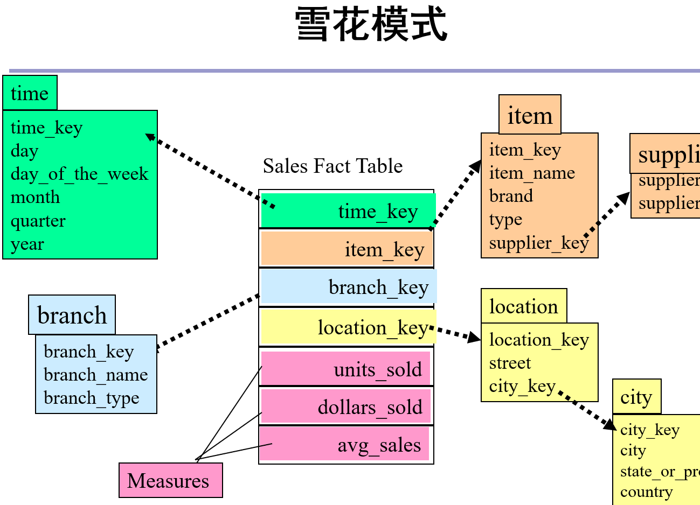

3. 事实星座

    多个事实表分享共同的维表

    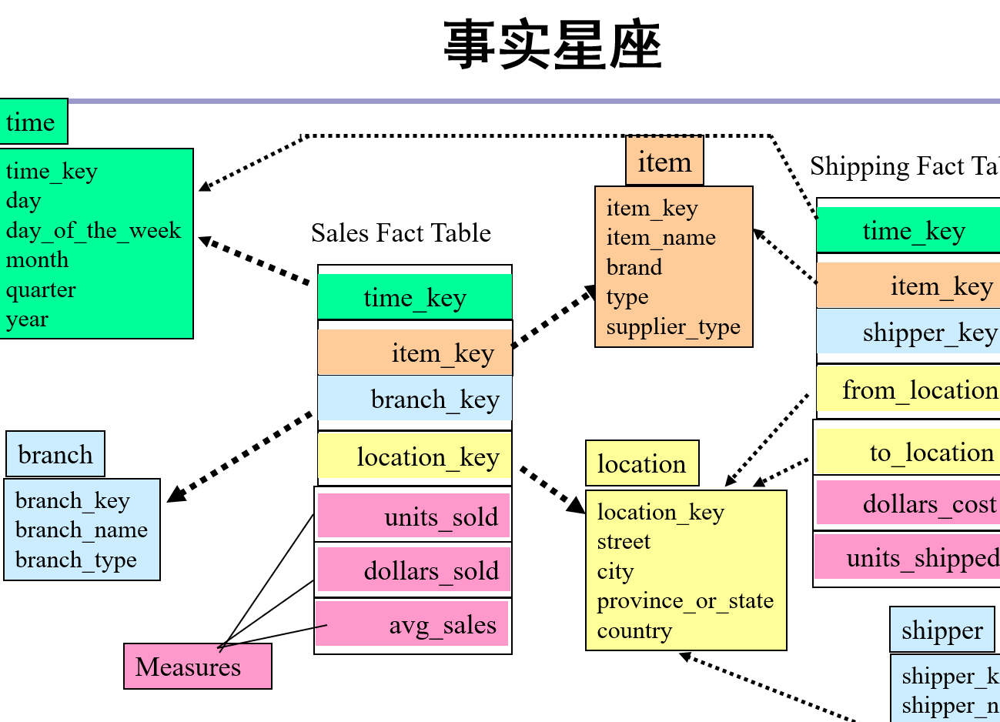

数据仓库一般采用前两种模式(树状,简单 , 而事实星座较为复杂)

### 度量的分类

1. 分布式的 distributive

    一个聚集函数能以分布式进行,称它是分布式的

    比如,min,max,sum,count

2. 代数的 algebraic

    它能由M个参数的代数函数计算 , M是有界的

    如,avg

3. 整体的 holistic

    median(中位数) , mode(众数)

对于代数的和整体的度量,无法采用分布式计算,因此对于常用的部分最好预先计算出来保存

### 数据立方体

数据立方体:在原始数据的基础上, 预先计算更少维度下的综合数据, 以空间换时间

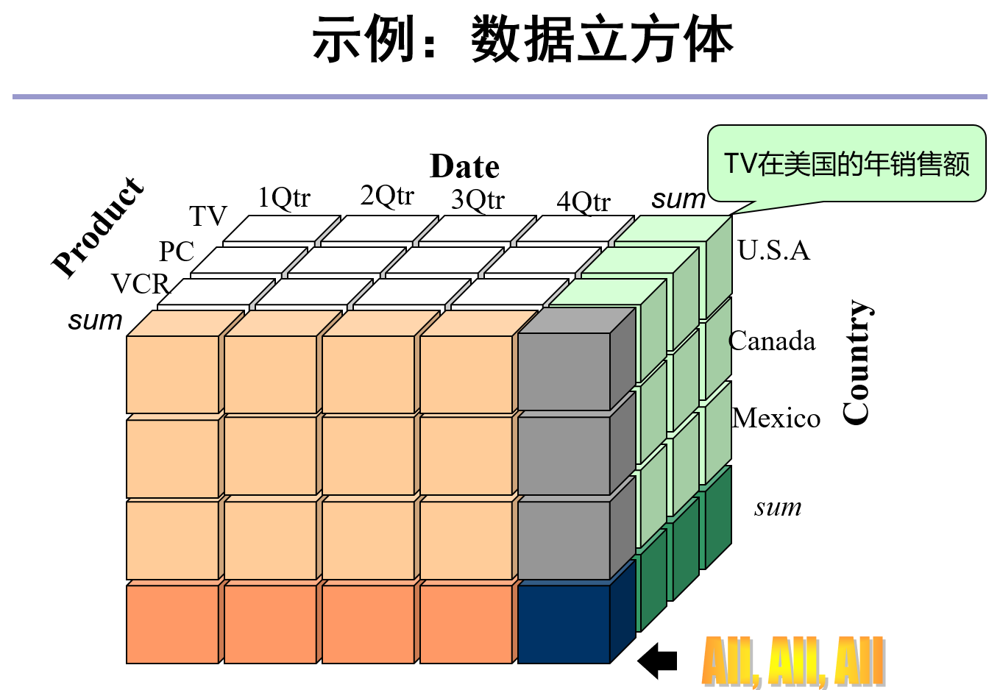
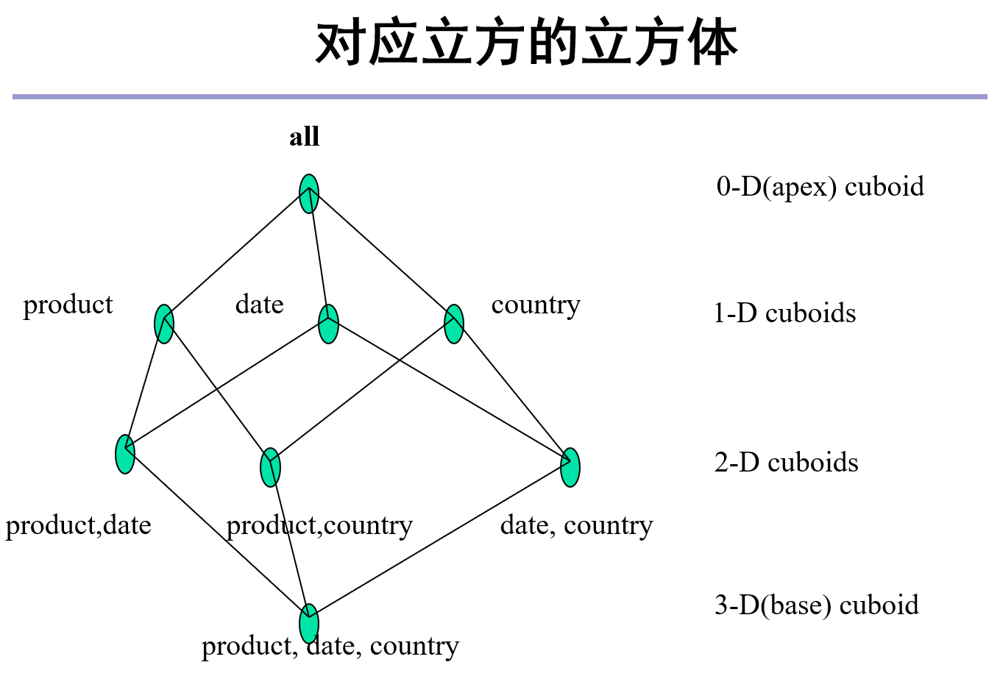

1. 3D 数据立方的白色部分 表示原始数据
2. 2D 数据立方的平面部分
3. 1D 数据立方的灰色竖条
4. 0D 数据立方的最深色部分 表示所有数据的总和

### OLAP的操作

1. 上卷 Roll up(drill up)

    通过一个维度的概念分层向上攀升或通过维度归约,在数据立方体上进行聚集

2. 下钻 drill down

    上卷的你操作

3. 切片 Slice 和 切块 dice

    投影与选择

4. 转轴 pivot (rotate)

    是一种目视操作,它转动数据的视角,提供数据的替代表示

### 3个数据仓库模型

1. 企业仓库
2. 数据集市
3. 虚拟仓库

## 关联规则挖掘

### 若干概念

* 关联规则: **频繁模式** Frequent pattern, 在数据库中频繁出现的模式(项集、序列)

    规则形式: $x_1 \land x_2 \land \cdots \land x_n \to y_1 \land y_2 \land \cdots \land y_m$
    读作:如果$x_1 \land x_2 \land \cdots \land x_n$,那么$y_1 \land y_2 \land \cdots \land y_m$

* k-项集:含有k个元素的集合 $X = \{x_1 , x_2 , \cdots , x_k\}$

* 对于规则$X\to Y$,
    * 支持度:$support = P(X \cup Y) = \frac{\text{项集}\{X\cup Y\}\text{的支持度计数}}{\text{事务表中总事务计数}} = \frac{\text{事务表中包含项集}\{X\cup Y\}\text{的事务数}}{\text{事务表中总事务计数}}$
    * 置信度:$confidence = P(Y|X) = \frac{\text{事务表中包含项集}\{X\cup Y\}\text{的事务数}}{\text{事务表中包含项集}\{X\}\text{的事务数}}$
    *   1. 支持度和置信度只有两者都高才有意义
        2. 以投票为例,只有10%的人参与投票, 即使获得全票也无意义
            即支持度低而置信度高
        3. $support \leq confidence$
    * 最小支持度/置信度: 由用户提供的筛选条件

* 支持度频率(支持度计数):模式或项集在DB中出现的频率

* 频繁模式/项集:支持度$\geq$支持度的模式/项集

* 关联规则挖掘的任务: 找出所有满足最小支持度和最小置信度的规则

* 单维布尔规则: if A(x) then A(y)， 涉及到一个谓词， 因此称为单维关联规则， 以 购买 为例， 是涉及买 或者 不买， 因此也称为 布尔关联规则

* 多维关联规则， 有两个以上谓词

* 量化关联： 量化的量与属性之间的关联

### Apriori 算法

**穷举法**

设事物表中有n见不同的商品 $\{x_2. x_2, \cdots, x_n\}$， 可以通过穷举的方法来美剧所有的关联规则， 从2-项集到n-项集，
以2-项集为例子：检查是否存在关联规则$x_i\to x_j$

对于n个元素的集合， 有$2^n$个子集， 而对于我们这个问题， 有$2^n - n - 1$个子集（减去1-项集， 空集）

集合的数目是指数级的，因此穷举法不可取

**Apriori**：一个候选集产生和测试算法

定理： 一个频繁集的任意子集也必须是频繁集

**Apriori裁剪原理**： 对于任意项集， 如果它不是频繁集， 则它的任何超级步用于产生/测试。（若一个集合不是频繁集， 其超级也不是频繁集）

算法过程：

1. 输入： 数据库D的最小支持度
2. D中所有的频繁项集
3. $L_{k -  1}$表示一个k-1项频繁集
4. 从$L_{k -  1}$中利用 **连接操作** 产生候选集 $C_k$
5. 对于$C_k$中每个元素$c$, 扫描数据库检查c是否是k-频繁项集
6. 是则把$C_k$加入到$L_k$
7. k = k+1, 若$L_{k - 1}$不是空， 则继续步骤4
8. 是关于串改用 $L_k$

连接操作： 两个有序k项集， 只有最后一项元素不同时， 则可以连接产生k+1项集， 比如 {A,C,D} 和 {A,C,E}， 连接产生 {A,C,D,E}

算法例子：最小支持度为50%

* C：统计每个1-项集的频率
* L：移除
1. C1：统计1-项集的频率
2. L1: D的支持度为$\frac{1}{4} < 50\%$
    理解： 对于规则$X\to Y$，$X\cup Y$就是表中的一个条目， 即最终的规则在这个项集内产生
3. C2: 连接操作， 1-项集各不相同， 因此两两连接产生{A,B},{A,C},...
4. C2：统计2-项集的频率
5. L2：{A,B},{A,E}的支持度小于50% (频率至少为2， 因为数据库总条目数为4， 4 * 50% 就是2)
6. C3：连接操作， 只有{B,C}和{B,E}可以连接
7. 算法结束， 最终规则必定从 {B,C,E}中产生

**如何从频繁集中产生关联规则？**
* 是否满足支持度？ 频繁集一定满足（定义）
* 是否满足置信度？
    （穷举法）对于频繁集的每个非空子集， 计算置信度

存在的问题：
1. 多次扫描数据库
2. 产生大量的候选集合

**算法改进**
循环终止条件改进: 满足$size(L_k) \leq k$即可结束算法
因为，若存在$L_{k + 1}$, 则其子集必定存在于$L_k$中，而这样的子集有k+1个， 因此, $L_k$至少有k+1个元素， 即$size(L_k) \geq k + 1$

**算法复杂性**指数复杂度， 对于n的频繁集， 其子集必然已被枚举出来， 因此至少指数级，n一般很小， 另外n也与最小支持度有关

**规则的另一个评价指标：**

$corr(A,B) = \frac{P(A\cup B)}{P(A)P(B)}$
* $> 1$， A与B正相关
* $= 1$， A与独立
* $< 1$， A与B负相关,可能存在的现象：应用规则之后， 效果反而不好了

### 基于频繁模式树的算法

Apriori算法存在的问题：会多次扫描， 并产生大量的候选集合

基于频繁模式树的算法改进：

1. 每一项按频率排序,删除部分非频繁模式
2. 构建频繁模式树
    1. 每一项表示树的一个路径（类似字典树）， 由此构建树
    2. 一个节点表示一个项集的一个元素， 对于相同的节点， 使用有向边连接（构建成链表便于访问）
3. 从频繁模式树种挖掘出频繁模式（见例子）
    1. 链表经过的节点所在路径上的点（例子中红色标注）， 每条路径上的点的任意组合， 取组成元素的频率的最小值为组成的频率
    2. 多条路径的相同的模式频率相加， 求得该模式的总频率
    3. 若总频率满足最小支持度，则是该模式是频繁模式

例子：
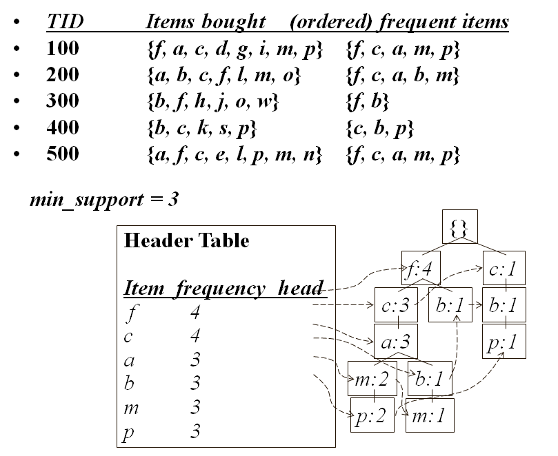
* min_support = 3， 因此，需要删除次数少于3的元素
    TID=100为例子， {d,g,i}在所有条目中统计少于3， 一定是非频繁模式，因此删除
* 除去有向边， 剩下的就是频繁集的结构
* Table 就是各个节点，有向边连接成的链表

包含p的频繁模式：
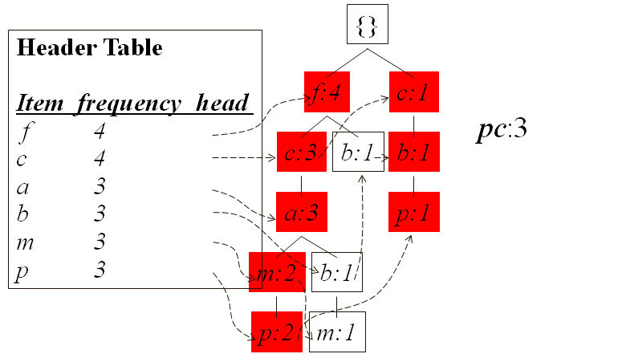
* p经过两条路径
    * 对于左边的路径{f,c,a,m,m}的任意组合都是待选的模式， 比如 {pc}，{pa}等， 对应的频率都是2（p出现了两次）
    * 两条路径统计， 只有{pc}的频率大于等于3， 因此{pc}是频繁集

包含m的频繁模式：
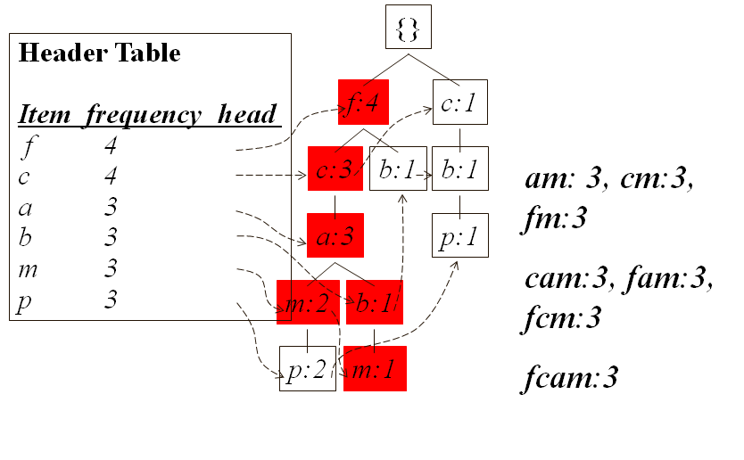
* 第一条路径m下边的p不再管， 这也是为什么从低频率的p开始产生频繁模式
* 包含m的频繁模式最终为{fcam}

包含b的频繁模式：
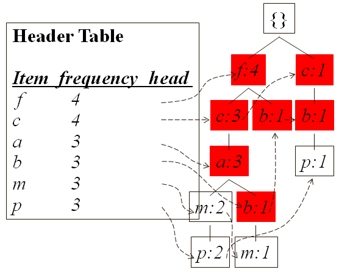
* 包含b的频繁模式为空

包含a的频繁模式：
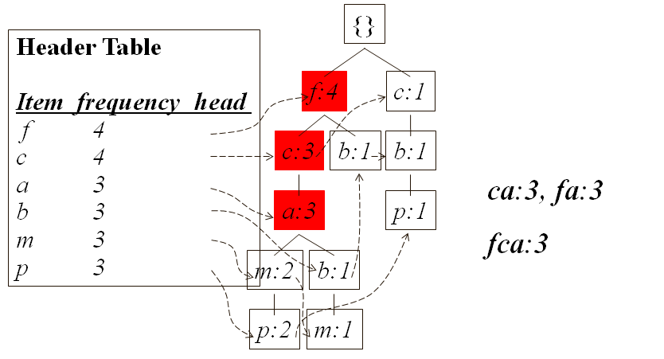

包含c的频繁模式：
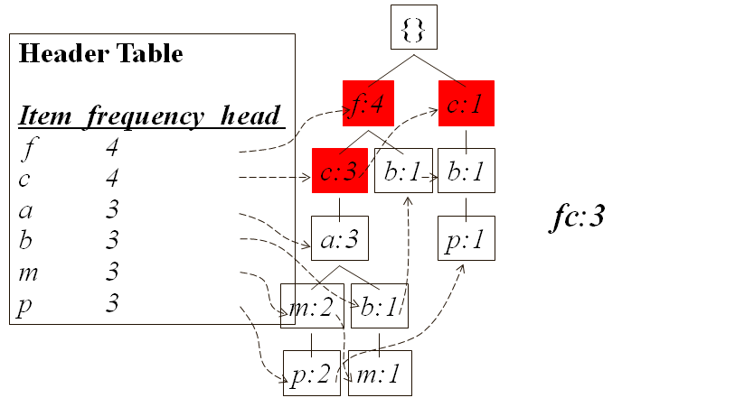

小结：
1. 通过树的结构来来表示整个数据库的条目，以减少空间消耗， 节点上的值，表示路径上的节点所代表的集合（前缀）的频率
2. 在频繁集的产生部分， 还是通过穷举的方法， 依旧是指数级

### 多维关联规则

基本思路： 与单维布尔关联规则挖掘类似

* 数据预处理： 如对数值数据离散化等
* 构建谓词数据集
* 利用 Apriori 算法挖掘频繁模式
* 得到多维关联规则

例子：

* 数据
    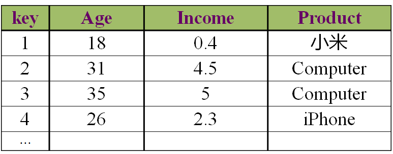
* 离散化
    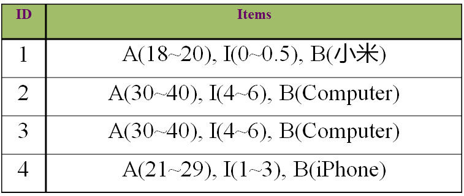
* 挖掘频繁谓词模式
    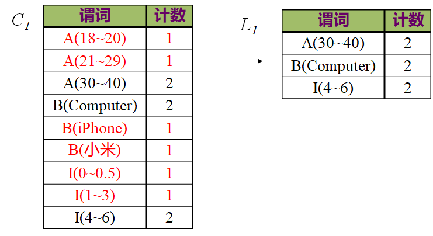
    
    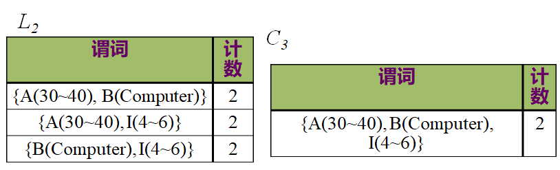
    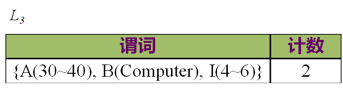

### 其他

科学研究的第四范式：2007年，已故的图灵奖得主吉姆·格雷（Jim Gray）在他最后一次演讲中描绘了数据密集型科研“第四范式”的愿景。将大数据科研从第三范式（计算机模拟）中分离出来单独作为一种科研范式，是因为其研究方式不同于基于数学模型的传统研究方式。

## 分类算法

有监督学习(supervised learning)包括：
* 分类 classification
* 回归 regression

机器学习的定义：
Mitchell 1997：对于某类任务T和性能度量P， 一个计算机程序被认为可以从经验E中学习是指， 通过经验E改进后， 它才任务T上有性能度量P衡量的性能有所提升。

什么是分类？
找到一个函数$h(x)$, 使得对于$\forall x \in X, Pr(x)|_{f(x)\neq h(x)}$尽可能小。

分类:一个2步的过程,
1. 模型构造和评价
    * 模型构造: 对已经分类的数据集进行描述, 分类模型可以表示为分类规则、决策树或深度神经网络等
    * 模型评价: 对构造出的分类模型进行评价(准确度)
2. 模型使用
    如果精度可以接受, 可以用该模型对未知类型的对象分类

**分类误差**:
* 训练误差: 分类器在训练集上的误差
* 泛化误差: 分类器在未见样本(不可在训练集中的样本)上的误差
* 训练误差即使达到100%也是无意义的, 它并不能体现模型的泛化能力。

### 过拟合与欠拟合

**符号:**
* $f(x)$ 目标函数
* $y = f(x) + \epsilon = f(x) + N(0, \sigma^2)$ 观测值
* p(x) 学习大的模型或估计器(estimator)
* $E[\cdot]$ 期望
* $Variance = E[(p(x) - E[p(x)])^2]$ 方差
    同一个算法， 在不同训练样本下得到的不同的模型的方差
* $Bias = E[p(x)] - f(x)$ 偏差
    同一个模型， 样本与样本观测值之间的偏差

一条未见样本的泛化误差：
$
\begin{array}{cl}
E[(p(x^*) - y^*)^2] &= E[ ( p(x^*) - E[ p(x^*) ] )^2 ]  \\
& \quad + ( E[p(x^*)] - f(x^*) )^2 + E[ ( y^* - f(x^*) )^2 ]
\end{array}
$
上式第一项为模型的方差， 第二项为模型的偏差的平方， 第三项为固有观察噪音的方差

对所有未见数据的期望泛化误差：
$E[ ( E[p(x^*)] - y^* )^2 ] = \frac{1}{n} \sum_{i = 1}^n ( E[p(x_i^2)] - y^*_i )^2$

* 过拟合(overfitting):模型的高方差与低偏差
    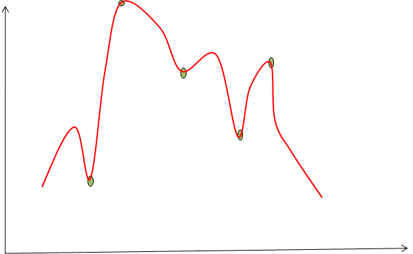
    > 捡了芝麻丢了西瓜

* 欠拟合(underfitting):模型的低方差与高偏差
    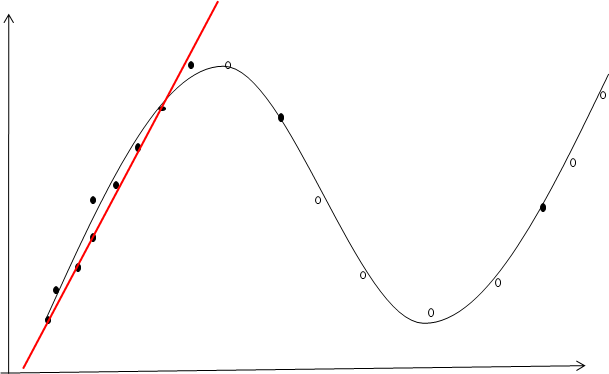
    > 管中窥豹 盲人摸象
    > 最小二乘法可以达到低方差的目的
    > 欠拟合, 往往假设过于简单

因此, 要在模型的方差与偏差之间取得平衡

### 模型评估

数据划分: 训练集(trainning data)、验证集(validation data)、测试集(test data)

验证集用于确定超参数

超参数: 不是算法需要学习的, 而是事先指定的参数, 比如神经网络的层数, 每层网络的神经元数目

* 划分法: 训练集与测试集
    * 把样本划分成2个独立的数据集合, 如 训练集(2/3) , 测试集(1/3)
    * 适合大规模的数据样本

* 交叉验证 cross-validation
    * 把数据集合划分成k个子样本
    * 使用k-1个子样本作为训练集, 另一个作为测试样本--k-折交叉验证
    * 得到k个模型, 准确率取k次平均
    * 适用于中等规模的数据

* 留一测试 leave one out
    * k = n 下的交叉验证
    * 适合小规模数据
    > 小规模不能以样本数目的多少来衡量, 而是应以样本空间来衡量
    > 比如, 10个属性, 每个属性2个值, 那么总共有$2^10 = 1024$种样本
    > 若给1000个不同的样本, $\frac{1000}{1024} \approx 1$, 此时可称为"大规模"

* 自助法 boostrapping
    * 采用有放回采样从样本$D$中($|D| = m$)采m个样本, 记为$D'$。样本在m此采样中时钟未被采到的概率:
    $$\lim_{m\to \infty}(1 - \frac{1}{m})^m = \frac{1}{e} \approx 0.368$$
    * 即初始样本$D$中， 有36.8%的样本未出现在D'。 于是我们可以用$D'$用作训练集， $D$\$D'$ 用作测试集。
    * 因此， 我们仍有m个训练样本， 且有约 1/3 的未出现在训练集中的测试样本

### 模型、学习与推导

模型 model: 用一个模型(如概率分布的公式), 将数据$x$与类状态$w$联系起来,该模型含有参数集合$\theta$

学习 learning: 利用训练集合{$x_i,w_i$},学习上述模型的参数集合$\theta$

推导 inference: 给定新数据x， 确定其类状态的后验概率$Pr(w|x,\theta)$

#### 区分模型

**区分模型$Pr(w|x)$**： 针对$w$(类别，标签)， 选择一个合适的概率分布$Pr(w)$。 其中该分布的参数是关于$x$的函数。

比如， 若类状态$w$是连续的， 则我们可以假设$Pr(w)$是一个高斯分布， 其中均值是一个关于$x$的函数。

其中$Pr(w|x,\theta)$称为后验分布 the posterior distribution

高斯分布：
$$Pr(w) = \frac{1}{\sqrt {2 \pi \sigma^2}} e^{- \frac{(w-\mu)^2}{2\sigma^2}}$$

然后利用训练数据{$x_i,w_i$},利用最大似然法 the maximum likelihood，ML 最大后验概率法 maximum a posterior， MAP， 或贝叶斯方法来学习参数集合$\theta$

推导： 给定新数据$x$， 直接确定其类状态的后验概率$Pr(w|x,\theta)$

#### 生成模型

**生成模型$Pr(x|w)$**： 针对$x$， 选择一个合适分布$Pr(x)$， 其中分布的参数是关于$w$的函数。

其中$Pr(x|w,\theta)$称为似然函数 the likelihood

$$Pr(x = e^k) = \prod_{j = 1}^K \lambda_j^{x_j} = \lambda_k$$

然后，同样是利用ML法，MAP法或贝叶斯方法来学习参数集合$\theta$

推导： 给定新数据$x$， 计算其类状态的后验概率$Pr(w|x)$。

运用贝叶斯定理：
$$Pr(w|x) = \frac{Pr(x|w)Pr(w)}{\sum_{w = 0}^i Pr(x|w)Pr(w)}$$

> $Pr(w)$ 似乎也要事先指定

**小结**:

* 区分模型推导时更简单
* 生成模型更加复杂： x往往比w高维， 因此参数往往更多， 训练困难
* 生成模型反映了数据的实际产生过程， 如果想把数据的生产过程集成到模型中， 则应该考虑生成模型， 比如GAN， Generative Adversarial Network
* 如果训练数据中有大量的遗失数据， 则应该考虑生成模型
* 生成模型更容易集成背景（专家知识）

### 决策树

**ID3算法:**

1. 创建根节点
2. 如果 样本都是同一类,则节点标记为该类, 并返回单节点树root
3. 如果 候选 属性列表为空(已经划分到没有属性可以继续划分), 则该节点标记为 候选样本中最普遍的类, 并返回单节点树 root
4. 否则
    1. 选择 候选属性 中分类能力最好的属性
    2. 对于A的每个可能的值$v_i$:
        1. 在root下增加一个新的分支对应测试$v_i$
        2. 如果取该值的样本为空, 则在这个心分支下增加一个叶子节点, 标记为example中最普遍的类, 并返回
        3. 否则在这个分支下增加一个子树ID3

**启发式策略**: 选择具有最高信息增益的属性

**熵的定义**: 属性$x$熵:
$$H(x) = -p(x)\log p(x)$$

**条件熵**: 在某个属性取某个值的条件下的样本上利用剩下的属性所计算出来的熵, 某个属性按这样的商进行加权(样本比例)平均所得到的熵,就是条件熵

**信息增益**: 熵 减去 条件熵

**例子:**
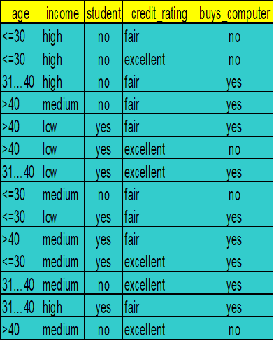

