# 模式识别导论

## Bayesian Decision Theory

1. Prior probability:ignore present state

    $$p(x)$$

2. Conditional probability:also called likelihood

    $$p(x|w)$$

    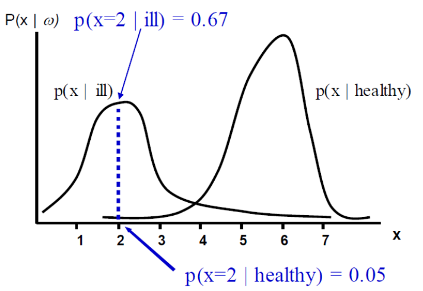

3. Posterior probability

    Bayes Formula:

    $$p(w|x)= \frac{p(x | w)p(w)}{p(x)}$$

### Bayes decision rule

* Decide $w_1$ if $p(w_1 | x) > p(w_2|x)$
* Decide $w_2$ if $p(w_2 | x) > p(w_1|x)$

or equivalent to(ignore $p(x)$)

* Decide $w_1$ if $ p(x | w_1)p(w_1) > p(x | w_2)p(w_2)$
* Decide $w_2$ if $ p(x | w_2)p(w_2) > p(x | w_1)p(w_1)$

ispecial case when $p(w_1) = p(w_2)$

* Decide $w_1$ if $p(x | w_1) > p(x | w_2)$
* Decide $w_2$ if $p(x | w_2)> p(x | w_1)$

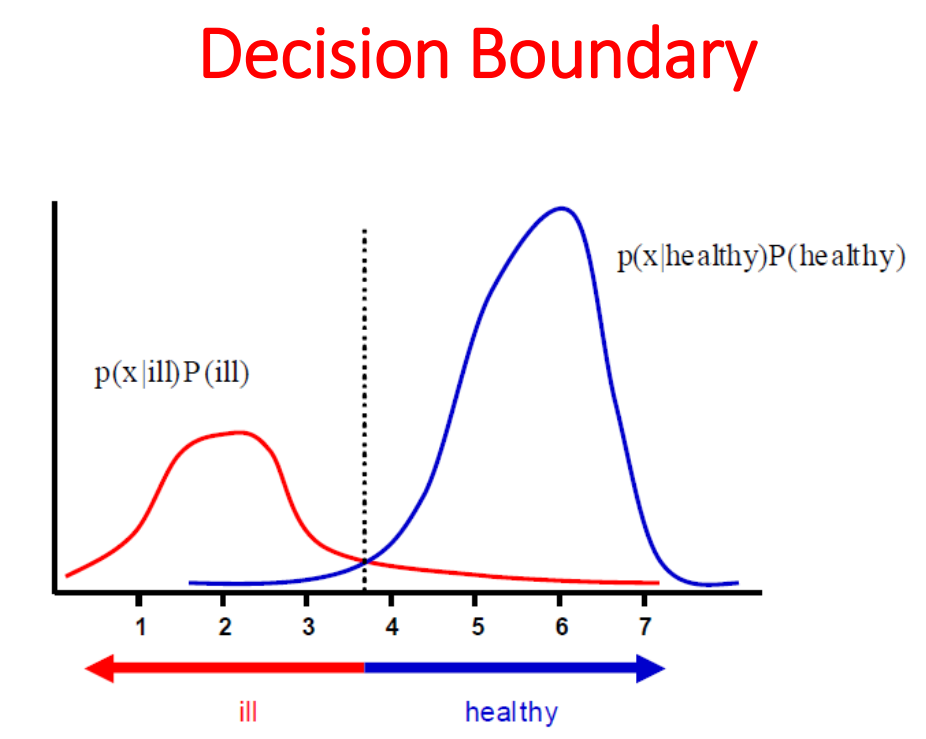

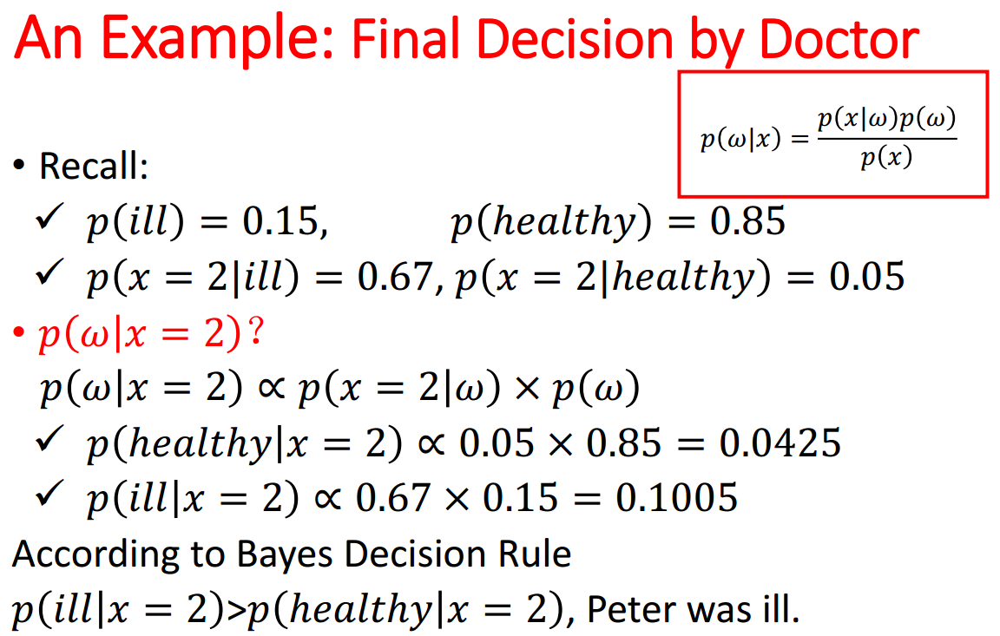

### Probability of Error

There are two possible errors
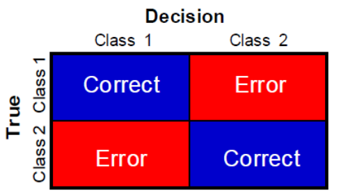

Probability of error is
$p(error|x) = p(w_1|x)$ if decide $w_2$
$p(error|x) = p(w_2|x)$ if decide $w_1$

equivalent to

$p(error | x) = min[p(w_1|x) , p(w_2|x)]$

> Bayes rule or Bayes classifier:
> decide $w_1$,if $p(w_1 | x) > p(w_2|x)$ , otherwise decide $w_2$

> 这里错误的概率,是指当我们预测为$w_i$的时候,错误的概率,由上图可以看出,预测为第二类错误的概率是第二列红色部分
> 而我们预测为$w_2$是因为$p(w_2|x)$最大, 即预测为$w_2$的正确率最大
> 那么对应的错误率自然是$1 - p(x_2|x)$ , 即下面多分类问题中的$max$

### Multi-class problem

Bayes rule:
select $w_i$ if $p(w_i|x) > p(w_j|x)$ for all $j \neq i$

Probability of Error:
$$p(error|x) = 1 - max[p(w_1|x),...,p(w_c|x)]$$

### Bayes Error Rate

$$ \begin{array}{rl}
p(error) &= p(x\in R_2 , w_1) + p(x \in R_1 , w_2)\\
&= p(x\in R_2|w_1)p(w_1) + p(x\in R_2|w_2)p(w_2)\\
&= \int_{R_2} p(x\in R_2|w_1)p(w_1) dx + \int_{R_1} p(x\in R_2|w_2)p(w_2) dx
\end{array}$$

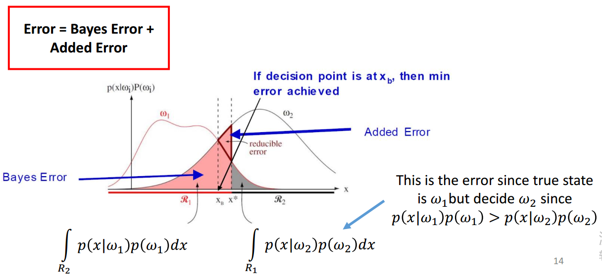

> 从上图可以看出, 当我们采取Bayes decision rule(图中的$x_a'$ , 两条曲线的交点)的时候 , $p(error)$不一定是最小的
> 因此需要确定决策边界(threshold),使得$p(error)$最小
> 为此需要计算$p(x|w)$和$p(w)$

### Loss function

Loss : measure the cost for each action taken

Let
$\{w_1 , w_2 , ... , w_c\}$ be the set of $c$ categories
$\{\alpha_1 , \alpha_2 , ... , \alpha_a\}$ be the set of possible actions
$\lambda_{ij} = \lambda(\alpha_i|w_j)$ be the loss incurred for taking action $\alpha_i$ when the category is $w_j$

> 在真值为$w_j$下采取$\alpha_i$造成的损失

The expected loss associated with taking action $\alpha_i$ is Conditional risk
$$R(\alpha_i|x) = \sum_{j = 1}^c \lambda_{ij}p(w_j|x)$$

and overall risk
$$\mathcal{R} = \int R(a(x) | x)p(x) dx$$

Choose $\alpha_i$ so that $R(\alpha_i|x)$ is as small as possible for every $x$ , then the overall risk will be minimized

#### Minimum Risk Decision Rule

take action $\alpha_1$ if
$$R(\alpha_1|x)<R(\alpha_2|x)$$

equivalent to :

decide $w_1$ if
$$(\lambda_{21} - \lambda_{11})p(x|w_1)p(w_2) > (\lambda_{12} - \lambda_{22})p(x|w_2)p(w_2)$$
otherwise ,declde $w_2$

> 作差之后,可以看成是预测正确的损失为1, 而预测错误的时候 ,带权计算误差 , 下面可以看出 minimum Risk Decision Rule 范围更广

**Zero-one loss function** :
$$\lambda(\alpha_i|w_j) = \left \{ \begin{array}{rl}0 & i = j \\ 1 & i \neq j \end{array} \right .$$

* No loss to a correct decision
* A unit loss to any error
* All erroes are equally costly

Risk:
$$\begin{array}{rl}R(\alpha_i|x) &= \sum_{j = 1}^c \lambda_{ij}p(w_j|x)\\&= \sum_{j \neq i} p(w_j|x) \\&= 1-p(w_i|x) \end{array}$$

So minimizing the average probability of error requires maximization $p(w_i|x)$

> 前面bayes rule , 我们选择后验概率最大的$w_i$作为参数的估计(似然概率最大的$w_i$) , 而这个部分解释了为什么要这么做 , 因为这么取造成的损失的期望是最小的

> 而后面的决策边界 , 则是在确定了$w_i$后, 作决策所用 , 选择一个决策边界使得错误率最小 , 这一步的操作是不会对损失的期望造成影响,因为$w_i$下,已经是最小的

Practice:
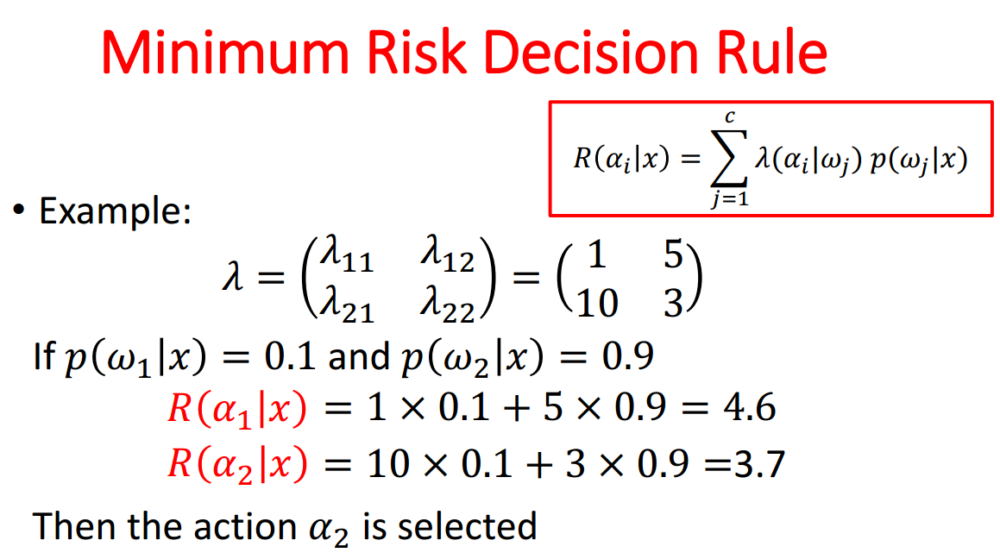

### Classfiers

Discriminant functions :
$$g_(x) = , i = 1 , \cdots , c$$

Decision Rule: x will be assigned to class $w_i$ if $g_i(x) > g_j(x) , \forall j \neq i$

**For Minium-Error-Rate:**
$$g_i(x) = p(w_i|x)$$

if $G$ is a monotonically increasing functions , the decision rule can also be :
Decision Rule: x will be assigned to class $w_i$ if $G(g_i(x)) > G(g_j(x)) , \forall j \neq i$

for example $log$
$$G(g_i(x)) = \ln (g_i(x)) = \ln p(x|w_i) + \ln p(w_i) - ln p(x)$$

**For tow class problem**:
> 二分类问题 , 判别函数作差

$$g(x) = g_1(x) - g_2(x) = \ln \frac{p(x|w_1)}{p(x|w_2)} + \ln \frac{p(w_1)}{p(w_2)}$$

> 左边这个形式就是逻辑回归的表达式 , 即逻辑回归假设$p(w_1) = p(w_2)$
> 由于在样本少的情况下, 贝叶斯方法并不能准确估计 , 因此采用极大似然法(ML) , 即和逻辑回归的表示对应上

### 特例:正态分布

Advantage of Normal Distribute:

1. Analytically traceable continuous
2. A lot of processes are asymptotically Gaussian

Definition:
$$p(x) = \frac{1}{(2\pi)^{\frac{d}{2}} |\Sigma|^\frac{1}{2}}exp\left (-\frac{1}{2}(x - \mu)^T\Sigma^{-1}(x - \mu)\right )$$

Assume $p(x|w_i) \sim N(\mu_i , \Sigma_i)$ 
and use $G(g_i(x)) = \ln (g_i(x)) = \ln p(x|w_i) + \ln p(w_i) - ln p(x)$ as discriminant function,
$$g_i(x) = -\frac{1}{2}(x - \mu_i)^T\Sigma_i^{-1}(x - \mu_i) - \frac{d}{2}\ln (2\pi) - \frac{1}{2} \ln |\Sigma_i| + \ln p(w_i)$$

改写成以下形式:
$$g_i(x) = x^TW_ix + w_ix + w_{i0}$$
其中,$W_i = -\frac{1}{2}\Sigma_i^{-1}$,
$w_i = \Sigma_i^{-1}\mu_i$,
$w_{i0} = -\frac{1}{2}\mu^T\Sigma_i^{-1}\mu - \frac{1}{2}\ln |\Sigma_i| + \ln p(w_i)$

#### Estimation on $p(x| w_i)$

how can we obtain them?

* can be estimated by using training samples
* No problem with estimation of $p(w_i)$
* Sample are often too small for the estimation of $p(x | w_i)$
* even worse for large dimension of feature space

one possible solution for estimating $p(x|w_i)$
assume known forms of distribution, such as normal distribution
$$p(x|w_i) \sim N(\mu_i , \Sigma_i)$$

the advantage of assuming a certain distribution form is that **the problem is now simplified from estimating unknown posterior function to one estimating parameters of a konw distribution function**

**ML Parameter Estimation**

> ML & Bayesian : two common parameter estimation methods
> Parameter such as $\mu_i$ and $\Sigma_i$ for normal distribution are fixed but unknown
> ML gives the best parameter estimation obtained by maximizing probability of obtaining observed samples
> Bayesian view parameter to be estimated as a random having some konwn prior distribution , and observing samples convert this to posterior density.

Assume:

* Sample $\{x_j\}$ in $D$ are i.i.d which are drawn independently according to the probability law $p(x|w_j)$
* $p(x | w_j) \sim N(\mu_j , \Sigma_j)$

$$p(D|\theta) = \displaystyle {\Pi_{k = 1}^n p(x_k | \theta)}$$

> According to beyes decision rule , maximize the posterior probability $p(x_k|\theta)$ will yield minimum error.

似然函数:$$l(\theta) = \ln p(D|\theta) = \sum_{k = 1}^n \ln p(x_k | \theta)$$

目标:$$\hat \theta = arg \max_\theta l(\theta)$$

令 $$\nabla_\theta l = 0$$
得
$$\begin{array}{rl}
\hat \mu &= \displaystyle  \frac{1}{n} \sum_{k = 1}^n x_k\\
\hat \sigma^2 &= \displaystyle \frac{1}{n} \sum_{k = 1}^n (x_k - \hat \mu)^2
\end{array}$$

**How to use ML to train a Classfier?**
Estimate $\mu_i$ and $\Sigma_i$ using $D_i$ for each class

### Tutorial

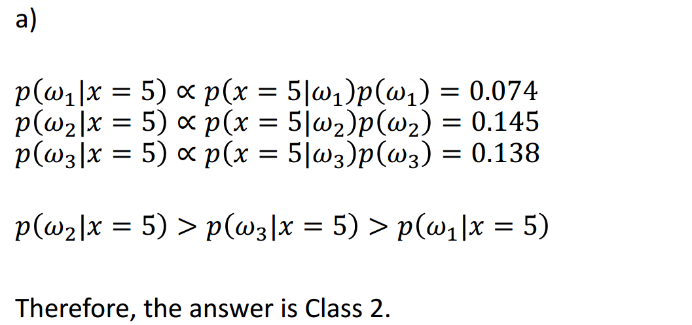

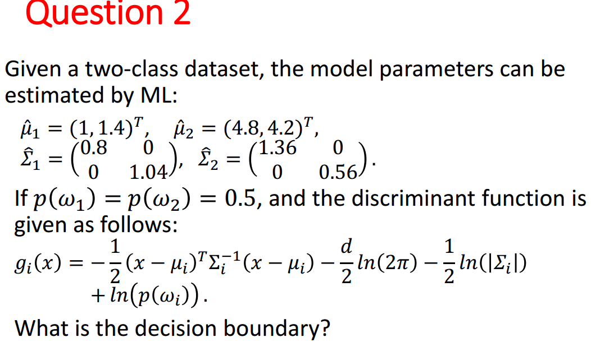
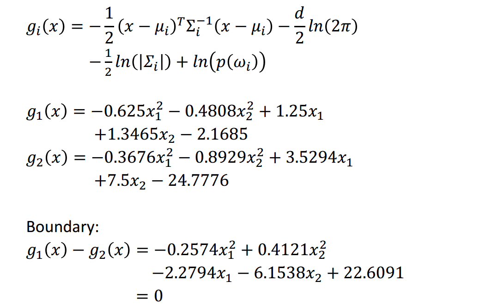

## Linear Models for classification

Two class problem:

* Geometry of Linear Discriminants
* Least Squares Classification
* Perceptron Algorithm
* Generalized Linear Model

### Patametric vs Non-Parametric Method

* Patametric Methods
    * assume the form of the sample distribution is known
    * Trainning samples used to estimate distribution parameter
    * accurate if distribution assumption is correct
    * such as use Maximum Likelihood to train  a Classifier

* Non-Parametric Methods
    * Do not make assumption of sample distribution
    * assume the proper form for discriminant function
    * Trainning samples used to estimate value of parameter of the classifier
    * sub-optimal , but simple to use

### Linear Classification Models

#### Two-Class Problem

Decision surface is defined as $g(x) = 0$
$$g(x) = w^Tx + w_0$$
Since $g(x)$ is linear, this decision surface is hyperplane.

Assign $x$ to class $C_1$ if $g(x) \geq 0$, else class $C_2$

Defines decision boundary as $g(x)= 0$

#### Distance of arbitrary point $x$ to surface

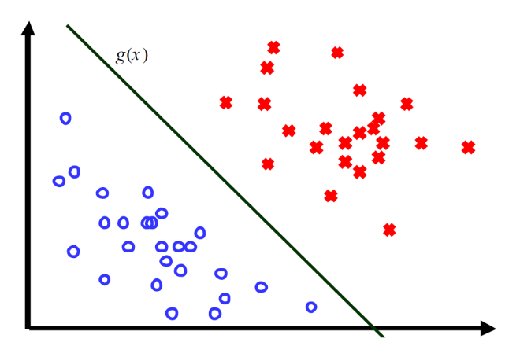

There are many solution of decision surface(optimal and sub-optimal), we want to choose the best one, So we need to calculate distance.

* distance of origin(原点) to surface
    * let $x_a$ and $x_b$ be points on the surface,we get $g(x_a) = g(x_b) = 0$, equivalent to 
    $$w^T(x_a - x_b) = 0$$
    > 即$w$是法向量
    * let $x$ be the orthogonal projection onto the decision surface, we have $x = kw$
    * $g(x) = 0 = w^Tkw + w_0$
    $$k = -\frac{w_0}{\|w\|^2} \Rightarrow d = \|x\| = -\frac{w_0}{\|w\|}$$

* Distance of arbitrary point $x$ to surface
    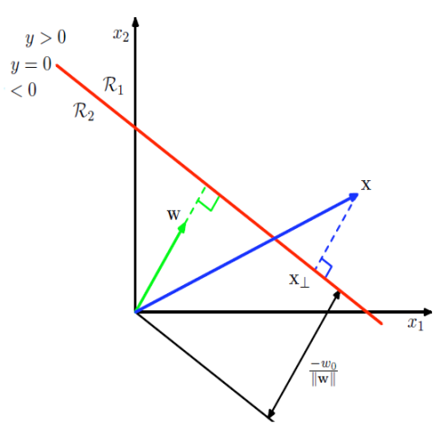

    * Let $x$ be the arbitrary point to surface, $x_\perp$ be the orthogonal projection onto the decision surface.
    * $$x = x_{\perp} + \gamma w$$
    * $$\begin{array}{rl}g(x_{\perp}) = 0 &= w^T(x - \gamma w) + w_0 = w^Tx - \gamma w^Tw + w_0\\
    &\Rightarrow \gamma = \frac{g(x)}{\|w\|^2}\\
    &\Rightarrow d = \|x - x_{\perp}\| = \frac{g(x)}{\|w\|}
    \end{array}
    $$
    > $\left \|\frac{w}{\|w\|}\right \| = 1$

#### Convexity of decision regions

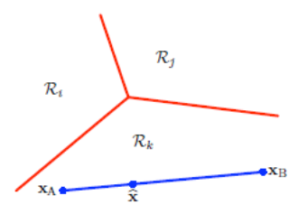

* any point $x$ on line $x_a$ and $x_b$ can be express as
    $$x = \lambda x_a + (1-\lambda)x_b$$,where $0\leq \lambda \leq 1$
* From linearity of discriminant functions
    $g_k(x) = x_k^Tx + w_{k0}$
* combining the two, we have
    $$g_k(x) = \lambda g_k(x_a) + (1-\lambda)g_k(x_b) $$
* because $x_a$ and $x_b$ lie inside $R_k$ it follow that
    $g_k(x_a) > g_j(x_a),g_k(x_b) > g_j(x_b)$ for all $j \neq k$
* Hence $x$ also lies inside $R_k$

#### Augmented Vector

* With dummy input $x_0 = 1$
* $x \leftarrow (x_0,x)$
* and $w \leftarrow (w_0,w)$
* then $g(x) = w^Tx$

#### Perceptron Algorithm
* Input vector $x$ transformed by a fixed nonlinear transformation to give feature vector $\phi(x)$
    $$g(x) = f(w^T\phi(x))$$
    where non-linear activation $f$ is a step function
    $$f(a) = \left \{\begin{array}{rl}+1 &, a\geq 0 \\-1&,a<0\end{array}\right .$$

* Use a target coding scheme
    $y = +1$, for class $C_1$
    $y = -1$, for class $C_2$

* all patterns need to satisfy
    $$w^T\phi(x_n)y_n > 0$$

* for each misclassfied sample, Perceptron Criterion tries to minimize:
    $$E(w) = -w^T\phi(x_n)y_n > 0$$

* Stochastic Gradient Descent
    $$g^{k + 1} = w^k - \eta\nabla E(w) = w^k + \eta\phi(x_n)y_n$$

#### Least Square for Classification

* Normalization
    * Simplify the setting: replace all labeled by $w_2$ by their 'negatives', such as
        $$x_i \leftarrow -x_i$$
        where $x_i$ is $w_2$
    * is the problem is linearly separable, all samples are
    $$w^Tx_i > 0$$
    as a result, labels can be ignored.

* Seek a hyperplane having a larger margin
* Sum-of-squared-error function handles the margin situation($w^Tx_i = b_i$)
    $$J_S(w) = \sum_{i = 1}^n (w^Tx_i - b_i)^2$$
    where $b_i$ are some arbitrarily specified positive constant.
* Matrix notation:
    $$J_S(w) = \|Xw - b\|^2$$

    $$w = \left ( \begin{array}{c}w_0\\w_1\\\vdots\\w_d\end{array}\right ),X = \left (\begin{array}{cccc}x_{10} & x_{11} & \cdots & x_{1d}\\x_{20} & x_{21} & \cdots & x_{2d}\\
    \vdots & \vdots & \ddots & \vdots\\
    x_{n0} & x_{n1} & \cdots & x_{nd}
    \end{array}\right ),b = \left (\begin{array}{c}b_0\\b_1\\\vdots\\b_d\end{array}\right )$$

* $$J_S(w) = 0 \Rightarrow w = X^{-1}b$$ if $X$ is nonsingular.
    however, usually, $X$ is rectangular:
    * More rows than columns
    * More samples than features
    * More equation than unkonwns

* Pseudoinverse Method
    $$\nabla J_S(w) = 0 = 2X^T(Xw - b)\Rightarrow w = (X^TX)^{-1}X^Tb$$

* Remark: $X^Tx$ is not always nonsingular
    $$w = \lim_{\epsilon\to 0} (X^TX + \epsilon I)^{-1}X^Tb$$

    > 既然是解析解, 是不是b可以设置成足够大?

* Gradient Descent can also be used, called Least-Mean-Squared(LMS)    
    $$\nabla J_S(w) = 2\sum_{i = 1}^n (w^Tx_i - b_i)x_i = 2X^T(Xw - b)$$

    LMS needs not converge to a separating hyperplane(which can separate the samples perfectly), even if one exists.

    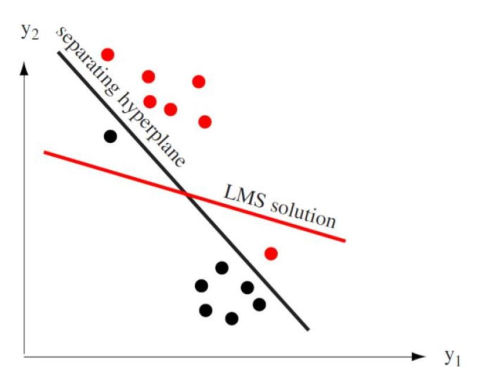

#### Gereralized Linear Model

* $G(X) = f(w^Tx + w_0)$
    ,$f$ is konwn as the activation function.
* The decision surfaces correspond to 
    $g(x) = constant$
    or $w^Tx + w_0 = constant$
    so decision boundaries are linear in feature space even if $f$ is nonlinear. e.g. a step function
    > 就是说, 只有一层的话, 即使最后是非线性激活, 最后还是线性划分

* Generalized linear discriminant function
    $g(x) = \sum_{i = 1}^d w_i\phi_i(x)$
    $y$ is not linear in $x$, but linear in activation function $\phi_i$

* Quadratic Discriminant Function
    $g(x) = w_0 + w_1x + w_2x^2$
    mapping:$\phi(x) = \left ( \begin{array}{c}1\\x\\x^w\end{array}\right )$
    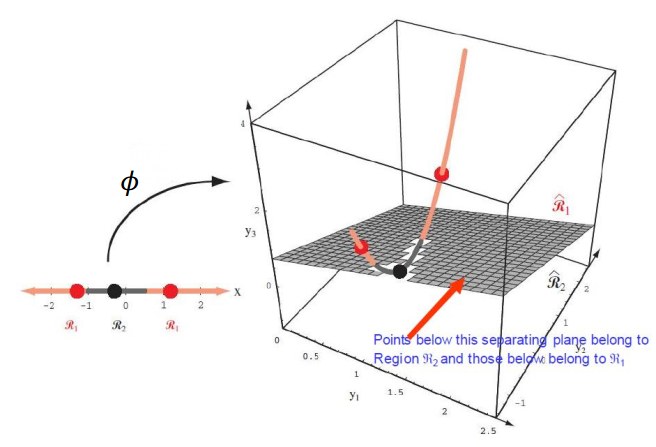

* this is the idea behind kernel trick

#### Related issue
* Size of learning rate $\eta$:
    * too small, convergence is nnedlessly slow
    * too large, the correction process will overshoot and can even diverge

* sub-optimal solution
    trapped by local minimum

### Extension to Multiple Classes
Two approaches:
* Using serveral two-class classifiers:
    Both result in ambiguous regions of input space
    * one-vs-the-rest
    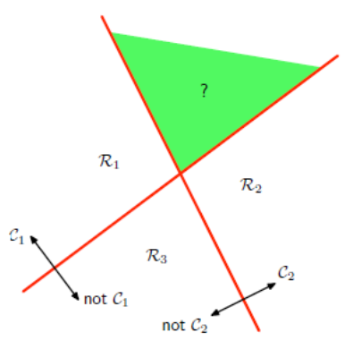        
    * one-vs-one
    @import "assets/moshishibiedaolun/2018-04-08-16-58-59.png" {width=50%} 

* Using $c$ linear discriminant function
    assign a point $x$ to class $C_k$ if $g_k(x) > g_j(k)$ for all $j \neq k$

    the decision boundary between class $C_k$ and $C_j$ is given by:
    $g_k(x) = g_j(x)$

    Advantage:
    * Avoid ambiguous region
    * Every decision region is singly connected
    * Low Complexity
    * $c$ classifiers are needed

### Tutorial
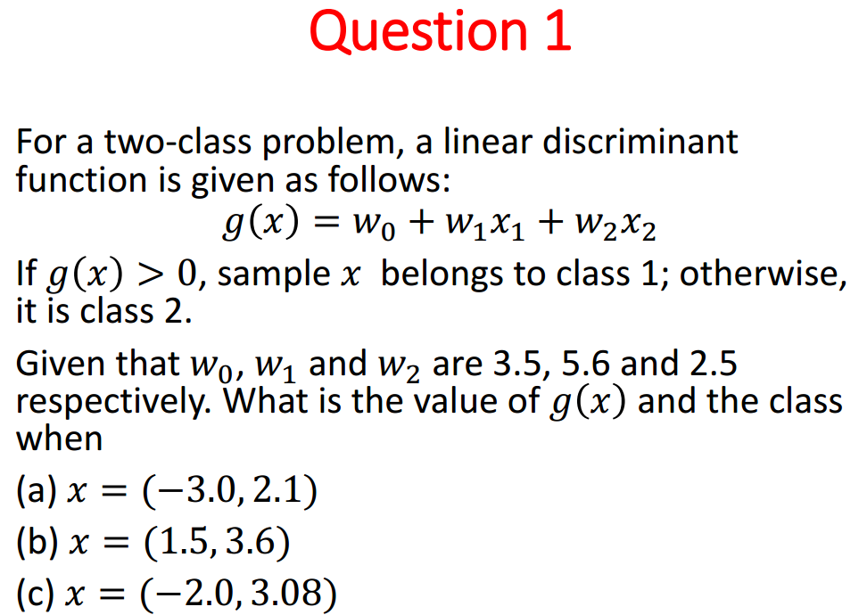
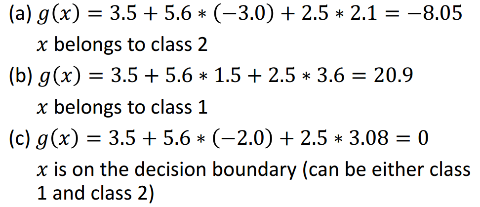
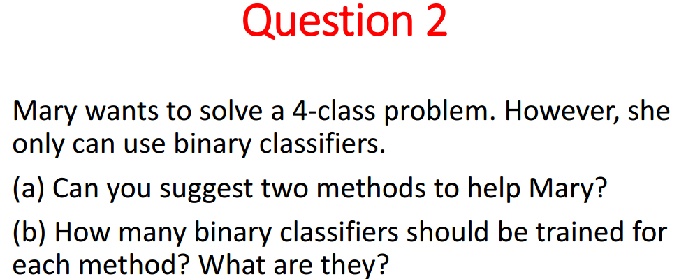
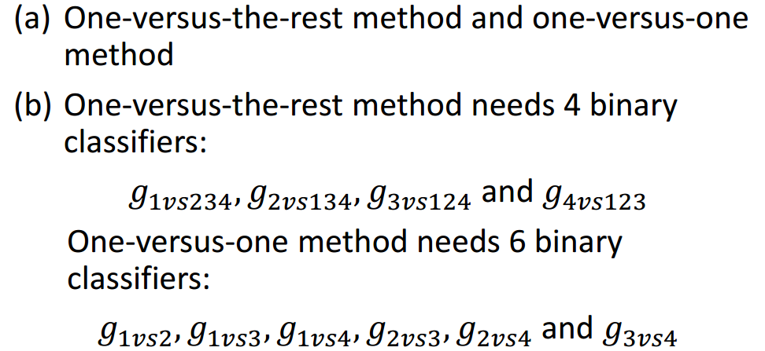
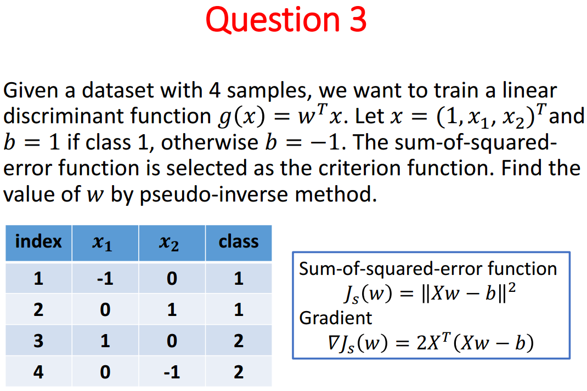
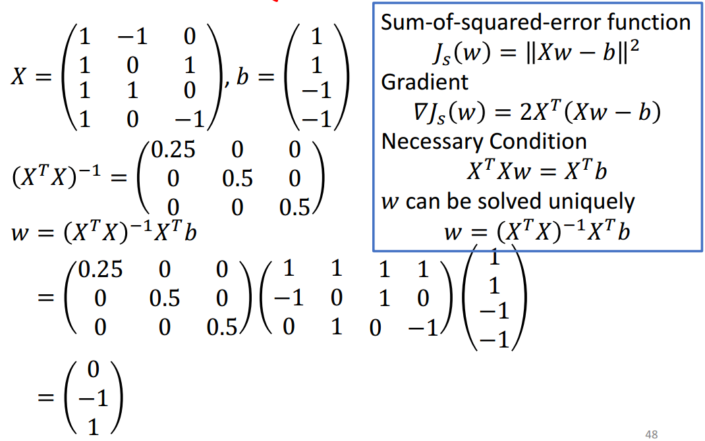