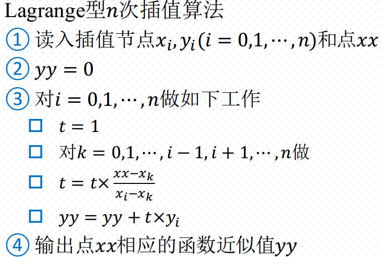
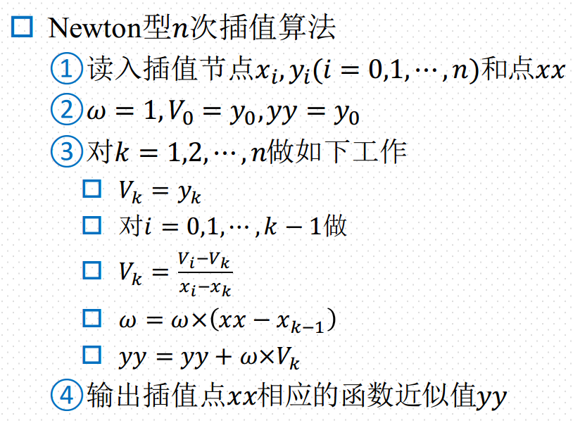

# 计算方法

## 误差

### 误差来源

1. 模型误差
2. 观测误差：受限于测量工具的精度
3. 方法误差：所求是模型的近似解
4. 舍入误差：计算机精度有限

### 误差的定义

误差=近似值-准确值,
记作:

$$e^* = x^* - x$$

误差，又叫绝对误差

### 误差限

误差限：一般情况下，准确值$x$是未知的，因此误差$e^*$的准确值是无法求出的，但有时而已根据具体测量或计算出误差的绝对值不可能超过某个整数，这个整数称为 **误差限**

定义：若$|e^*| = |x^* - x| \leq \epsilon^*$ ，则称$\epsilon^*$为近似值$x^*$的误差限， 近似值$x^*$的误差限也记作 $\epsilon(x^*)$

### 有效数字 P13 句2

定义1：若近似值$x^*$的误差限为该值的某一位的半个单位，且从该为开始往左数到第一位非0数字共有$n$位，则称 $x^*$具有n为有效数字

而对任何数值经过四舍五入之后得到的近似值，它的误差限是它末位的半个单位，因此只需要从后往左数即可

 
例子：$\pi$的近似值3.1415有多少位有效数字？

$$|3.1415 - x| < 0.5 \times 10^{-3}$$

从$10^-3$位开始往前数到第一个非0数字，共有4位， 因此3.1415有4位有效数字

$\pi$四舍五入后的值是3.1416，因此在计算3.1415的有效数字位数的时候不能直接从末位往前数

注：$\pi$ 的准确值有无穷多位有效数字

 
有效数字与误差限的关系（定义2）：

设$x^*$为准确值$x$的近似值，且将$x^*$表示为

$$x^* = \pm 0.a_1a_2\cdots a^m \times 10^p$$

p为整数,$a_1,a_2\cdots ,a^m$为$0\sim 9$之间的数字，且$a_1\neq 0$，若有
$$|x^* - x| < 0.5 \times 10^{p - n}$$
则近似值$x^*$有$n$位有效数字

概括地说，总长p位，有效数字为n位，其误差限为$0.5\times 10^{p - n}$

### 相对误差

因为量纲等问题， 误差的大小并不能真正反映出错误的程度，所以考虑“单位误差”即 **相对误差**

定义：$$相对误差 = \frac{绝对误差}{准确值}$$

由于 准确值 往往是未知的，因此采用近似值近似计算

$$相对误差 = \frac{绝对误差}{准确值} \approx \frac{绝对误差}{近似值}$$

即

$$e_r^* = \frac{e^*}{x} \approx \frac{e^*}{x^*} = \frac{x^* - x}{x^*} $$

但，只有在$\frac{e^*}{x^*}\to 0$的条件下才可以用

 
证明:当$\frac{e^*}{x^*}\to 0$时，
$$\frac{e^*}{x} = \frac{e^*}{x^*}$$

证明思路：作差，消去$x$
$$\lim_{\frac{e^*}{x^*}\to 0}\left |\frac{e^*}{x^*} - \frac{e^*}{x}\right | = \left | e^*\frac{x^* - x}{xx^*} \right | = \left | \frac{(e^*)^2}{xx^*} \right |  = \left | \frac{(e^*)^2}{(x^* - e^*)x^*} \right | = \left | \frac{(\frac{e^*}{x^*})^2}{1 - \frac{e^*}{x^*}} \right | = 0$$

### 相对误差限

定义：
$$|e_r^*| = \left | \frac{x^* - x}{x^*} \right | \leq \frac{\epsilon^*}{|x^*|}$$
则相对误差限为(误差除以近似值的绝对值)
$$\epsilon_r^* = \frac{\epsilon^*}{|x^*|}$$

 
相对误差限与有效数字的关系:

若近似值$x^* = \pm 0.a_1a_2\cdots a_m \times 10^p$有n位有效数字($n\leq m$)，其相对误差限为？

n为有效数字， 其误差限$\epsilon^*$为：
$$|e^*| = |x - x^*| \leq \epsilon^* = \frac{1}{2} \times 10^{p - n}$$

$$\left |\frac{x - x^*}{x^*}\right| \leq \frac{\epsilon^*}{|x^*|} = \frac{10^{p - n}}{2\times 0.a_1a_2\cdots a_m \times 10^p} = \frac{10^{ - n}}{2\times 0.a_1a_2\cdots a_m } \leq \frac{10^{1 - n}}{2a_1}  $$

 
若近似数$x^* = \pm 0.a_1a_2\cdots a_m \times 10^p$,且相对误差限满足关系式
$$\epsilon_r^* \leq \frac{1}{2(a_2 + 1)} \times 10^{-(n - 1)}$$
则 $x^*$有多少位有效数字？

$$\begin{array}{ll}
\epsilon_r^* &= \frac{\epsilon^*}{|x^*|} \leq \frac{1}{2(a_2 + 1)} \times 10^{-(n - 1)}\\
\epsilon^* &\leq |x^*|\times \frac{1}{2(a_2 + 1)} \times 10^{-(n - 1)} \\
&=0.a_1a_2\cdots a_m \times 10^p \times \frac{1}{2(a_2 + 1)} \times 10^{-(n - 1)}\\
&=(a + 0.a_2\cdots a_m)\times 10^{p - 1} \times \frac{1}{2(a_2 + 1)} \times 10^{-(n - 1)}\\
&\leq (a + 1)\times 10^{p - 1} \times \frac{1}{2(a_2 + 1)} \times 10^{-(n - 1)}\\
&= \frac{1}{2} \times 10^{p - n}
 \end{array}$$

 因此有n位有效数字

### 误差传递

误差传递：数值运算过程中的误差估计，使用$x^*$代替准确值$x$进行计算 ，则$f(x)$必定存在误差

思路：使用f(x) 在 $x^*$ 的taylor展开作为 f(x) 准确值的计算（只取到线性项，忽略余项），由此构造误差进行分析

$f(x)$在$x^*$附近的taylor展开：
$$f(x) = f(x^*) + f'(x^*)(x - x^*)$$
绝对误差：
$$e(f(x^*)) = f(x^*) - f(x) = f'(x^*)(x^* - x) = f'(x^*)e(x^*)$$
相对误差：
$$e_r(f(x^*)) \approx \frac{e(f(x^*))}{f(x^*)} = \frac{f'(x^*)}{f(x^*)}e(x^*)$$
误差限：
$$ |f(x) - f(x^*)| = |f'(x^*)e(x^*)| = |f'(x^*)||e(x^*)| \leq |f'(x^*)| \epsilon(x^*) = \epsilon(f(x^*))$$
相对误差限:
$$ \epsilon_r(f(x^*)) \approx \frac{\epsilon(f(x^*))}{|f(x^*)|} = \left |\frac{f'(x^*)}{f(x^*)} \right | \epsilon(x^*)$$

 
二元taylor展开：（偏导）
$$\begin{array}{ll}
f(x , y) &= f(x^*,y^*) + \frac{\partial f(x^* , y^*)}{\partial x}(x - x^*) + \frac{\partial f(x^* , y^*)}{\partial y}(y - y^*)\\
&=f(x^*,y^*) + f_x'(x^*,y^*)(x - x^*) + f_y'(x^*,y^*)(y - y^*)\\
&= f(x^*,y^*) + f_x'(x - x^*) + f_y'(y - y^*)
\end{array}$$
绝对误差：
$$e(f(x^*,y^*)) = f(x^*,y^*) - f(x , y) = f_x'(x^* - x) + f_y'(y^* - y) = f_x'e(x^*) + f_y'e(y^*)$$
相对误差：
$$\begin{array}{ll}
e_r(f(x^*,y^*)) &\approx \frac{e(f(x^*,y^*))}{f(x^*,y^*)} =\frac{ f(x^*,y^*) - f(x , y)}{f(x^*,y^*)} \\&= \frac{f_x'}{f(x^*,y^*)}(x^* - x) + \frac{f_y'}{f(x^*,y^*)}(y^* - y) \\&= \frac{f_x'}{f(x^*,y^*)}e(x^*) + \frac{f_y'}{f(x^*,y^*)}e(y^*)
\end{array}$$
误差限：
$$|e(f(x^*,y^*))| = |f_x'(x - x^*) + f_y'(y - y^*)| \leq |f_x'|\epsilon(x^*) + |f_y'|\epsilon(y^*) = \epsilon(f(x^*,y^*))$$
相对误差限：
$$\epsilon_r(f(x^*,y^*)) \approx \frac{\epsilon(f(x^*,y^*))}{f(x^*,y^*)}=\left |\frac{f_x'}{f(x^*,y^*)}\right |\epsilon(x^*) + \left | \frac{f_y'}{f(x^*,y^*)}\right |\epsilon(y^*) $$

### 数值计算中应该注意的问题

1. 避免两个相近的数相减--??????课本的貌似是相对误差 ， 不知道推导是否正确
    $$\epsilon_r(x^*-y^*) = \frac{\epsilon(x^*) + \epsilon(x^*)}{|x^* - y^*|}$$

2. 防止大数吃小数

3. 减少运算的次数

4. 避免做除数绝对值远小于被除数绝对值的除法
    1. 结果可能溢出
    2. 舍入误差严重增大

5. 选择数值稳定的计算公式

    给定$I_n = \int_0^1 x^ne^{x- 1}dx$，可以用公式$I_n = 1 - n I_{n - 1}$计算，有两个递推方向：正推(已知$I_n$递推出$I_{n - 1}$)，逆推(已知$I_n$递推出$I_{n + 1}$)

    1. 从$I_0$正推出$I_n$

        近似值：
        $$I_n^* = 1 - nI_{n - 1}^*$$

        $$\begin{array}{ll}
        e(I_n^*) &= I_n^* - I_n = ( 1 - nI_{n - 1}^*) - ( 1 - nI_{n - 1}) = -n(I^*_{n - 1} - I_{n - 1})\\
        &= \cdots\\
        &= (-1)^nn!(I_0^* - I_0)
        \end{array}$$

        可以看出误差呈“阶乘式”增长

    2. 从$I_n$逆推出$I_0$

        近似值:
        $$I_{n - 1}^* =  \frac{1 - I^*_n}{n}$$

        $$I_{n - 1}^* - I_{n - 1} = \frac{-1}{n}(I_n^* - I_n)$$

        $$\Rightarrow I_0^* - I_0 = \frac{(-1)^n}{n!}(I_n^* - I_n)$$

        逆推的时候，可以看出误差传播逐步减少

## 插值

插值是已知某些点的函数值，求任意点的函数值。

要求：插值函数在已知点无误差 ， 构造$P_n(x) \approx f(x)$

### 线性插值

线性插值是代数插值中最简单的一种情形，它的提法是：

给定$y = f(x)$的函数表 ， 构造函数$p_1(x)$满足条件:

1. $p_1(x)$ 是一个不超过一次的代数多项式
2. $p_1(x_0) = y_0 , p_1(x_2) = y_1$

线性插值函数表:

| $x$        | $x_0$ | $x_1$ |
|------------|-------|-------|
| $y = f(x)$ | $y_0$ | $y_1$ |

#### 两点式 Lagrange 形式

$$p_1(x) = \frac{x - x_1}{x_0 - x_1}y_0 + \frac{x - x_0}{x_1 - x_0}y_0$$

Lagrange 形式:插值节点用基函数加权求和

$$p_1(x) = l_0(x)y_0 + l_1(x)y_1$$

其中,$l_0(x)$称为插值基函数

#### 点斜式 Newton 形式

$$p_1(x) = \frac{y_1 - y_0}{x_1 - x_0}(x - x_0) + y_0$$

Newton 形式:

$$p_1(x) = f(x_0 , x_1)(x - x_0) + f(x_0)$$

其中 , $f(x_0 , x_1)$称为一阶差商 , 该值 与 $x_0$和$x_1$的顺序无关

> **两种形式的关系** : 等价

#### 线性插值函数的误差估计

设$p_1(x)$是过$(x_0 , y_0)$和$(x_1 , y_1)$两点的线性插值函数 ,

$[a,b]$是包含$[x_0 , x_1]$的任一区间,

并设$f(x) \in C^1[a,b] , f''(x)$在$[a,b]$上存在 ,

则对任一给定的$x\in [a,b]$ , 总存在一点 $\xi \in (a , b)$,使得
$$R(x) = f(x) - p_1(x) = \frac{f''(\xi)}{2!}(x - x_0)(x - x_1)$$

其中,$\xi$依赖于$x$ , $R(x)$称为余项

> $f(x) \in C^1[a,b]$表示$f(x) , f'(x)$连续 , $C$表示连续 , 上标$^1$表示到一阶导数为止

证明:

1. 构造辅助函数

    对任一定的$x$,构造辅助函数:要求$\varphi(x_0) = \varphi(x_1) = \varphi(x) = 0$
    $$ \varphi(t) = f(t) - p_1(t) - k(t - x_0)(t - x_1) $$
    其中,$k$为待定常数.

    > 记忆: 前两项作差 , 后一项是余项 ; 因为 $p_(x)$ 在$x_0$和$x_1$上无误差 , 即 $R(x_0) = R(x_1) = 0$ , 因此需要$(t - x_0)(t - x_1)$这样的形式

2. 计算待定常数
    现在已经满足的$\varphi(x_0) = \varphi(x_1) = 0$,还需$\varphi(x) = 0$,有

    > 这三个$\varphi(*) = 0$要求可以理解成 算上余项之后,结果为0

    $$\varphi(x) =  f(t) - p_1(t) - k(t - x_0)(t - x_1) = 0$$

    得$$k = \frac{f(x) - p_1(x)}{(x - x_0)(x - x_1)} =^{def} \frac{R(x)}{(x - x_0)(x - x_1)}$$

3. 反复运用罗尔定理

    由2得
    $$\varphi(t) = f(t) - p_1(t) -\frac{f(x) - p_1(x)}{(x - x_0)(x - x_1)}(t - x_0)(t - x_1)$$

    满足,$\varphi(x_0) = \varphi(x_1) = \varphi(x) = 0$

    $$
    \left .
    \begin{array}{r}
    \varphi(x_0) = 0\\
    \varphi(x_1) = 0\\
    \varphi(x) = 0
    \end{array}\right \}\Rightarrow
    \left .
    \begin{array}{r}
    \exists \xi_1 , \varphi'(\xi_1) = 0\\
    \exists \xi_2 , \varphi'(\xi_2) = 0
    \end{array}\right \}\Rightarrow
    \exists \xi , \varphi''(\xi) = 0
    $$

4. 求导代入
    $$\varphi''(t) = f''(t) - p_1''(t) - 2!\frac{R(x)}{(x - x_0)(x - x_1)} =^{p_1''(t) = 0} f''(t) - 2!\frac{R(x)}{(x - x_0)(x - x_1)}$$

    > $2!$是因为二次项二次求导得出来的,第一次得$2$,第二次得$1$ , 合起来$2!$

    $$\varphi''(\xi) = 0 = f''(\xi) - 2!\frac{R(x)}{(x - x_0)(x - x_1)}$$

    移项后得证:
    $$R(x) = \frac{f''(\xi)}{2!}(x - x_0)(x - x_1) $$

### 二次插值

二次插值: 有3个插值节点

$$p_2(x) = a_0 + a_1x + a_2x^2$$

插值条件:

1. $p_2(x)$是一个是一个不超过二次的代数项
2. $p_(x_0) = y_0 , p_(x_1) = y_1 , p_(x_2) = y_2$

#### 参数的存在性

$$\left \{ \begin{array}{l}
p_2(x_0) = a_0 + a_1x_0 + a_2x_0^2 = y_0\\
p_2(x_1) = a_0 + a_1x_1 + a_2x_1^2 = y_1\\
p_2(x_2) = a_0 + a_1x_2 + a_2x_2^2 = y_2
\end{array}\right .$$

得到系数行列式:

$$\left | \begin{array}{ccc}
1 & x_0 & x_0^2\\
1 & x_1 & x_1^2\\
1 & x_2 & x_2^2
\end{array}\right | = (x_1 - x_0)(x_2 - x_0)(x_2 - x_1)$$

故, 只要$x_0,x_1,x_2$互不相同,则行列式必不为0,即$a_0 , a_1 , a_2$存在且唯一

#### Lagrange 形式

构造Lagrange 形式:
$$p_2(x) = l_0(x)y_0 + l_1(x)y_1 +  l_2(x)y_2$$
其中,$l_*(x)$为不超过二次的代数多项式(为满足插值条件1)

若基函数满足下表的取值 ,则函数满足插值条件2:
| 函数值   | $x_0$ | $x_1$ | $x_2$ |
|----------|-------|-------|-------|
| $l_0(x)$ | 1     | 0     | 0     |
| $l_1(x)$ | 0     | 1     | 0     |
| $l_2(x)$ | 0     | 0     | 1     |

由上表构造基函数的形式(以$l_0(x)$为例):
$$l_0(x) = A(x - x_1)(x - x_2)$$
,其中$A$为待定常数

> 由于$p_2$(x)在插值节点处无误差 ,因此需要$(x - x_1)(x - x_2)$这一项

代入$x_0$
$$l_0(x_0) = 1 = A(x_0 - x_1)(x_0 - x_2)$$
得:
$$A = \frac{1}{(x_0 - x_1)(x_0 - x_2)}$$

故$$l_0(x) = \frac{(x - x_1)(x - x_2)}{(x_0 - x_1)(x_0 - x_2)}$$

同理:
$$l_1(x) = \frac{(x - x_0)(x - x_2)}{(x_1 - x_0)(x_1 - x_2)}$$
$$l_2(x) = \frac{(x - x_0)(x - x_1)}{(x_2 - x_0)(x_2 - x_1)}$$

因此
$$p_2(x) = \frac{(x - x_1)(x - x_2)}{(x_0 - x_1)(x_0 - x_2)}y_0 + \frac{(x - x_0)(x - x_2)}{(x_1 - x_0)(x_1 - x_2)}y_1 +  \frac{(x - x_0)(x - x_1)}{(x_2 - x_0)(x_2 - x_1)}y_2$$

#### Newton 形式

二阶差商:
$$f(x_i , x_j , x_k) = \frac{f(x_i,  x_j) - f(x_j , x_k)}{x_i - x_k}$$

Newton 形式:
$$N_2(x) = a_0 + a_1(x - x_0) + a_2(x - x_0)(x - x_1)$$
其中$a_0 , a_1 , a_2$是待定常数

1. 求待定常数(差商)

    $$N_2(x_0) = y_0 = a_0 = f(x_0) \Rightarrow a_0 = f(x_0)$$

    $$N_2(x_1) = a_0 + a_1(x_1 - x_0) = y_1 = f(x_1)\Rightarrow a_1 = \frac{f(x_1) - f(x_0)}{x_1 - x_0} =^{def} f(x_0 , x_1)$$

    \Rightarrow & 1
    $$\begin{array}{rl}
    & N_2(x_2) = a_0 + a_1(x_2 - x_0) + a_2(x_2 - x_0)(x_2 - x_1) = y_2 = f(x_2)\\
    \Rightarrow^{简单移项} & \frac{f(x_2) - f(x_0) - f(x_0 , x_1)(x_2 - x_0)}{(x_2 - x_0)(x_2 - x_1)}\\
    = & \frac{f(x_2 , x_0) - f(x_0 , x_1)}{x_2 - x_1}\\
    =& f(x_0 , x_1 , x_2)
    \end{array}$$

#### 二次插值误差余项

$$R(x) = f(x) - p_2(x) = \frac{f'''(\xi)}{3!}(x - x_0)(x - x_1)(x - x_2)$$

证明思路和线性插值余项一致:先构造辅助函数 , 求解辅助函数的待定常数 , 多次运用罗尔定理 , 代入导函数得解

### n次线性插值

n次插值:已知n+1个插值节点, 插值函数在插值节点处无误差

插值条件:

1. $p_n(x)$ 是一个不超过n次的代数多项式
2. $p_n(x_i) = y_i , i = 0 ,1 , \cdots , n$

设
$$p_n(x) = a_0 + a_1x + a_2x^2 + \cdots + a_nx^n$$

根据插值条件2,有以下方程:
$$\left \{\begin{array}{rc}p_n(x_0) &= a_0 + a_1 x_0 + x_2x_0^2 + \cdots + a_nx_0^n = y_0\\
p_n(x_1) &= a_0 + a_1 x_1 + a_2x_1^2 + \cdots + a_nx_1^n = y_1\\
&\vdots\\
p_n(x_n) &= a_0 + a_1 x_n + a_2x_n^2 + \cdots + a_nx_n^n = y_n
\end{array}\right .$$

写成行列形式:
$$\left | \begin{array}{ccccc}
1 & x_0 & x_0^2 & \cdots & x_0^n\\
1 & x_1 & x_1^2 & \cdots & x_1^n\\
\vdots &\vdots &\vdots &\ddots &\vdots\\
1 & x_n & x_n^2 & \cdots & x_n^n\\
\end{array} \right | = \prod_{0\leq j < \leq n>}(x_i - x_j)$$

若$x_i - x_j \neq 0$  ,行列式不为0 , 故此时方程组有唯一解。

#### n次插值Lagrange形式

设$$p_n(x) = l_0(x)y_0 + l_1(x)y_1 + \cdots +  l_n(x)y_n = \sum_{i = 0}^n l_i(x)y_i$$

由插值条件一, 构造基函数满足以下取值且$l_i$是不超过$n$次代数多项式:

|          | $x_0$    | $x_1$    | $\cdots$ | $x_n$    |
|----------|----------|----------|----------|----------|
| $l_0(x)$ | 1        | 0        | $\cdots$ | 0        |
| $l_1(x)$ | 0        | 1        | $\cdots$ | 0        |
| $\vdots$ | $\vdots$ | $\vdots$ |          | $\vdots$ |
| $l_n(x)$ | 0        | 0        | $\cdots$ | 1        |

即$$l_i(x) = \left \{\begin{array}{rl} 1 & , x = x_i\\0 &, x\neq x_i\end{array}\right .$$

求解$l_i(x)$的具体形式:$l_i(x)$在非$x_i$处为一阶零点 , 得
$$l_i(x) = A \prod_{j \neq i , 0}^n (x - x_j)$$

代入$l_i(x_i) = 1$得
$$A = \frac{1}{\displaystyle  \prod_{j \neq i , 0}^n (x_i - x_j)}$$

故
$$l_i(x) = \frac{\displaystyle \prod_{j \neq i , 0}^n (x - x_j)}{\displaystyle  \prod_{j \neq i , 0}^n (x_i - x_j)} $$

##### 另一种表达形式

$$\begin{array}{rl}p_n(x) &= \displaystyle \sum_{i = 0}^n \frac{w(x)}{(x - x_i)w'(x_i)}y_i\\
w(x) &= (x - x_0)(x - x_1)\cdots(x - x_n)\\
w'(x) &= (x_i - x_0)(x_i - x_1)\cdots(x_i - x_{i - 1})(x_i - x_{i + 1})\cdots(x_i - x_n)
\end{array}$$

> $w(x)$是n+1项 , $w'(x)$是 **n** 项

#### n次插值Newton形式

n阶差商:

* 递归形式

    $$f(x_{i0},x_{i1} , \cdots , x_{in})= \frac{f(x_{i0},x_{i1} , \cdots , x_{in-1}) - f(x_{i1},x_{i2} , \cdots , x_{in})}{x_{i0} - x_{in}}$$
    > 前n项的差商减去后n项的差商 的差 再除以首尾两项的差

* 非递归形式

    $$\begin{array}{rl}f(x_{i0},x_{i1} , \cdots , x_{in})&= \displaystyle \sum_{i = 0}^k \frac{f(x_i)}{w'_k(x_i)}\\
   w'_k(x) &= (x_i - x_0)(x_i - x_1)\cdots(x_i - x_{i - 1})(x_i - x_{i + 1})\cdots(x_i - x_k)
    \end{array}$$

Newton 形式的推导方法:

* $$f(x , x_0) = \frac{f(x) - f(x_0)}{x - x_0} \Rightarrow f(x) = f(x_0) + (x - x_0)f(x , x_0)$$

* $$\begin{array}{rl}
f(x , x_0 , x_1) &= \frac{f(x , x_0) - f(x_0 , x_1)}{x - x_1} \\ &\Rightarrow f(x , x_0) = f(x, x_0, x_1)(x - x_1) + f(x_0, x_1)
\end{array}$$

* 代入得:$$\begin{array}{rl}
f(x) &= f(x_0) + (x - x_0)(f(x, x_0, x_1)(x - x_1) + f(x_0, x_1))\\
&= f(x_0) +  f(x_0, x_1)(x - x_0) + f(x, x_0, x_1)(x - x_1)(x - x_0)
\end{array}$$

* 其中$f(x, x_0, x_1)$无法求, 称为余项

* 以此类推, 得n次Newton形式
    $$\begin{array}{rl}
    f(x) & = f(x_0) + f(x_0, x_1)(x - x_0) + f(x_0, x_1, x_2)(x - x_0)(x - x_1)\\
    &\quad + \cdots + f(x_0, x_1, \cdots, x_n)(x - x_0)\cdots(x-x_{n - 1})\\
    & \quad + f(x_0, x_1, \cdots, x_n, x)(x - x_0)\cdots(x-x_n)
    \end{array}$$

#### 误差分析

**定理:** 设$p_n(x)$是过$(x_i,y_i), i = 0,1,\cdots,n$的n次插值函数, $[a,b]$是包含$x_0,x_1,\cdots,x_n$的任一区间, 并设$f(x)\in^n[a,b]$ , $f(x)^{(n+1)}$在$[a,b]$上存在, 则对任意给定的$x\in[a,b]$, 总存在一点$\xi\in(a,b)$, 使得
$$R(x) = f(x) - p_n(x) = \frac{p^{(n + 1)(\xi)}}{(n + 1)!}(x - x_0)(x - x_1)\cdots(x - x_n)$$
,其中$\xi$依赖于$x$

### 习题

* 已知函数$f(x) = x^3 - 4x$, 插值节点为$x_0 = 1, x_1 = 2, x_2 = 3$, 求 Newton型二次插值.

    * 构造差商
    $$\left \{\begin{array}{ll}x_0 = 1, f(x_0) = -3 \\x_1 = 1, f(x_1) = 0\\x_2 = 2, f(x_2) = 15\end{array}\right . \Rightarrow
    \left \{\begin{array}{l}f(x_0, x_1) = 3\\f(x_0, x_2) = 9
    \end{array}\right . \Rightarrow f(x_0, x_1, x_2) = 6$$

    * 写出公式
    $$\begin{array}{rl}f(x) &= f(x_0) + f(x_0,x_1)(x - x_0) + f(x_0, x_1, x_2)(x - x_0)(x - x_1) \\
    &= -3 + 3(x - x_0) + 6(x - x_0)(x - x_1)
    \end{array}$$

### 分段线性插值

**龙格(Runge)现象** : 高次插值多项式并不一定很好近似被插值函数

即当$n\to \infty$时, $p_n(x)$不一定收敛到$f(x)$, 也就是$p_n(x)$ 与 $f(x)$ 的误差不一定越来越小.

解决办法:区间分段,每段低次插值

误差分析:

**定理:** 设给定$y = f(x)$函数表, 令$a=x_0,b=x_n,f(x)\in^1[a,b]$,$f''(x)$在$[a,b]$存在, $p(x)$是$f(x)$的分段线性插值函数, 则有
$$|R(x)| = |f(x) - p(x)| \leq \frac{h^2}{8}M$$,其中$$h = \max_{0\leq i \leq n - 1}|x_{i + 1} - x_i|\quad,M = \max_{a\leq x\leq b} |f''(x)|$$