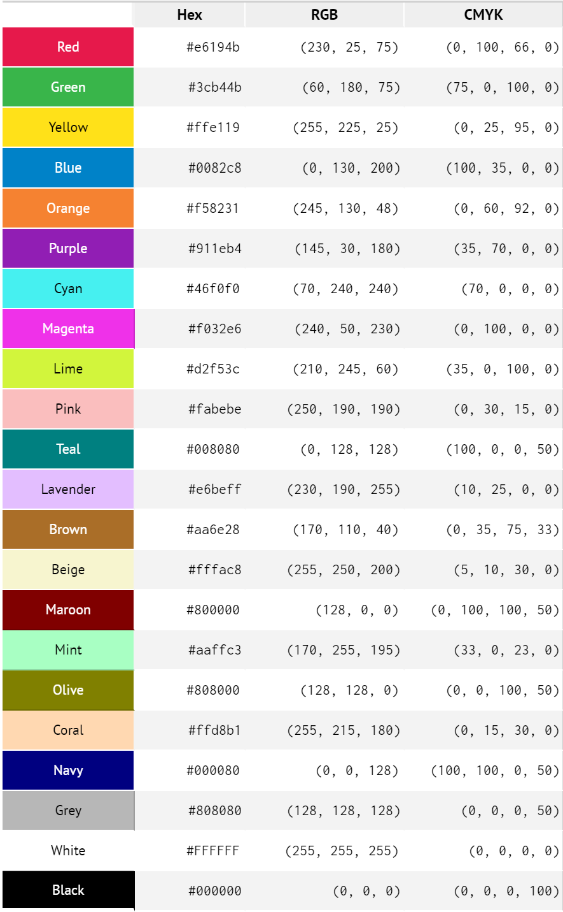

# 20种不同的颜色值

|          | Hex     | RGB             | CMYK              |
|----------|---------|-----------------|-------------------|
| Red      | #e6194b | (230, 25, 75)   | (0, 100, 66, 0)   |
| Green    | #3cb44b | (60, 180, 75)   | (75, 0, 100, 0)   |
| Yellow   | #ffe119 | (255, 225, 25)  | (0, 25, 95, 0)    |
| Blue     | #0082c8 | (0, 130, 200)   | (100, 35, 0, 0)   |
| Orange   | #f58231 | (245, 130, 48)  | (0, 60, 92, 0)    |
| Purple   | #911eb4 | (145, 30, 180)  | (35, 70, 0, 0)    |
| Cyan     | #46f0f0 | (70, 240, 240)  | (70, 0, 0, 0)     |
| Magenta  | #f032e6 | (240, 50, 230)  | (0, 100, 0, 0)    |
| Lime     | #d2f53c | (210, 245, 60)  | (35, 0, 100, 0)   |
| Pink     | #fabebe | (250, 190, 190) | (0, 30, 15, 0)    |
| Teal     | #008080 | (0, 128, 128)   | (100, 0, 0, 50)   |
| Lavender | #e6beff | (230, 190, 255) | (10, 25, 0, 0)    |
| Brown    | #aa6e28 | (170, 110, 40)  | (0, 35, 75, 33)   |
| Beige    | #fffac8 | (255, 250, 200) | (5, 10, 30, 0)    |
| Maroon   | #800000 | (128, 0, 0)     | (0, 100, 100, 50) |
| Mint     | #aaffc3 | (170, 255, 195) | (33, 0, 23, 0)    |
| Olive    | #808000 | (128, 128, 0)   | (0, 0, 100, 50)   |
| Coral    | #ffd8b1 | (255, 215, 180) | (0, 15, 30, 0)    |
| Navy     | #000080 | (0, 0, 128)     | (100, 100, 0, 50) |
| Grey     | #808080 | (128, 128, 128) | (0, 0, 0, 50)     |
| White    | #FFFFFF | (255, 255, 255) | (0, 0, 0, 0)      |
| Black    | #000000 | (0, 0, 0)       | (0, 0, 0, 100)    |

## 参考

* [List of 20 Simple, Distinct Colors – Sasha Trubetskoy](https://sashat.me/2017/01/11/list-of-20-simple-distinct-colors/)