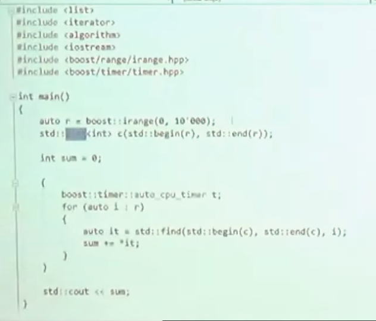

# High performance data structures in boost - Boris Schäling - Meeting C++ 2018

**要存储你的元素总是使用`vector`**

使用 替换为 vector 更快

前者(list)执行的代码数反而更少, 但是后者花费的时间更多, 这是因为cache的作用

同样, 换成set也一样, vector 更快

使用`flat_set`, 速度再次下降和vector相近, `flat_set` 使用 vector 实现, 数据有序, 但和set一样的接口, 同时相同的时间复杂度

当读取数据的时候, 不仅仅我们当前访问的点会被传入cache, 而是更多一点, 称为 cache line
如此, 在迭代读取数据的时候, 当操作完一个数, 下一个数已经在cache中了

base_collection, 对于大小不同的父类和子类, 可以直接插入

function_collection

any_collection 有任意相同的接口(不需要元素在相同的继承结构结构里面, 只需要有某个特定的接口, 这个接口通过boost type_erasure指定)即可保存到同一个容器里面

但, 因为某些原因, 比如希望迭代器能够保持无论是在插入, 删除的操作之后, 一个可替代的结构是 `boost:intrusive::list`

使用这个`list`的时候需要给被存储的类添加一个`hook`(继承`boost:intrusive::list_base_hook`), 因为, 这个`list`在`push_back`操作的时候不会发生复制, 因而, 需要某个指针去串联`list`的元素, 因此添加一个`hook`, 就是那个类

然后, 需要自己对这些对象的内存进行管理, 比如, 都放到一个`vector`里面(滑稽.jpg)

---

参考:

[High performance data structures in boost - Boris Schäling - Meeting C++ 2018]

[High performance data structures in boost - Boris Schäling - Meeting C++ 2018]: https://www.youtube.com/watch?v=VRtX1qjaa2M&t=2181s
