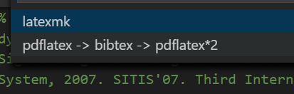

# IEEE bibtex 使用

* 需要下载 IEEE 的模板 , 包含`.bst`文件

* `bibi.bib` 文件内容:

    ```latex
    @misc{UCRArchive,
    title={The UCR Time Series Classification Archive},
    author={Chen, Yanping and Keogh, Eamonn and Hu, Bing and Begum, Nurjahan and Bagnall, Anthony and Mueen, Abdullah and Batista, Gustavo},
    year={2015},
    month={July},
    note = {\url{www.cs.ucr.edu/~eamonn/time_series_data/}}
    }
    ```

* latex 文件内引用:

    ```latex
    \bibliographystyle{IEEEtran}
    \bibliography{bibi}
    ```

* 编译:依次执行以下命令(vscode插件)

    ```
    pdflatex
    bibtex
    pdflatex
    pdflatex
    ```
    

## 参考

[CTAN: Package IEEEtran](https://ctan.org/pkg/ieeetran)
[Michael Shell: The IEEEtran BibTeX Style](http://www.michaelshell.org/tex/ieeetran/bibtex/)