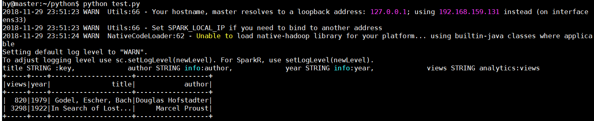

# 使用 Spark sql 访问 hbase

## hbase-connector 解决办法

1. 配置: hbase2.1.1, spark2.4.0, 安装在同一个机器上

2. spark 环境变量 添加 habse 和 hbase-spark-connector 的 jar 包
    ```bash
    # spark/conf/spark-env.sh
    export SPARK_DIST_CLASSPATH=$(/home/hy/hbase-2.1.1/bin/hbase classpath):/home/hy/hbase-connectors/spark/hbase-spark/target/hbase-spark-1.0.0-SNAPSHOT.jar:/home/hy/hbase-2.1.1/lib/*
    ```

3. 数据准备
    ```sql
    create 'books', 'info', 'analytics'
    put 'books', 'In Search of Lost Time', 'info:author', 'Marcel Proust'
    put 'books', 'In Search of Lost Time', 'info:year', '1922'
    put 'books', 'In Search of Lost Time', 'analytics:views', '3298'
    put 'books', 'Godel, Escher, Bach', 'info:author', 'Douglas Hofstadter'
    put 'books', 'Godel, Escher, Bach', 'info:year', '1979'
    put 'books', 'Godel, Escher, Bach', 'analytics:views', '820'
    ```

4. 代码: `test.py`
    ```python
    # -*- coding:utf-8 -*-
    from pyspark import SparkContext, SparkConf
    from pyspark.sql import SQLContext

    appName = 'test0'
    master = 'local'
    conf = SparkConf().setAppName(appName).setMaster(master)
    sc = SparkContext(conf=conf)
    sqlc = SQLContext(sc)

    df = sqlc.read.format('org.apache.hadoop.hbase.spark') \
    .option('hbase.table','books') \
    .option('hbase.columns.mapping', \
            'title STRING :key, \
            author STRING info:author, \
            year STRING info:year, \
            views STRING analytics:views') \
    .option('hbase.spark.use.hbasecontext', False) \
    .load()

    df.show()
    ```

5. 执行: `python test.py`
    ```bash
    +-----+----+--------------------+------------------+
    |views|year|               title|            author|
    +-----+----+--------------------+------------------+
    |  820|1979| Godel, Escher, Bach|Douglas Hofstadter|
    | 3298|1922|In Search of Lost...|     Marcel Proust|
    +-----+----+--------------------+------------------+
    ```

    

6. 写操作:
    ```python
    # 写入, 更新直接写即可
    # df=sc.parallelize([('title1', 'author1'), ('b', 'authorb')]).toDF(schema=['title', 'author'])
    df=sc.parallelize([ Row(title='title1', author='author1'), Row(title='b', author='authorb')]).toDF()
    df.write.format('org.apache.hadoop.hbase.spark') \
        .option('hbase.table','books') \
        .option('hbase.columns.mapping', \
                'title STRING :key, \
                author STRING info:author') \
        .option('hbase.spark.use.hbasecontext', False) \
        .save()
    ```

---

## 探索过程

启动 habse

```bash
hbase/bin/start-hbase.sh
```

hbase 数据准备:

```sql
create 'books', 'info', 'analytics'
put 'books', 'In Search of Lost Time', 'info:author', 'Marcel Proust'
put 'books', 'In Search of Lost Time', 'info:year', '1922'
put 'books', 'In Search of Lost Time', 'analytics:views', '3298'
put 'books', 'Godel, Escher, Bach', 'info:author', 'Douglas Hofstadter'
put 'books', 'Godel, Escher, Bach', 'info:year', '1979'
put 'books', 'Godel, Escher, Bach', 'analytics:views', '820'
```

---

python 代码如下:
(参考[DIOGO][1]修改得到, 这个还不能直接运行)

```python
# test.py
# -*- coding:utf-8 -*-
from pyspark import SparkContext, SparkConf
from pyspark.sql import SQLContext

appName = 'test0'
master = 'local'
conf = SparkConf().setAppName(appName).setMaster(master)
sc = SparkContext(conf=conf)
sqlc = SQLContext(sc)

df = sqlc.read.format('org.apache.hadoop.hbase.spark') \
    .option('hbase.table','books') \
    .option('hbase.columns.mapping', \
            'title STRING :key, \
            author STRING info:author, \
            year STRING info:year, \
            views STRING analytics:views') \
    .option('hbase.use.hbase.context', False) \
    .option('hbase.config.resources', 'file:///home/hy/hbase-2.1.1/conf/hbase-site.xml') \
    .option('hbase-push.down.column.filter', False) \
    .load()
df.show()
```

---

执行 `python test.py`, 提示 `ClassNotFoundException:org.apache.hadoop.hbase.spark`

```java
py4j.protocol.Py4JJavaError: An error occurred while calling o31.load.
: java.lang.ClassNotFoundException: Failed to find data source: org.apache.hadoop.hbase.spark. Please find packages at http://spark.apache.org/third-party-projects.html
        at org.apache.spark.sql.execution.datasources.DataSource$.lookupDataSource(DataSource.scala:657)
```

这是因为缺少 `hbase-connectors` 的 jar 包:

```bash
git clone https://github.com/apache/hbase-connectors
cd hbase-connectors/spark
mvn clean install
```

得到:

```bahse
/home/hy/hbase-connectors/spark/hbase-spark/target/hbase-spark-1.0.0-SNAPSHOT.jar
```

添加该jar包到 spark 的环境变量: `spark/conf/spark-env.sh` `SPARK_DIST_CLASSPATH`

```bash
export SPARK_DIST_CLASSPATH=/home/hy/hbase-connectors/spark/hbase-spark/target/hbase-spark-1.0.0-SNAPSHOT.jar
```

---

再次执行: `python test.py`

提示以下错误: `NoClassDefFoundError:org.apache.hadoop.hbase.spark.DefaultSource.createRelation`

```java
py4j.protocol.Py4JJavaError: An error occurred while calling o31.load.
: java.lang.NoClassDefFoundError: org/apache/hadoop/hbase/client/TableDescriptor
        at org.apache.hadoop.hbase.spark.DefaultSource.createRelation(DefaultSource.scala:69)
```

这是因为还有 habse 的包没添加
(`hbase-connector`的包已经添加成功了, 但是这个包里面的类有些函数不存在, 这些在 hbase 那):

继续添加 hbase 的 jar 包:

```bash
export SPARK_DIST_CLASSPATH=$(/home/hy/hbase-2.1.1/bin/hbase classpath):/home/hy/hbase-connectors/spark/hbase-spark/target/hbase-spark-1.0.0-SNAPSHOT.jar:/home/hy/hbase-2.1.1/lib/*
```

---

执行: `python test.py`, 提示以下错误:

```java
py4j.protocol.Py4JJavaError: An error occurred while calling o31.load.
: java.lang.NoSuchMethodError: org.json4s.jackson.JsonMethods$.parse(Lorg/json4s/JsonInput;Z)Lorg/json4s/JsonAST$JValue;
        at org.apache.hadoop.hbase.spark.datasources.HBaseTableCatalog$.apply(HBaseTableCatalog.scala:246)
```

在 `hbase-connector` 内查找出错的代码
[`org.apache.hadoop.hbase.spark.datasources.HBaseTableCatalog$.apply(HBaseTableCatalog.scala:246)`][3] :

```scala
val map = parse(jString).values.asInstanceOf[Map[String, _]]
```

百度后说是 `json4s` 的版本问题

查找证据:
在 [hbase-connectors/spark/pom.xml][4] 中, 版本为

```xml
<!-- The following version is in sync with Spark's choice
        Please take caution when this version is modified -->
<json4s.version>3.2.11</json4s.version>
```

在 [spark/pom.xml][5]中, 版本为:

```xml
<dependency>
    <groupId>org.json4s</groupId>
    <artifactId>json4s-jackson_${scala.binary.version}</artifactId>
    <version>3.5.3</version>
</dependency>
```

因此, 此时的 spark 和 habse-connector 内的 json4s 的版本的确不一样.

验证: 直接修改 [habse-connector][6] 与 spark一致, 重新进行编译

```xml
<!-- hbase-connectors/spark/pom.xml -->
<json4s.version>3.5.3</json4s.version>
```

---

再次执行 `python test.py`, 提示 `NullPointerException`

```java
py4j.protocol.Py4JJavaError: An error occurred while calling o31.load.
: java.lang.NullPointerException
        at org.apache.hadoop.hbase.spark.HBaseRelation.<init>(DefaultSource.scala:138)
```

出错语句为[DefaultSource.scala:138][7]:

```scala
val wrappedConf = new SerializableConfiguration(hbaseContext.config)
```

因此, 原因为 `hbaseContext` 为 `null`.

在文件内找 [`hbaseContext`][8] 定义:

```scala
val hbaseContext:HBaseContext = if (useHBaseContext) {
    LatestHBaseContextCache.latest
  } else {
    val config = HBaseConfiguration.create()
    configResources.map(resource => resource.split(",").foreach(r => config.addResource(r)))
    new HBaseContext(sqlContext.sparkContext, config)
  }
```

此时应该 `useHBaseContext` 为 `true`,

继续找 [`LatestHBaseContextCache`的使用][9] 和 [定义][10]:

```scala
class HBaseContext(@transient val sc: SparkContext,
                   @transient val config: Configuration,
                   val tmpHdfsConfgFile: String = null)
  extends Serializable with Logging {
      ...
  LatestHBaseContextCache.latest = this
  }
...
object LatestHBaseContextCache {
  var latest:HBaseContext = null
}
```

因此可以得到结论, 由于我们在python代码里面从未执行过 `new HBaseContext` 之类的操作, 导致 `LatestHBaseContextCache` 为初始值 `null`

---

根据上述分析, 只需要我们在代码中执行一次 `new HBaseContext` 即可解决为题. 在 scala 或 java 中可轻易解决
(这也是为什么[文档里面][11]代码会有`val hbaseContext = new HBaseContext(sc, config)`而却未被使用过).

但在 python 里面存在困难( 借助 `py4j` 应该也是可以实现的)

因此, 考虑回之前出现的条件判断语句中的 `useHBaseContext` 条件, 若它为 `false`, 那么就可以得到一个默认的 `HBaseContext`, 找到[其定义][13]:

```scala
val useHBaseContext =  parameters.get(HBaseSparkConf.USE_HBASECONTEXT).map(_.toBoolean).getOrElse(HBaseSparkConf.DEFAULT_USE_HBASECONTEXT)
```

同时, 这一段代码和 python 里面的代码有点相似, 也许有关联, `USE_HBASECONTEXT` 应该就是通过这行代码从python传递参数给scala的函数:

```python
.option('hbase.use.hbase.context', False) \
```

---

此处, `useHBaseContext`应该是传递为 `False` 了, 似乎没有问题, 继续查看 `HBaseSparkConf.USE_HBASECONTEXT`, 发现[定义][14]是:

```scala
val USE_HBASECONTEXT = "hbase.spark.use.hbasecontext"
```

而我们的代码是 `hbase.use.hbase.context`, 因此出错.

然后在 [`HBaseSparkConf.scala`][15] 中并没有发现 `hbase.config.resources`, 直接去掉(应该是`hbase.spark.config.location`, 这个猜测是 hbase 和 spark 在不同集群下才需要做的事情, 我们单机就忽略看看)

```scala
/**
 * HBaseSparkConf.scala
 * This is the hbase configuration. User can either set them in SparkConf, which
 * will take effect globally, or configure it per table, which will overwrite the value
 * set in SparkConf. If not set, the default value will take effect.
 */
@InterfaceAudience.Public
object HBaseSparkConf{
  /** Set to false to disable server-side caching of blocks for this scan,
   *  false by default, since full table scans generate too much BC churn.
   */
  val QUERY_CACHEBLOCKS = "hbase.spark.query.cacheblocks"
  val DEFAULT_QUERY_CACHEBLOCKS = false
  /** The number of rows for caching that will be passed to scan. */
  val QUERY_CACHEDROWS = "hbase.spark.query.cachedrows"
  /** Set the maximum number of values to return for each call to next() in scan. */
  val QUERY_BATCHSIZE = "hbase.spark.query.batchsize"
  /** The number of BulkGets send to HBase. */
  val BULKGET_SIZE = "hbase.spark.bulkget.size"
  val DEFAULT_BULKGET_SIZE = 1000
  /** Set to specify the location of hbase configuration file. */
  val HBASE_CONFIG_LOCATION = "hbase.spark.config.location"
  /** Set to specify whether create or use latest cached HBaseContext*/
  val USE_HBASECONTEXT = "hbase.spark.use.hbasecontext"
  val DEFAULT_USE_HBASECONTEXT = true
  /** Pushdown the filter to data source engine to increase the performance of queries. */
  val PUSHDOWN_COLUMN_FILTER = "hbase.spark.pushdown.columnfilter"
  val DEFAULT_PUSHDOWN_COLUMN_FILTER= true
  /** Class name of the encoder, which encode data types from Spark to HBase bytes. */
  val QUERY_ENCODER = "hbase.spark.query.encoder"
  val DEFAULT_QUERY_ENCODER = classOf[NaiveEncoder].getCanonicalName
  /** The timestamp used to filter columns with a specific timestamp. */
  val TIMESTAMP = "hbase.spark.query.timestamp"
  /** The starting timestamp used to filter columns with a specific range of versions. */
  val TIMERANGE_START = "hbase.spark.query.timerange.start"
  /** The ending timestamp used to filter columns with a specific range of versions. */
  val TIMERANGE_END =  "hbase.spark.query.timerange.end"
  /** The maximum number of version to return. */
  val MAX_VERSIONS = "hbase.spark.query.maxVersions"
  /** Delayed time to close hbase-spark connection when no reference to this connection, in milliseconds. */
  val DEFAULT_CONNECTION_CLOSE_DELAY = 10 * 60 * 1000
}
```

最终更改成:

```python
# test.py
# ...
df = sqlc.read.format('org.apache.hadoop.hbase.spark') \
    .option('hbase.table','books') \
    .option('hbase.columns.mapping', \
            'title STRING :key, \
            author STRING info:author, \
            year STRING info:year, \
            views STRING analytics:views') \
    .option('hbase.spark.use.hbasecontext', False) \
    .load()
```

再次执行 `python test.py`, 成功得到结果:
```bash
+-----+----+--------------------+------------------+
|views|year|               title|            author|
+-----+----+--------------------+------------------+
|  820|1979| Godel, Escher, Bach|Douglas Hofstadter|
| 3298|1922|In Search of Lost...|     Marcel Proust|
+-----+----+--------------------+------------------+
```


---

后续: 关于那个 `map` 的配置, 也就是 spark dataframe 的列 和 hbase 的列对应的方式, 应该还可以通过定义 `catalog` 这种方式传参, 这样就和 hbase 的文档的写一致(文档的代码是scala的)

```scala
catalog = ''.join("""{
       "table":"{"namespace":"default", "name":"books"}",
       "rowkey":"key",
       "columns":{
         "title":{"cf":"rowkey", "col":"key", "type":"string"},
         "author":{"cf":"info", "col":"author", "type":"string"},
         "year":{"cf":"info", "col":"b", "year":"string"},
         "views":{"cf":"analytics", "col":"views", "type":"string"}
       }
     }
}""".split())

df = sqlc.read\
.options(catalog=catalog)\
.option('hbase.spark.use.hbasecontext', False) \
.format('org.apache.hadoop.hbase.spark')\
.load()
```

但是报错 `None.get`:

```scala
py4j.protocol.Py4JJavaError: An error occurred while calling o30.load.
: java.util.NoSuchElementException: None.get
        at scala.None$.get(Option.scala:347)
        at scala.None$.get(Option.scala:345)
        at org.apache.hadoop.hbase.spark.datasources.HBaseTableCatalog$.apply(HBaseTableCatalog.scala:250)
```

可以把 `org.apache.hadoop.hbase.spark` 替换成 `shc` 的 `org.apache.spark.sql.execution.datasources.hbase` (shc的代码)

或者通过在 `apply` 内加 `println` 的方式观察传递的值, 以具体的方式

```scala
def apply(params: Map[String, String]): HBaseTableCatalog = {
    ...
    println(jString)
    ...
}
```

但此两种方法没有继续深究下去...

---

## 参考

- [Interacting With HBase from PySpark][1]

- [Difference between shc and hbase-spark connector in HBase codebase · Issue #220 · hortonworks-spark/shc][2]

- [hbase/spark.adoc at master · apache/hbase][11]

- [Apache HBase ™ Reference Guide][12]

- [hortonworks-spark/shc: The Apache Spark - Apache HBase Connector is a library to support Spark accessing HBase table as external data source or sink.][16]

- [apache/hbase-connectors: Apache HBase Connectors][17]

- [How to connect HBase and Spark using Python? - Stack Overflow][18]

- [使用SparkSQL/DataFrame读取HBase表 - strongyoung的专栏 - CSDN博客][19]

- [Use Spark to read and write HBase data - Azure HDInsight | Microsoft Docs][20]

[1]: https://diogoalexandrefranco.github.io/interacting-with-hbase-from-pyspark/

[2]: https://github.com/hortonworks-spark/shc/issues/220

[3]: https://github.com/apache/hbase-connectors/blob/825f8abaaa0fed7c1c428cd712f4d1efdbe3b59b/spark/hbase-spark/src/main/scala/org/apache/hadoop/hbase/spark/datasources/HBaseTableCatalog.scala#L246

[4]: https://github.com/apache/hbase-connectors/blob/5be8a098d7e1b11e65bcc8669a5dcb181d6089be/spark/pom.xml#L49

[5]: https://github.com/apache/spark/blob/15c038497791e7735898356db2464b8732695365/pom.xml#L714

[6]: https://github.com/285571052/hbase-connectors/commit/635a1d4f742120ad92dd058cb6c1889e1f3196ed#diff-4ce8d865f6ee3c2eea04aa4e650c38b9

[7]: https://github.com/apache/hbase-connectors/blob/825f8abaaa0fed7c1c428cd712f4d1efdbe3b59b/spark/hbase-spark/src/main/scala/org/apache/hadoop/hbase/spark/DefaultSource.scala#L138

[8]: https://github.com/apache/hbase-connectors/blob/825f8abaaa0fed7c1c428cd712f4d1efdbe3b59b/spark/hbase-spark/src/main/scala/org/apache/hadoop/hbase/spark/DefaultSource.scala#L130

[9]: https://github.com/apache/hbase-connectors/blob/825f8abaaa0fed7c1c428cd712f4d1efdbe3b59b/spark/hbase-spark/src/main/scala/org/apache/hadoop/hbase/spark/HBaseContext.scala#L76

[10]: https://github.com/apache/hbase-connectors/blob/825f8abaaa0fed7c1c428cd712f4d1efdbe3b59b/spark/hbase-spark/src/main/scala/org/apache/hadoop/hbase/spark/HBaseContext.scala#L1123

[11]: https://github.com/apache/hbase/blob/8e0571a3a412d8fdeb8de4581aa251116602caf5/src/main/asciidoc/_chapters/spark.adoc

[12]: https://hbase.apache.org/book.html#_sparksql_dataframes

[13]: https://github.com/apache/hbase-connectors/blob/825f8abaaa0fed7c1c428cd712f4d1efdbe3b59b/spark/hbase-spark/src/main/scala/org/apache/hadoop/hbase/spark/DefaultSource.scala#L108

[14]: https://github.com/apache/hbase-connectors/blob/825f8abaaa0fed7c1c428cd712f4d1efdbe3b59b/spark/hbase-spark/src/main/scala/org/apache/hadoop/hbase/spark/datasources/HBaseSparkConf.scala#L44

[15]: https://github.com/apache/hbase-connectors/blob/825f8abaaa0fed7c1c428cd712f4d1efdbe3b59b/spark/hbase-spark/src/main/scala/org/apache/hadoop/hbase/spark/datasources/HBaseSparkConf.scala#L27

[16]: https://github.com/hortonworks-spark/shc

[17]: https://github.com/apache/hbase-connectors

[18]: https://stackoverflow.com/questions/38470114/how-to-connect-hbase-and-spark-using-python

[19]: https://blog.csdn.net/strongyoung88/article/details/52197522

[20]: https://docs.microsoft.com/en-us/azure/hdinsight/hdinsight-using-spark-query-hbase
