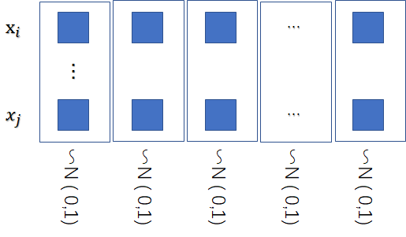
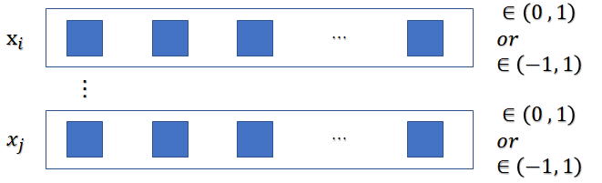

# Standardization,Normalization,Feature binarization

## 两种归一化方式

1. Standardization: 在属性维度上对所有样本的每个属性分别归一化

    某些算法对于每个属性满足N（0，1）的数据有效 ， 或者N(0，1)是算法的基本假设 ， 比如PCA

    

2. Normalization: 是在样本维度上，对每个样本的所有属性进行归一化

    对样本单独进行，在计算一些距离度量的kernel等有增益（感觉是防止计算出来的距离差距过大导致的大数吃小数的问题，之前跑代码遇到过计算dtw kernel出现inf的情况）

    归一化虽然有些值会被处理成 0 ，但是整个样本的浮动模式应该是不受影响的，也就是样本的特征依然被保留下来

    

**Standardization** of datasets is a common requirement for many machine learning estimators implemented in scikit-learn; they might behave badly if the individual features do not more or less look like standard normally distributed data: Gaussian with zero mean and unit variance.

**Normalization** is the process of scaling individual samples to have unit norm. This process can be useful if you plan to use a quadratic form such as the dot-product or any other kernel to quantify the similarity of any pair of samples.

Feature **binarization** is the process of thresholding numerical features to get boolean values. This can be useful for downstream probabilistic estimators that make assumption that the input data is distributed according to a multi-variate Bernoulli distribution. For instance, this is the case for the sklearn.neural_network.BernoulliRBM.

## 两种归一化算法

从(xmin ,xmax)归一化到(ymin,ymax)

1. mapminmax : y = (ymax-ymin)*(x-xmin)/(xmax-xmin) + ymin;
2. mapstd :  y = (x-xmean)*(ystd/xstd) + ymean;

## 参考

[4.3. Preprocessing data — scikit-learn 0.19.1 documentation](http://scikit-learn.org/stable/modules/preprocessing.html)

[matlab - mapminmax](https://cn.mathworks.com/help/nnet/ref/mapminmax.html)

[matlab - mapstd](https://cn.mathworks.com/help/nnet/ref/mapstd.html)