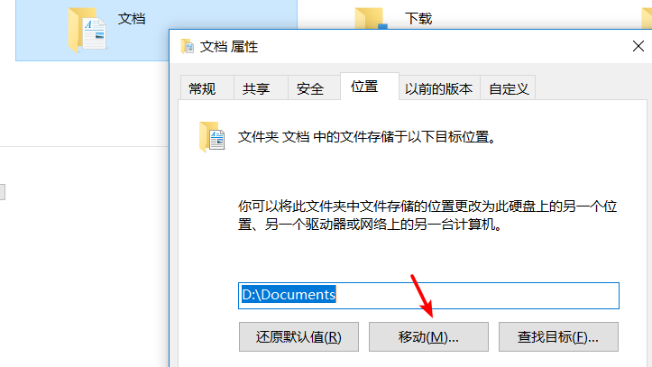

# Win10资源管理器侧边栏改动

## 移动库文件夹

右键->属性->位置->移动

## 删除侧边栏

- 3D对象

找到 `HKEY_LOCAL_MACHINE\SOFTWARE\Microsoft\Windows\CurrentVersion\Explorer\MyComputer\NameSpace` 和 `HKEY_LOCAL_MACHINE\SOFTWARE\Wow6432Node\Microsoft\Windows\CurrentVersion\Explorer\MyComputer\NameSpace`
删除`{0DB7E03F-FC29-4DC6-9020-FF41B59E513A}`

## 隐藏 OneDrive

1. 找到 `HKEY_CLASSES_ROOT\CLSID\{018D5C66-4533-4307-9B53-224DE2ED1FE6}`，将`System.IsPinnedToNameSpaceTree`的值改为`0`。

2. 如果是64位系统，把`HKEY_CLASSES_ROOT\Wow6432Node\CLSID\{018D5C66-4533-4307-9B53-224DE2ED1FE6`中`System.IsPinnedToNameSpaceTree`的值改为`0`。

## 参考

- [Win10 资源管理器导航栏设置：显示库，删除6个文件夹和隐藏Onedrive - 简书](https://www.jianshu.com/p/a13f63073d53)
- [[Tip] Remove Extra Folders from Windows 10 Explorer "This PC" - AskVG](https://www.askvg.com/tip-remove-6-extra-folders-from-windows-10-explorer-this-pc/)