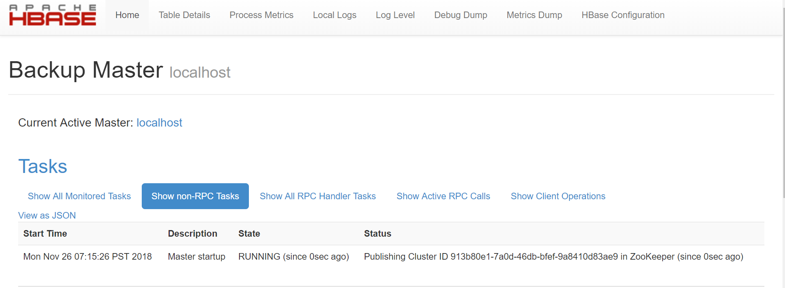

# hbase

## 单机版

1. 下载[安装包](http://mirrors.shu.edu.cn/apache/hbase/)[hbase-2.1.1-bin.tar.gz](http://mirrors.shu.edu.cn/apache/hbase/2.1.1/hbase-2.1.1-bin.tar.gz)

2. 解压
    ```bash
    tar xfz hbase-2.1.1-bin.tar.gz
    ```

3. 修改配置文件 `conf/hbase-site.xml`
    ```xml
    <?xml version="1.0"?>
    <?xml-stylesheet type="text/xsl" href="configuration.xsl"?>
    <configuration>
    <property>
        <name>hbase.rootdir</name>
        <value>file:///home/hy/hbase-2.1.1/data</value>
    </property>
    <property>
        <name>hbase.master.info.port</name>
        <value>60010</value>
    </property>
    </configuration>
    ```
    配置`hbase.rootdir`, 来选择HBase将数据写到哪个目录, 默认为 `/tmp/hbase-${user.name}` 重启后会丢失

4. 配置java环境, `vi ./conf/hbase-env.sh`
    ```bash
    export JAVA_HOME=/usr/lib/jvm/java-8-openjdk-amd64
    ```

5. 启动 hbase
    ```bash
    ./bin/start-hbase.sh
    ./bin/stop-hbase.sh
    ```

6. 访问 Web UI `http://192.168.159.131:60010`
    

7. 启动shell
    ```bash
     ./bin/hbase shell
    ```

8. 尝试 shell 操作 habse
    ```bash
    create 'test', 'cf'
    put 'test', 'row1', 'cf:a', 'value1'
    put 'test', 'row2', 'cf:b', 'value2'
    scan 'test'
    get 'test', 'row1'
    disable 'test'
    drop 'test'
    exit
    ```
    创建名为 `test` 的表, 只有一个列族 `cf`
    添加第一行: `key` 为 `row1` , 列为 `cf:a`， 值是 `value1`
