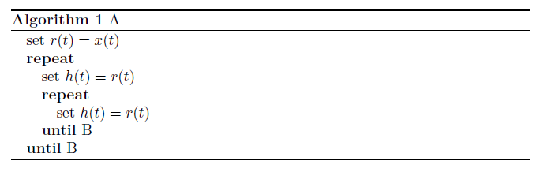

# latex Algorithm 环境

```latex
\usepackage{algorithm}
\usepackage{algorithmic}
\begin{algorithm}  
    \caption{A}  
    \label{alg:A}  
    \begin{algorithmic}  
        \STATE {set $r(t)=x(t)$}   
        \REPEAT   
        \STATE set $h(t)=r(t)$   
        \REPEAT  
        \STATE set $h(t)=r(t)$   
        \UNTIL{B}   
        \UNTIL{B}  
    \end{algorithmic}  
\end{algorithm}  
```



## 参考

[LaTeX算法排版例子 - CSDN博客](https://blog.csdn.net/lqhbupt/article/details/8723478)
[LaTeX/Algorithms - Wikibooks, open books for an open world](https://en.wikibooks.org/wiki/LaTeX/Algorithms)