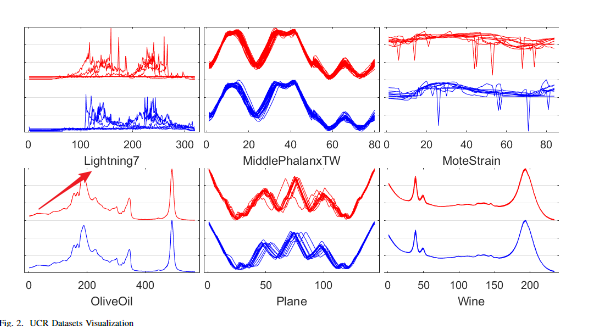
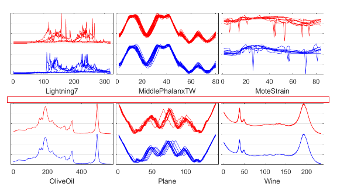

# latex 图片子图间添加间隔

给`\includegraphics`之间的两个图片添加空白间隔:使用`makebox`

```LaTeX
\begin{figure*}[!htbp]
    ...
	\includegraphics[width = 0.3 \textwidth]{assets/AGDTW/1_09.png}
	\noindent\makebox[\textwidth]{}
	\includegraphics[width = 0.3 \textwidth]{assets/AGDTW/1_23.png}
    ...
\end{figure*}
```

* 没加 `makebox`
    

* 加了 `makebox`
    

## 参考

[floats - Custom margin settings for figure in LaTeX - TeX - LaTeX Stack Exchange](https://tex.stackexchange.com/a/57706)