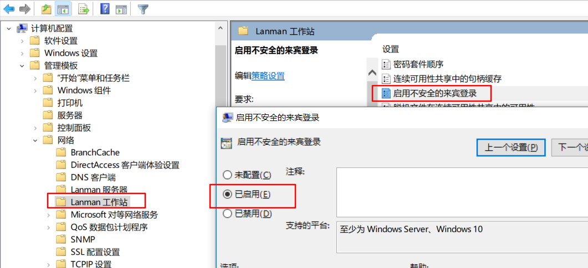
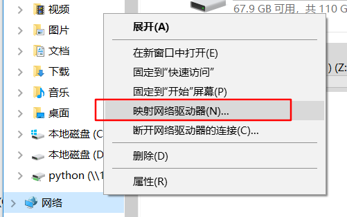

# samba 同步文件夹

1. ubuntu: 安装 `samba`
    ```bash
    sudo apt-get install samba
    ```

2. ubuntu: 配置文件
    ```bash
    sudo cp  /etc/samba/smb.conf  /etc/samba/smb.conf.bak
    sudo echo "[python]
    path = /home/hy/python
    writeable = yes
    browseable = yes
    guest ok = yes" >> /etc/samba/smb.conf
    ```
    <!-- sudo /etc/init.d/samba restart -->

3. windows: 右键开始菜单->运行->`gpedit.msc`->计算机配置-管理模板-网络-lanman工作站-启用不安全的来宾登陆
    

4. windows: 我的电脑->右键:网络->映射网络驱动器->`\\192.168.159.131\python`
    
