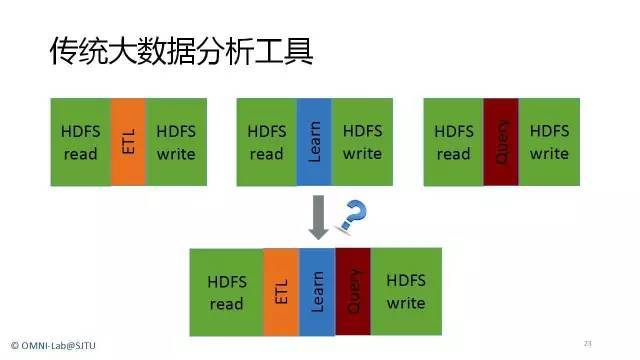
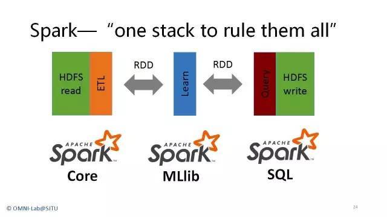
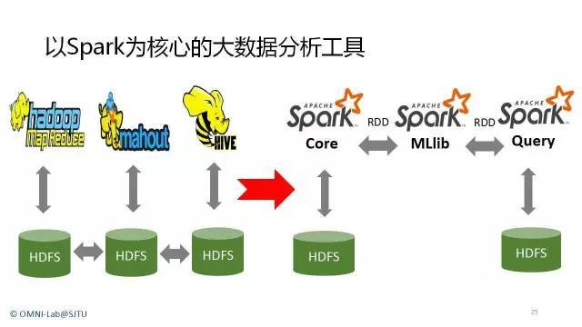
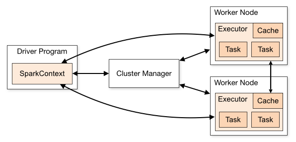
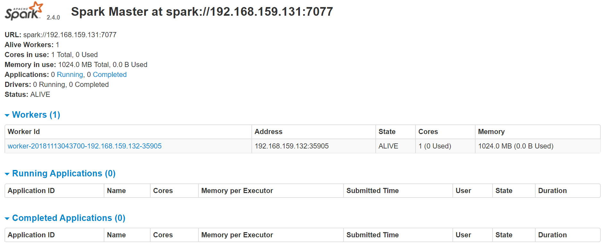
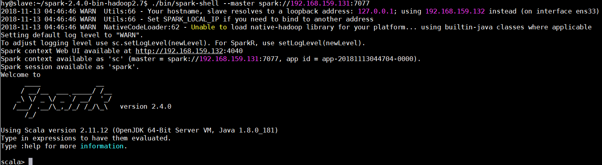
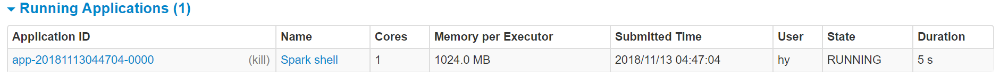

# spark

Spark具有如下几个主要特点：

- 运行速度快：Spark使用先进的DAG（Directed Acyclic Graph，有向无环图）执行引擎，以支持循环数据流与内存计算，基于内存的执行速度可比Hadoop MapReduce快上百倍，基于磁盘的执行速度也能快十倍；
- 容易使用：Spark支持使用Scala、Java、Python和R语言进行编程，简洁的API设计有助于用户轻松构建并行程序，并且可以通过Spark Shell进行交互式编程；
- 通用性：Spark提供了完整而强大的技术栈，包括SQL查询、流式计算、机器学习和图算法组件，这些组件可以无缝整合在同一个应用中，足以应对复杂的计算；
- 运行模式多样：Spark可运行于独立的集群模式中，或者运行于Hadoop中，也可运行于Amazon EC2等云环境中，并且可以访问HDFS、Cassandra、HBase、Hive等多种数据源。

---

Spark相对于Hadoop的优势:
Hadoop虽然已成为大数据技术的事实标准，但其本身还存在诸多缺陷，最主要的缺陷是其MapReduce计算模型延迟过高，无法胜任实时、快速计算的需求，因而只适用于离线批处理的应用场景。

回顾Hadoop的工作流程，可以发现Hadoop存在如下一些缺点：

- 表达能力有限。计算都必须要转化成Map和Reduce两个操作，但这并不适合所有的情况，难以描述复杂的数据处理过程；
- 磁盘IO开销大。每次执行时都需要从磁盘读取数据，并且在计算完成后需要将中间结果写入到磁盘中，IO开销较大；
- 延迟高。一次计算可能需要分解成一系列按顺序执行的MapReduce任务，任务之间的衔接由于涉及到IO开销，会产生较高延迟。而且，在前一个任务执行完成之前，其他任务无法开始，难以胜任复杂、多阶段的计算任务。

Spark在借鉴Hadoop MapReduce优点的同时，很好地解决了MapReduce所面临的问题。相比于MapReduce，Spark主要具有如下优点：

- Spark的计算模式也属于MapReduce，但不局限于Map和Reduce操作，还提供了种数据集操作类型，编程模型比MapReduce更灵活；
- Spark提供了内存计算，中间结果直接放到内存中，带来了更高的迭代运算效率；
- Spark基于DAG的任务调度执行机制，要优于MapReduce的迭代执行机制。

Spark最大的特点就是将计算数据、中间结果都存储在内存中，大大减少了IO开销，因而，Spark更适合于迭代运算比较多的数据挖掘与机器学习运算。

Spark并不能完全替代Hadoop，主要用于替代Hadoop中的MapReduce计算模型。实际上，Spark已经很好地融入了Hadoop生态圈，并成为其中的重要一员，它可以借助于YARN实现资源调度管理，借助于HDFS实现分布式存储。

此外，Hadoop可以使用廉价的、异构的机器来做分布式存储与计算，但是，Spark对硬件的要求稍高一些，对内存与CPU有一定的要求。

---

为什么 Spark?






在实际应用中，大数据处理主要包括以下三个类型：

- 复杂的批量数据处理：时间跨度通常在数十分钟到数小时之间；
- 基于历史数据的交互式查询：时间跨度通常在数十秒到数分钟之间；
- 基于实时数据流的数据处理：时间跨度通常在数百毫秒到数秒之间。

目前已有很多相对成熟的开源软件用于处理以上三种情景，比如，可以利用Hadoop MapReduce来进行批量数据处理，可以用Impala来进行交互式查询（Impala与Hive相似，但底层引擎不同，提供了实时交互式SQL查询），对于流式数据处理可以采用开源流计算框架Storm。一些企业可能只会涉及其中部分应用场景，只需部署相应软件即可满足业务需求，但是，对于互联网公司而言，通常会同时存在以上三种场景，就需要同时部署三种不同的软件，这样做难免会带来一些问题：

- 不同场景之间输入输出数据无法做到无缝共享，通常需要进行数据格式的转换；
- 不同的软件需要不同的开发和维护团队，带来了较高的使用成本；
- 比较难以对同一个集群中的各个系统进行统一的资源协调和分配。

Spark的设计遵循“一个软件栈满足不同应用场景”的理念，逐渐形成了一套完整的生态系统，既能够提供内存计算框架，也可以支持SQL即席查询、实时流式计算、机器学习和图计算等

---

## 下载

- 下载: [Downloads | Apache Spark](https://spark.apache.org/downloads.html)

- 解压
    ```bash
     tar -xf ./spark-2.4.0-bin-hadoop2.7.tgz
     cd spark-2.4.0-bin-hadoop2.7/
    ```

---

## 运行

```bash
./bin/spark-shell --master local[2]
```

`--master` 表示需要连接的 `master` 节点, `local` 表示本地, `[2]` 表示2个县城

```bash
./bin/spark-submit examples/src/main/python/pi.py 10
```

---

## 在集群上部署 spark



集群类型:

- Standalone
- Apache Mesos
- Hadoop YARN
- Kubernetes

---

### Standalone

启动 master
(需要配置`spark-env.h`, 否则会被当做 `local` 执行, 导致 worker 无法连接到 master):

```bash
echo SPARK_MASTER_HOST=192.168.159.131 > ./conf/spark-env.sh
./sbin/start-master.sh
```

或者 需要 `conf/slaves`?
> To launch a Spark standalone cluster with the launch scripts, you should create a file called conf/slaves in your Spark directory, which must contain the hostnames of all the machines where you intend to start Spark workers, one per line.
> If conf/slaves does not exist, the launch scripts defaults to a single machine (localhost)

`192.168.159.131` 是 master 所在主机的 ip

---

启动 worker

```bash
./sbin/start-slave.sh spark://192.168.159.131:7077
```

访问 Web UI: [http://localhost:8080]



---

连接一个应用到spark集群:

```bash
./bin/spark-shell --master spark://192.168.159.131:7077
```




---

- [运用Spark进行交通数据案例分析：大型活动大规模人群的检测与疏散 - 云+社区 - 腾讯云](https://cloud.tencent.com/developer/article/1059262)
- [常见的七种Hadoop和Spark项目案例-博客-云栖社区-阿里云](https://yq.aliyun.com/articles/603785?utm_content=m_1000003940)
- [Overview - Spark 2.4.0 Documentation](http://spark.apache.org/docs/latest/index.html)
- [子雨大数据之Spark入门教程(Python版)_厦大数据库实验室博客](http://dblab.xmu.edu.cn/blog/1709-2/)
