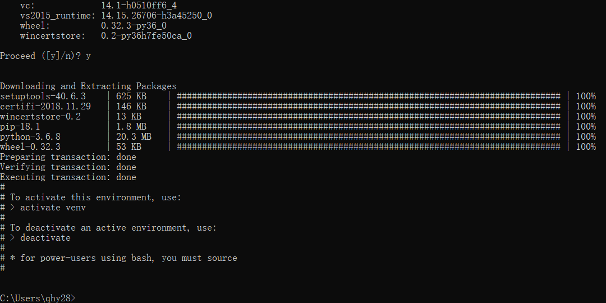
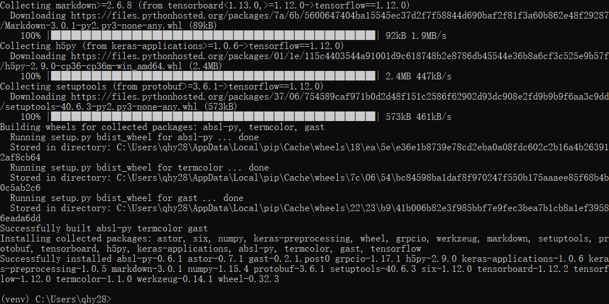
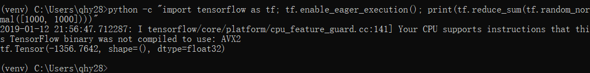
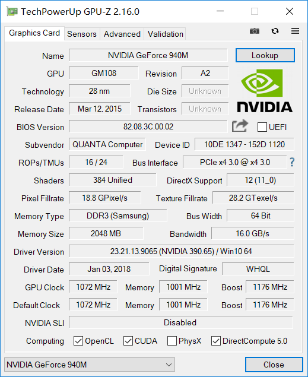
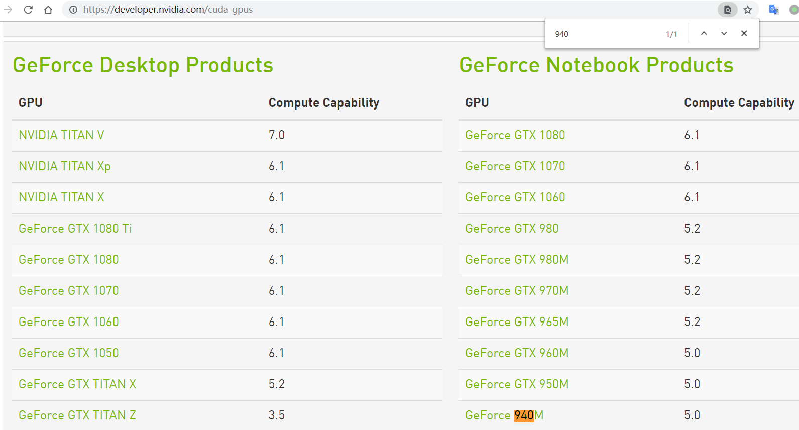
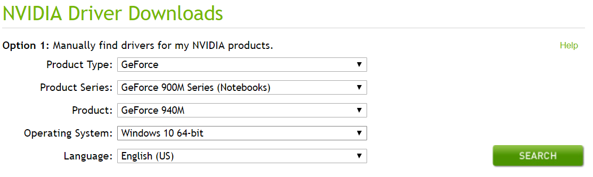
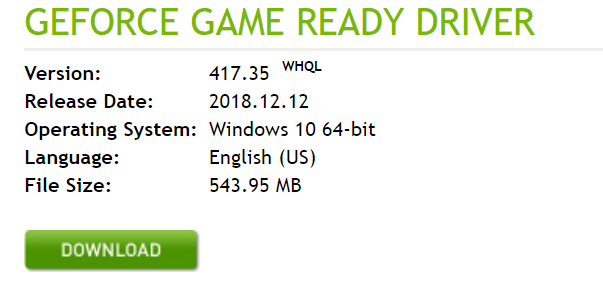
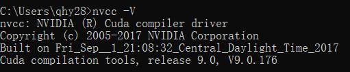
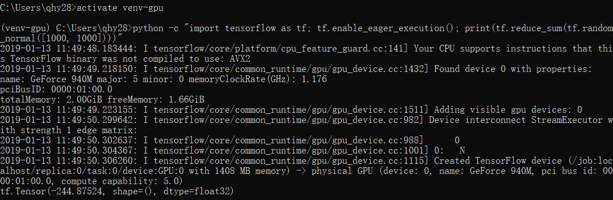

# tensorflow installation windows

## CPU 版本

1. 下载安装 [miniconda]

2. 创建一个新的虚拟环境 `venv`, `python` 版本 `3.6`
    ```shell
    conda create -n venv pip python=3.6
    ```
    

3. 激活虚拟环境
    ```shell
    activate venv
    ```

4. 安装
    ```shell
    # pip install --ignore-installed --upgrade https://storage.googleapis.com/tensorflow/windows/cpu/tensorflow-1.12.0-cp36-cp36m-win_amd64.whl
    pip install --ignore-installed tensorflow-1.12.0-cp36-cp36m-win_amd64.whl
    ```
    

5. 测试是否安装成功
    ```shell
    python -c "import tensorflow as tf; tf.enable_eager_execution(); print(tf.reduce_sum(tf.random_normal([1000, 1000])))"
    ```
    

## GPU 版本

1. 下载安装 [miniconda]

2. 创建一个新的虚拟环境 `venv`, `python` 版本 `3.6`
    ```shell
    conda create -n venv pip python=3.6
    ```

3. 激活虚拟环境
    ```shell
    activate venv
    ```

4. 安装
    ```shell
    # pip install --ignore-installed --upgrade https://storage.googleapis.com/tensorflow/windows/gpu/tensorflow_gpu-1.12.0-cp36-cp36m-win_amd64.whl
    pip install --ignore-installed tensorflow_gpu-1.12.0-cp36-cp36m-win_amd64.whl
    ```
5. 使用 [GPUZ] 查看 显卡( [geforce-940m] ), 在[gpu-cuda]是否在 `支持 CUDA 的 GPU 卡` 的列表(其实GPUZ已经可以看到了)
    
    

6. 安装驱动程序[Download Drivers | NVIDIA]
    > NVIDIA® GPU 驱动程序 - CUDA 9.0 需要 384.x 或更高版本。
    
    

7. 安装[CUDA Zone | NVIDIA Developer]
    [Installation Guide Windows :: CUDA Toolkit Documentation]
    > CUDA® 工具包 - TensorFlow 支持 CUDA 9.0。

    验证安装版本:
    ```shell
    nvcc -V
    ```
    

8. 安装[NVIDIA cuDNN | NVIDIA Developer]
    [cuDNN Archive | NVIDIA Developer]
    > cuDNN SDK（7.2 及更高版本）

    下载9.0版本

9. 设置环境变量
    ```shell
    SET PATH=C:\Program Files\NVIDIA GPU Computing Toolkit\CUDA\v9.0\bin;%PATH%
    SET PATH=C:\Program Files\NVIDIA GPU Computing Toolkit\CUDA\v9.0\extras\CUPTI\libx64;%PATH%
    SET PATH=C:\Program Files\NVIDIA GPU Computing Toolkit\CUDA\cudnn-9.0-windows10-x64-v7.4.2.24_2\cuda\bin;%PATH%
    ```

10. 测试是否安装成功
    ```shell
    python -c "import tensorflow as tf; tf.enable_eager_execution(); print(tf.reduce_sum(tf.random_normal([1000, 1000])))"
    ```
    

[tensorflow]: https://www.tensorflow.org/install/gpu
[miniconda]: https://conda.io/miniconda.html
[GPUZ]: https://www.techpowerup.com/gpuz/
[gpu-cuda]:https://developer.nvidia.com/cuda-gpus
[geforce-940m]:https://www.geforce.com/hardware/notebook-gpus/geforce-940m
[Download Drivers | NVIDIA]:https://www.nvidia.com/Download/index.aspx?lang=en-us
[CUDA Zone | NVIDIA Developer]:https://developer.nvidia.com/cuda-zone
[CUPTI :: CUDA Toolkit Documentation]:https://docs.nvidia.com/cuda/cupti/
[Installation Guide Windows :: CUDA Toolkit Documentation]:https://docs.nvidia.com/cuda/cuda-installation-guide-microsoft-windows/
[NVIDIA cuDNN | NVIDIA Developer]:https://developer.nvidia.com/cudnn
[cuDNN Archive | NVIDIA Developer]:https://developer.nvidia.com/rdp/cudnn-archive
