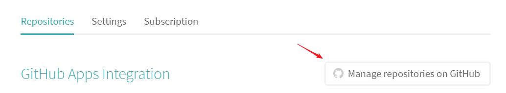
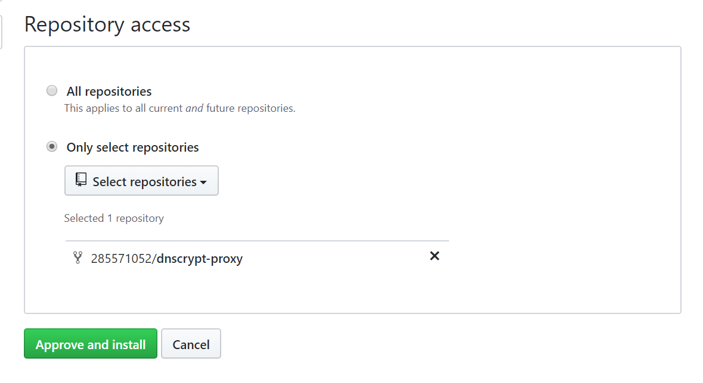
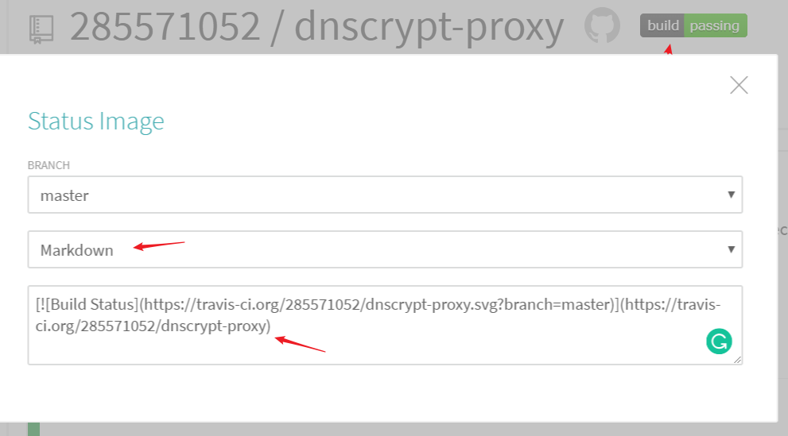

# travis 自动发布 release

1. 登录[travis](travis-ci.com)后，添加对应的 repository
    

    

2. repository 添加文件 `.travis.yml`
    ```yml
    sudo: false
    language: go
    os:
    - linux
    go:
    - 1.11.1
    script:
    - gimme --list
    - echo $TRAVIS_GO_VERSION
    - cd dnscrypt-proxy
    - go clean
    ...
    ```

3. 使用 [travis](https://github.com/travis-ci/travis.rb#installation) 客户端 配置 release
    ```
    travis setup releases
    ```
    `.travis.yml` 自动配置好 `YOUR_API_KEY_ENCRYPTED`
    ```yml
    deploy:
        provider: releases
        api_key:
            secure: YOUR_API_KEY_ENCRYPTED
        file: "FILE TO UPLOAD"
        skip_cleanup: true
        on:
            tags: true
    ...
    ```

4. 配置加密的环境变量
    ```
    travis encrypt SK=<secret_key>
    ```
    `.travis.yml` 添加
    ```yml
    env:
        global:
            secure: xxx
    ```

5. 添加 `tag` 触发

6. 添加状态图标
    [](https://travis-ci.org/285571052/dnscrypt-proxy)

    ```
    [](https://travis-ci.org/285571052/dnscrypt-proxy)
    ```

    
## 参考

- [Travis CI Tutorial - Travis CI](https://docs.travis-ci.com/user/tutorial/)

- [GitHub Releases Uploading - Travis CI](https://docs.travis-ci.com/user/deployment/releases/)

- [https://github.com/travis-ci/travis.rb#installation](travis-ci/travis.rb: Travis CI Client (CLI and Ruby library))

- [通过travis部署代码到远程服务器 - 我仅仅是一个Coder - CSDN博客](https://blog.csdn.net/qq8427003/article/details/64921238)

- [.travis.yml](https://github.com/285571052/dnscrypt-proxy/blob/master/.travis.yml)