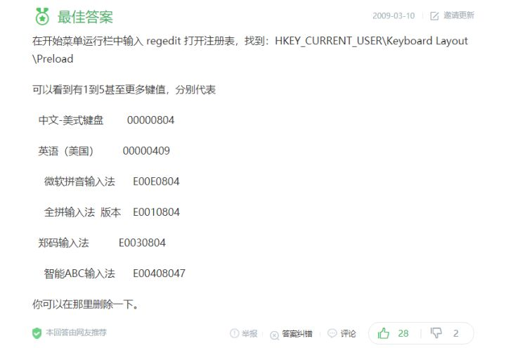

# windows 10美式键盘重启就消失了

配置: QQ拼音+美式键盘
现象: 重启后, 只剩下QQ拼音, 美式键盘没了
表现: 在语言栏首选项里面, 美式键盘还是存在的, 右下角语言栏没有加载进去, 尝试删了再加, 重启问题依旧
解决: 改注册表

本地查看注册表的时候, preload只有一条 `1    00000804`(对应QQ拼音)
然后添加 `2 00000409`, 重启后恢复美式键盘的加载, 但默认加载是QQ拼音
调整顺序`1 00000409, 2    00000804`, 重启默认是美式键盘了

待解决: 不知道为什么会导致这个问题

---

## 参考

- [Windows 10 有哪些忍不了的设计？ - 知乎](Windows 10 有哪些忍不了的设计？ - 知乎用户的回答 - 知乎
https://www.zhihu.com/question/266312580/answer/306119891)
