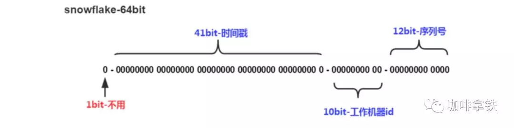

# 分布式ID

## 背景

业务中需要一些唯一的ID如何生成

## 解决

- UUID
    128bit,转换成16bit使用字符串表示，本地生成，无网络I/O，性能较快，但占空间多，且不能生成递增有序的数字
    场景：日志记录

- 数据库主键自增
    有序，但可能被利用猜测出用户日注册量等，性能受限于数据库服务器

- redis
    性能比（数据库主键自增）好，但会出现重复ID与不稳定的情况

- Zookeeper

- 数据库分段+服务缓存ID
    美团：服务与ProxyServer连接而不直接与数据库交互，每个ProxyServer拿到某个数量的ID用于返回，能保证递增的趋势，DB宕机也能坚持一段时间

- 雪花算法-Snowflake
    Twitter：生成64bit的整数
    

## 参考
- [如果再有人问你分布式ID，这篇文章丢给他](https://mp.weixin.qq.com/s/KfoLFClRwDXlcTDmhCEdaQ)