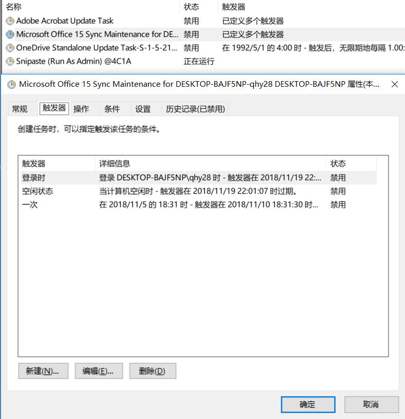

# 彻底关闭office2013上载中心

---

无效: 使用 更改/卸载, 把office的工具去掉, 仍然会启动

---

使用 `autorun` 找到 计划任务的启动项

或 直接在 `计划任务` 里面禁用

---

**但是**, 重启之后, 仍然会启动 上载中心

---

删除该启动任务, 重启之后, 又恢复了该计划任务.

---

关闭快速启动, 开机仍然启动上载中心

---

又一次重启后, 没有启动了, 神奇

---

- [如何完全禁用Microsoft Office上载中心 - 系统极客](https://www.sysgeek.cn/disable-microsoft-office-upload-center/)
