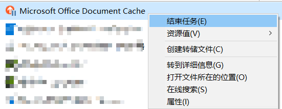

# 彻底关闭office2013上载中心

## 解决办法

1. 关闭程序
    
2. 关闭开机启动项(启动项,计划任务等)
    
3. (可选)关闭开机 `自动打开应用`
    

---

## 奇怪现象

**只删除了开机启动, 却没有关闭程序, 会因为 `重启自动打开应用` 导致office上载中心始终开机启动的现象**, 因此需要结束程序或关闭 `重启自动打开应用`

---

无效: 使用 更改/卸载, 把office的工具去掉, 仍然会启动

---

使用 `autorun` 找到 计划任务的启动项

或 直接在 `计划任务` 里面禁用

---

无效: **但是**, 重启之后, 仍然会启动 上载中心

---

无效: 删除该启动任务, 重启之后, 又恢复了该计划任务.

---

无效: 关闭快速启动, 开机仍然启动上载中心

---

又一次重启后, 没有启动了, 神奇(结束了office上载中心后才重启)

---

验证:
启动程序->不结束程序->删除开机启动->程序启动
启动程序->结束程序->删除开机启动->程序不启动
启动程序->关闭开机 `自动打开应用`->删除开机启动->程序不启动

## 参考

- [如何完全禁用Microsoft Office上载中心 - 系统极客](https://www.sysgeek.cn/disable-microsoft-office-upload-center/)
