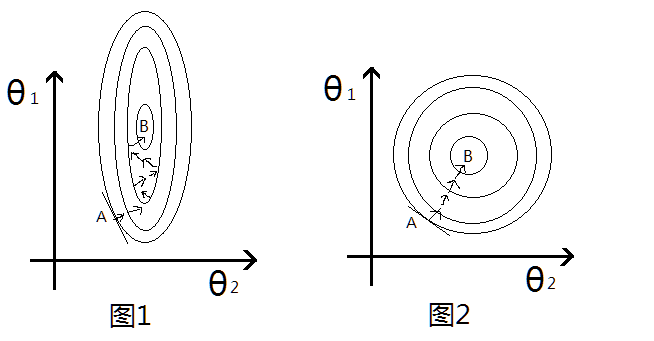
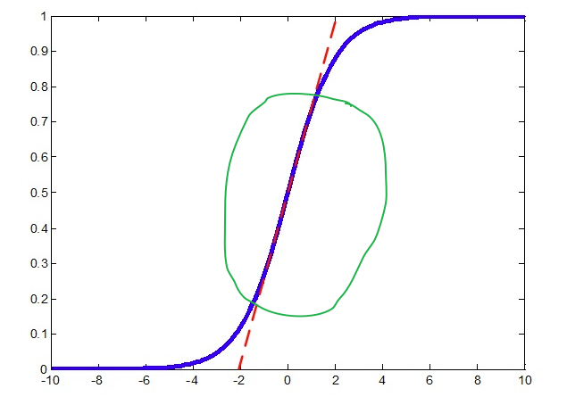
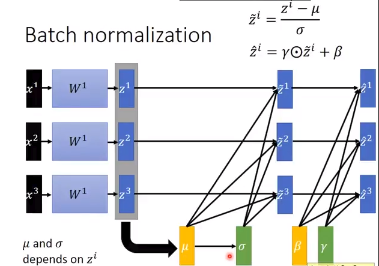

# Feature Scaling 和 Batch Norm 笔记

**文章目录**

1. [从Feature Scaling 开始](#从feature-scaling-开始)
2. [Batch Normalization](#batch-normalization)
3. [附Pytorch 简单实现](#附pytorch-简单实现)
4. [参考](#参考)

> Batch
> Normlization是2015年提出的一个加速神经网络训练的技巧，同时对performance也有一定的提高，现在基本已经广泛使用了。这里相对完整的整理一下学习笔记。主要参考李宏毅老师的机器学习课程。

## 从Feature Scaling 开始

提起BN首先需要从Feature Scaling/Normalization(特征缩放/归一化)说起。
在机器学习中，经常需要对特征做归一化，标准化，具体原因是什么呢？如果输入的特征的尺度差别很大，比如说\(x_{1}\)的取值位于\(0 - 1\),\(x_{2}\)的尺度位于 \(1000 - 2000\), 这个时候，就需要将特征scaling到同一个尺度，一般来说，特征缩放之后有两个好处。

- **提高学习器的性能**，特别是涉及到距离计算的，比如KNN, SVM等分类器，KMeans聚类等。这个很容易理解，在计算距离的时候，
  如果某一个特征取值范围很大，这样这一个特征对距离的计算就会占据主导作用，
  其它尺度小的特征起到的作用就会变小，而实际上这些特征的重要性可能是一样的。
  因此做了Feature Scaling将特征范围缩放到一个尺度的话，就可以避免这种情况。

- **加快梯度下降优化的收敛速度** 这里经常使用的是吴恩达老师的机器学习课程中预测房价的例子，假设有影响房价两个特征

  - \(x_{1}\):房间数目，一般比较小，位于1-5左右
  - \(x_{2}\):房屋面积, 一般取值比较大，比如位于80-200等

一般线性回归的关系函数如下:
    $$s = \theta_{1}x_{1} + \theta_{2}x \ast 2 + b$$

取平方误差的话, 损失函数为(仅仅考虑一个数据):

$$LOSS = (s_{\theta}(x_{i}) - y_{i})^{2}$$

因为\(x_{2}\)的尺度比\(x_{1}\)大很多，因此即使两个参数\(w_{1},w_{2}\)同样大小的变化，乘上\(x_{i}\)之后，对最后的结果LOSS影响差距也很不同, \(w_{2}\)明显要比\(w_{1}\)的作用要大，也就是说，\(\theta_{2}\)很小的变化就会导致LOSS较大变化，在LOSS的等高线上就会呈现出椭圆的形状, 如图1:


这个图的横纵坐标表示两个特征，然后每一圈代表一个LOSS值，圈越大，LOSS越大，最里面的B则是最优解的位置。
然后考虑梯度更新的过程，上述的等高线即LOSS与\(\theta_{1},\theta_{2}\)的函数关系， 因此图中椭圆的切线方向就是梯度下降的方向，
从图1中可以看出来，从初始点A到最有点B需要经过很多次的无用的迭代，并不是每次向着最优的方向走，类似于之字形，这样收敛就会很慢了。
反过来看，如果做了Feature Scaling的话,\(\theta_{1},\theta_{2}\)
的更新变化对LOSS影响一致，这样等高线就会成近圆形如图2所示，这样沿着切线的方向进行梯度更新就会一直沿着最优的方向走，就会加快收敛速度。

常用的Feature Scaling的方法有:

- 标准化(Standardization): 所有特征量化到标准正态分布上:
  $$z = \frac{x - \mu}{\sigma}$$
  其中\(\mu,\sigma\)
  就是\(x\)
  的均值和标准差，这样所有特征的尺度就基本类似了。 这种标准化的缺点就是如果原始数据不近似于高斯分布的话，效果可能会变差，毕竟修改了分布。
- 最大-最小化 (Min-Max Scaling) 线性归一:
  $$z = \frac{x - x_{min}}{x_{max} - x_{min}}$$
  这种也比较简单常用。这样所有的数据都会到\([0,1]\)的范围内了，尺度一致。

此外， 其实做Feature Scaling或多或少的跟原始数据都有一些差异，
理论上比较好的方法是，不同的Feature设置不同的学习率，尺度大的特征的学习率应该小一点，尺度小的特征的学习率稍微大一些，但是在实际梯度下降中，特征很多，对每个特征设置不通的学习率不切实际，很难实现，因此换一种思路，对特征做scale,
这样也可以避免尺度不一带来的问题。

## Batch Normalization

开始考虑神经网络， 我们知道神经网络有很多个Layer组成， 每个layer的输入都是上一层layer的输出，
那我们就有理由相信对每一层的输入的特征做Feature Scaling
可能会起到不错的作用。 在说BN之前，需要简单提一下 Internal Covariate Shift(ICS) 这个现象.
我们知道多层的神经网络，每一层的输出数据的分布都在随着训练也就是参数更新发生着变化，比如说第一层的输出的分布随着第一层的权重和bias的训练更新而改变，这种数据分布的改变就称之为:
Internal Covariate Shift(ICS).
而如果对每一层的输入都做归一化的话，就相当于每一层的分布都保持一致了(均值方差相同),
这样可以一定程度上减小ICS带来的影响，当然显然并不能从根本上解决，只是减弱一些而已(具体关于ICS的内容这里不再介绍，理论知识偏多)。
下面考虑一下Batch Normalization是怎么做的。 有了前面的Feature Scaling, 貌似问题很简单了，
就对每一层的输出做scaling就可以了，直接使用上述的第一种归一化的方式即可:

$$\hat{x} = \frac{x - \mu}{\sigma}$$

但是这里需要考虑一个问题，在做归一化的时候，
会影响原来学到的特征，比如说在输入到sigmod激活函数之前，如果经过Wx+b之后的结果，分布在S型函数的两侧，
也就是近乎平行坐标轴的那部分区域，这样原本经过激活函数之后就是0或者1了， 但是经过归一化之后，结果数据都到了S型函数的中间部分,如下图:



这样会有问题，归一化都到了\[-1, 1\]那一部分区域，
而对应的sigmod近乎是一条直线了，如红色虚线所示，那这样就成了线性变换了，那神经网络的非线性变化就没有意义了。所以BN在做完归一化，具体来说是标准化之后，又做了一步特征转换的操作:

$$\hat{x} = \frac{x - \mu}{\sigma}//归一化$$
$$z = \gamma\hat{x} + \beta//重构转换$$

其中\(\gamma,\beta\)

是两个参数，跟权重矩阵参数一样， 也是需要训练更新的。\(\hat{x}\)
则是标准化之后的值。可以看出来，如果\(\gamma = \sigma,\beta = \mu\)的时候，我们就会发现\(x = z\)了，这样就恢复到了原始的特征分布，其实可以这样理解，\(\gamma,\beta\)
这两个参数其实就是来学习前面的Normalization到底有没有作用，如果没有作用那就做一些转换，抵消一部分Normalization带来的影响。
这样完整的BN的步骤如下，需要注意的是，输入是一个Batch的数据，上述求得均值，方差均是对同一个Batch的数据计算得出的也就是说下图的m就是minbatch
size：


用图示表示，更加形象一些:


需要注意的有两点:

- 理论上BN可以放到激活函数之前，也可以放在其之后，但是一般情况，BN层会放在激活函数之前，这个其实很容易理解，比如激活函数如果是sigmod或者tanh的话，本身的输出都已经在一定程度上有了归一化了，后面再加一个BN的话，意义不大。
- batch-size 大一些泛化能力更强。 如果batch很小的话，计算均值和方差其实没有代表性。

前面的都是在training阶段，在test的时候，情况不太一样。因为在测试的话，我们没有batch 的输入，如何去计算\(\mu,\gamma\)
呢。一般都是从训练数据出发,
比如使用所有数据的均值和方差，这种方法在数据集很大的时候，很难实现。因此可以退而求其次，在最后一个epoch的时候，保存每个batch的均值和方差，最后去平均。取最后一个epoch的原因也很简单，最后一个epoch参数的训练已经近乎最优了。

## 附Pytorch 简单实现

Pytorch已经内置了 `BatchNorm`函数，而且有多种，这里就以简单的神经网络来做个例子，直接在激活函数之前就加入BN即可:

```python
model = nn.Sequential(
    nn.Linear(10, 20),           # 输入10维，隐层20维
    nn.BatchNorm1d(20, momentum=0.5),     # BN层，参数为隐层的个数
    nn.tanh(),                        # 激活函数
    nn.Linear(20, 2),             # 输出层
 )
```

## 参考

1. https://arxiv.org/abs/1502.03167
2. http://blog.csdn.net/lovesophiaw/article/details/58996684
3. https://zhuanlan.zhihu.com/p/25234554
4. [李宏毅老师 Batch-Norm
    教程](https://www.youtube.com/watch?v=BZh1ltr5Rkg)
5. http://www.voidcn.com/article/p-bptxerfe-bcx.html
6. https://morvanzhou.github.io/tutorials/machine-learning/torch/5-04-A-batch-normalization/

本文标题: Feature Scaling 和 Batch Norm 笔记

发布时间: 2017-12-05, 16:50:00

最后更新: 2017-12-06, 22:52:25

本文链接:
[http://shomy.top/2017/12/05/Feature-Scaling-Batch-Norm/](/2017/12/05/Feature-Scaling-Batch-Norm/)

非商业转载请注明作者及出处。商业转载请联系
[作者](mailto:shomyliu@gmail.com)本人。