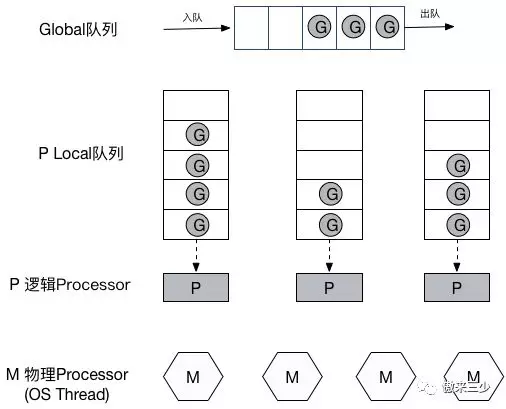

# Goroutine并发调度模型深入之实现一个协程池

Goroutine是优秀的，但不是完美的，在极大规模的高并发场景下，也可能会暴露出问题，什么问题呢？又有什么可选的解决方案？

通常goroutine会被当做coroutine（协程）的 golang实现，从比较粗浅的层面来看，这种认知也算是合理，但实际上，goroutine并非传统意义上的协程

goroutine并不等同于协程

在Go语言中，每一个goroutine是一个独立的执行单元，相较于每个OS线程固定分配2M内存的模式，goroutine的栈采取了动态扩容方式， 初始时仅为2KB，随着任务执行按需增长，最大可达1GB（64位机器最大是1G，32位机器最大是256M），且完全由golang自己的调度器 Go Scheduler 来调度。

任何用户线程最终肯定都是要交由OS线程来执行的，goroutine（称为G）也不例外，但是G并不直接绑定OS线程运行，而是由Goroutine Scheduler中的 P - Logical Processor （逻辑处理器）来作为两者的『中介』

G: 表示Goroutine，每个Goroutine对应一个G结构体，G存储Goroutine的运行堆栈、状态以及任务函数，可重用。G并非执行体，每个G需要绑定到P才能被调度执行。

P: Processor，表示逻辑处理器， 对G来说，P相当于CPU核，G只有绑定到P(在P的local runq中)才能被调度。对M来说，P提供了相关的执行环境(Context)，如内存分配状态(mcache)，任务队列(G)等，P的数量决定了系统内最大可并行的G的数量（前提：物理CPU核数 >= P的数量），P的数量由用户设置的GOMAXPROCS决定，但是不论GOMAXPROCS设置为多大，P的数量最大为256。

M: Machine，OS线程抽象，代表着真正执行计算的资源，在绑定有效的P后，进入schedule循环；而schedule循环的机制大致是从Global队列、P的Local队列以及wait队列中获取G，切换到G的执行栈上并执行G的函数，调用goexit做清理工作并回到M，如此反复。M并不保留G状态，这是G可以跨M调度的基础，M的数量是不定的，由Go Runtime调整，为了防止创建过多OS线程导致系统调度不过来，目前默认最大限制为10000个。

G-P-M 模型调度

Go调度器工作时会维护两种用来保存G的任务队列：一种是一个Global任务队列，一种是每个P维护的Local任务队列

大规模Goroutine的瓶颈

每个goroutine只分配2KB的内存，但如果是恐怖如斯的数量，聚少成多，内存暴涨，就会对GC造成极大的负担

如果goroutine规模太大，内存吃紧，runtime调度和垃圾回收同样会出问题

net/http标准库, net/http为啥这么快？每来一个请求它就会开一个goroutine去处理，相当任性粗暴

不过有Go调度器背书，一般来说也没啥压力，然而，如果，我是说如果哈，突然一大波请求涌进来了（比方说黑客搞了成千上万的肉鸡DDOS你，没错！就这么倒霉！），这时候，就很成问题了，他来10w个请求你就要开给他10w个goroutine，来100w个你就要老老实实开给他100w个，线程调度压力陡升，内存爆满，再然后，你就跪了…

有什么方案可以减缓大规模goroutine对系统的调度和内存压力？

这个问题根源是什么？goroutine的数量过多导致资源侵占，那要解决这个问题就要限制运行的goroutine数量，合理复用，节省资源，具体就是 — goroutine池化。

此举首先极大减轻了runtime调度goroutine的压力，其次，便是降低了对内存的消耗

实现一个Goroutine Pool

Goroutine Pool 的实现思路大致如下：

启动服务之时先初始化一个 Goroutine Pool 池，这个Pool维护了一个类似栈的FILO队列 ，里面存放负责处理任务的Worker，然后在client端提交task到Pool中之后，在Pool内部，接收task之后的核心操作是：检查当前Worker队列中是否有空闲的Worker，如果有，取出执行当前的task；没有空闲Worker，判断当前在运行的Worker是否已超过该Pool的容量，是 — 阻塞等待直至有Worker被放回Pool；否 — 新开一个Worker（goroutine）处理；每个Worker执行完任务之后，放回Pool的队列中等待。

> hy: 此处设计是, task争夺worker, worker不够就创造worker; 对比 另一个思路, worker争夺task, 前者的好处是? 前者可以更简单地控制worker的数量?

Goroutine Pool真正的价值还是在：限制并发的goroutine数量；复用goroutine，减轻runtime调度压力，提升程序性能；规避过多的goroutine侵占系统资源（CPU&内存）

[Goroutine并发调度模型深入之实现一个协程池][1]

[1]:https://mp.weixin.qq.com/s/K4CeE1BYuhalJIoN3PSe6A
