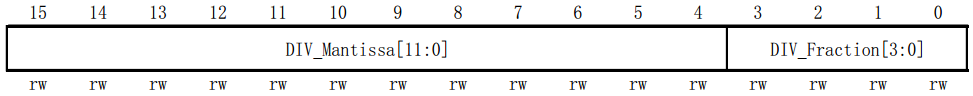
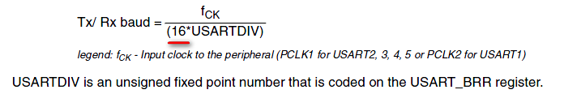
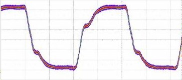
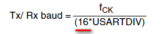
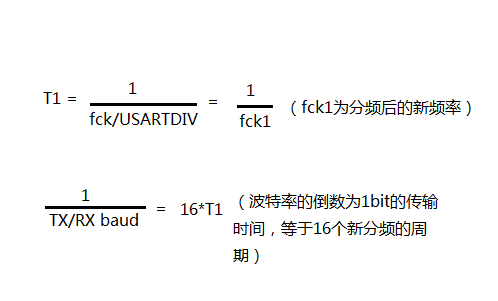

# STM32下如何计算波特率？
from:<https://forum.mianbaoban.cn/topic/61471_1_1.html>

波特率的计算
  STM32下的波特率和串口外设时钟息息相关，USART 1的时钟来源于APB2，USART
2-5的时钟来源于APB1。在STM32中，有个波特率寄存器USART\_BRR，如下：

  STM32串口波特率通过USART\_BRR进行设置，STM32的波特率寄存器支持分数设置，以提高精确度。USART\_BRR的前4位用于表示小数，后12位用于表示整数。但是它还不是我们想要设置的波特率，想要设置我们串口的波特率大小还需要进行计算。其实有关波特率的计算是下面这一条表达式：
  

  从上面的表达式，我们引入了一个新量USARTDIV，它表示对串口的时钟源fck进行分频。假设我们已知道了波特率和fck时钟频率的大小，那么通过上式便可以计算出USARTDIV的具体大小，然后再通过USART的值大小对波特率寄存器进行设置。
  USARTDIV通过上面的表达式得出，是一个带有小数的浮点数（如27.75）。将小数部分和整数部分分开，分别得到一个整数值n（如27）和一个小数值m（如0.75）。有了这两个值我们便可以填写USART\_BRR寄存器进而设置我们串口波特率大小了。
  将整数部分m（27 = 0x1B）直接写入USART\_BRR的后12位部分；将小数部分n乘以16后得到的整数值（如0.75 x 16 =
12 = 0xC）写入USART\_BRR前4位部分,最后USART\_BRR的值为0x1BC。
注意：如果小数部分乘以16之后仍带有小数，则要四舍五入去除小数部分得到一个新的整数，再将其写入USART\_BRR的前四位。
  为什么在计算波特率的公式中要乘以16？
  我们知道串口通信是通过TXD和RXD这两条线进行通信的，当接收器的RXD连接着发送器的TXD，接收器的TXD连接着发送器的RXD，接收器和发送器可以通过RXD和TXD互传数据。当接收器检测到RXD这条线的电平被拉为低电平，立即开始接收发送器发送过来的数据，刚刚那个低电平只是一个告知接收器可以接收数据的起始位而已。
  在数据的传输中，信号可能受到一些干扰而产生一些抖动，如下图。如果接收端只对这些信号数据采样一次，那么它有可能采样到的是抖动的不准的数据，进而使数据传输不准确，所以接收端在采样数据线上的数据，通常都要采样多次，然后通过比较获得准确的数据。
  

  前面已经说过，USARTDIV，它表示对串口的时钟源fck进行分频，而这16表示的正是1bit数据的采样次数。为什么呢？
 
  ，将这个表达式的分子分母倒过来，可以得到下面这条表达式
     

  每一位的传输时间只有1/TX\_baud，这个总时间除以16，所以每采样一次的时间正好是T1，即新分频后的周期。而初始的串口时钟信号来自于APBx，APBx时钟信号需要经过分频才会等于T1，所以才需要分频USARTDIV。