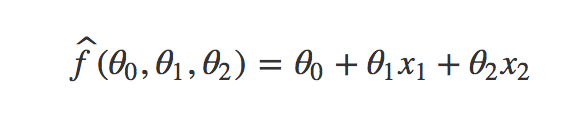

# [Understanding regularisation and a preference for small weights](https://datascience.stackexchange.com/questions/29682/understanding-regularisation-and-a-preference-for-small-weights)

## Question:
> This has been a spot of confusion for me lately upon reading more into regularisation in neural networks.
>
> I have always viewed weights as being a measure of the importance of a feature in a model. E.g. A model of ice cream sales starts off with random weights and eventually learns to increase the weights connected to the temperature feature.
>
> With regularisation (L2, I have been looking at most recently), small weights are favoured more by the model. This makes good sense to me when we are trying to prevent overfitting in our models. The model generalises well between different pieces of input data because the smaller weights give their associated feature less of an impact in the model. This will draw out the true patterns of the model as opposed to a few cases that may skew the weights.
>
> Now my confusion is what if a feature like temperature is a consistent predictor of ice cream sales in our model, what does its associated weights look like after regularisation? Is their impact on the cost function so great that the model doesn't prefer smaller weights instead? Also how do folks usually set a value for lambda?

## Answer:

Ridge or L2 regularization is used to prevent over-fitting when having multi-col-linearity in your features. Here is an example : suppose you want to train a linear regression model on following dataset:

      x1      x2      y
     1.0    -1.0      5
    -1.0     1.0      5

Training a linear regression model, we are searching for an hypothesis function with following format :

As you can observe, there are multiple solutions to this problem. For example :

    theta0 = 5, theta1 = 1 and theta2 = 1

But, there are also multiple other solutions to this problem. Including :

    theta0 = 5, theta1 = 1000000 and theta2 = 1000000

Now imagine you have a new observation such as:

          x1      x2      y
     1.00001    -1.0      5

A solution with small theta coefficients is most likely to yield better results than a solution with large theta coefficients. To understand L2 regularization, we have to understand that multicollinearity can yield to less robust solutions because is can appear ridges in cost function surface and so result in a less good solution. By adding a penalization term, we will smooth the cost function surface to make learning focus on small theta coefficients :

So, going back to your temperature example, ridge regression will reduce temperature theta coefficient as much as possible in order to avoid a potential multicollinearity with other features. By adding L2 regularization, it is now possible to address overfitting issues in model if there is multicollinearity in your features. However, if your regularization strength is too large, you risk to force your learning to focus on small values of theta only and so it could yield a bias emergence in your model and so an underfitting situation.

