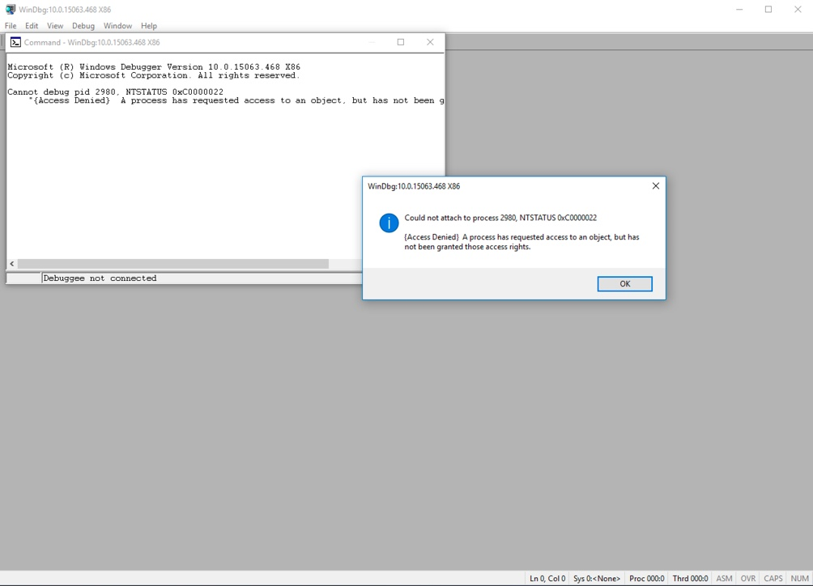
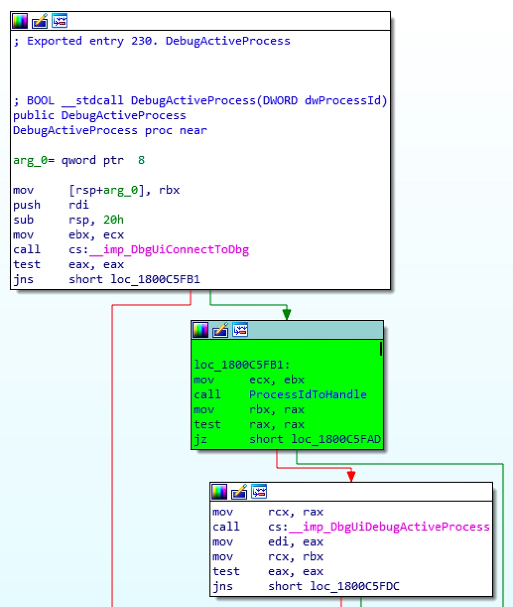
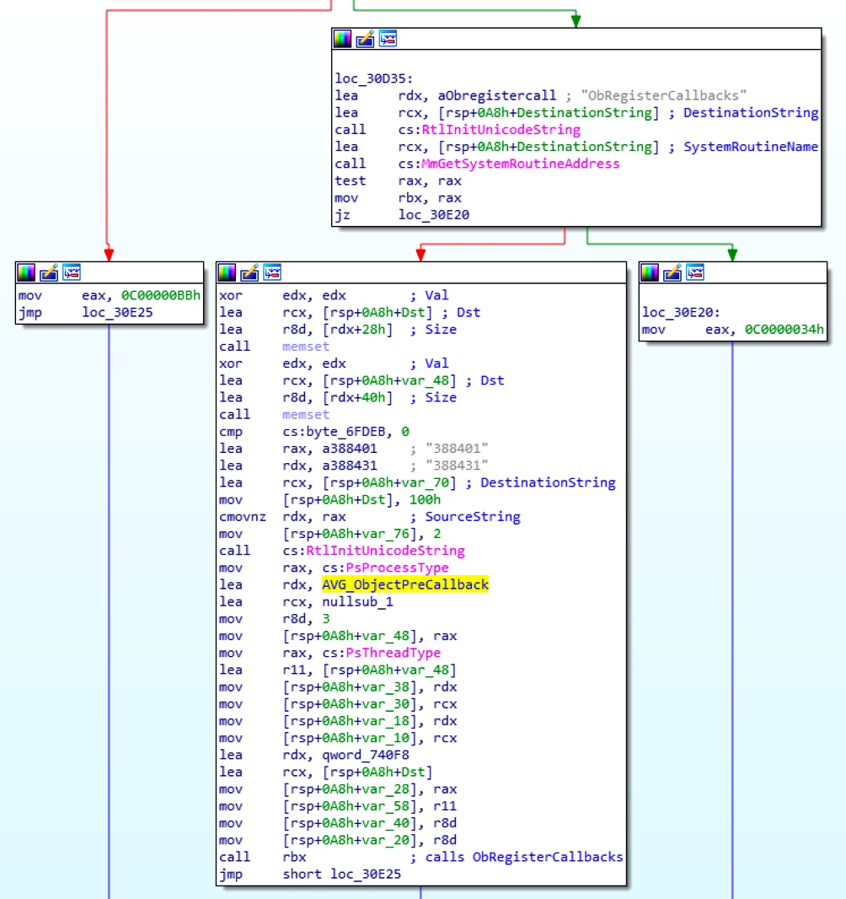
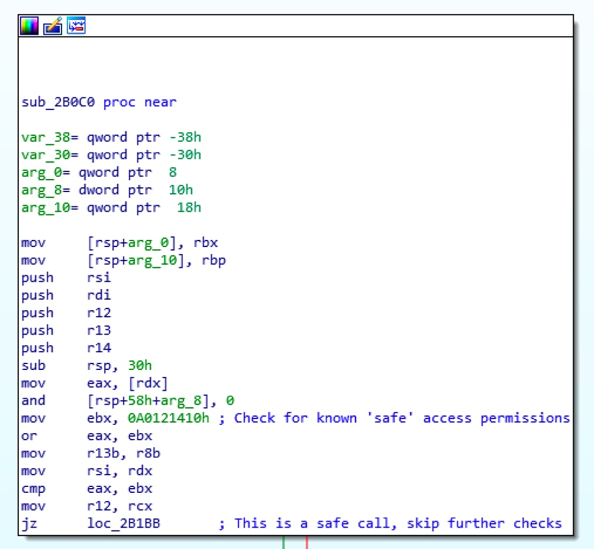
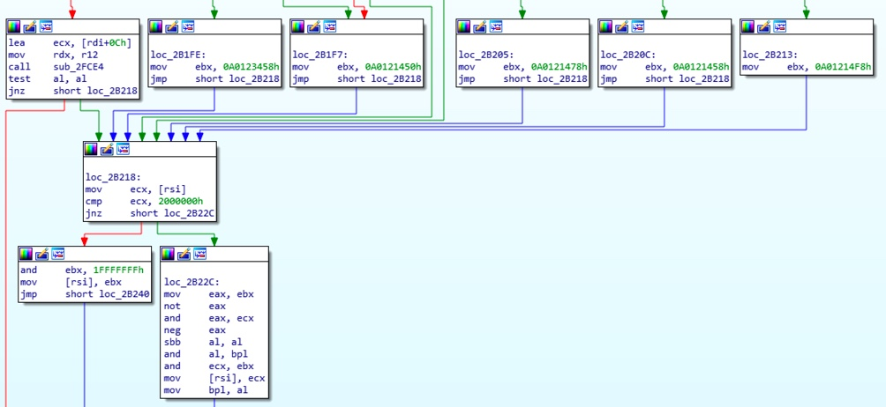
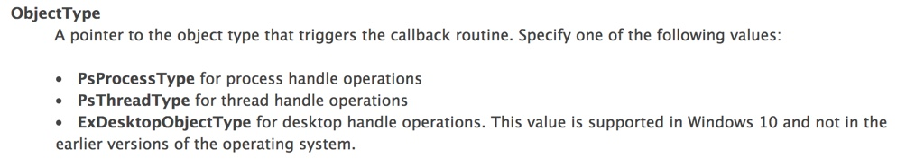
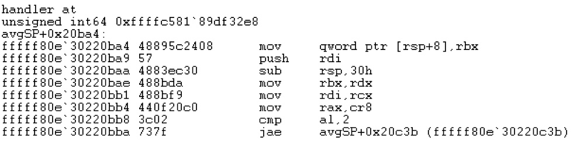
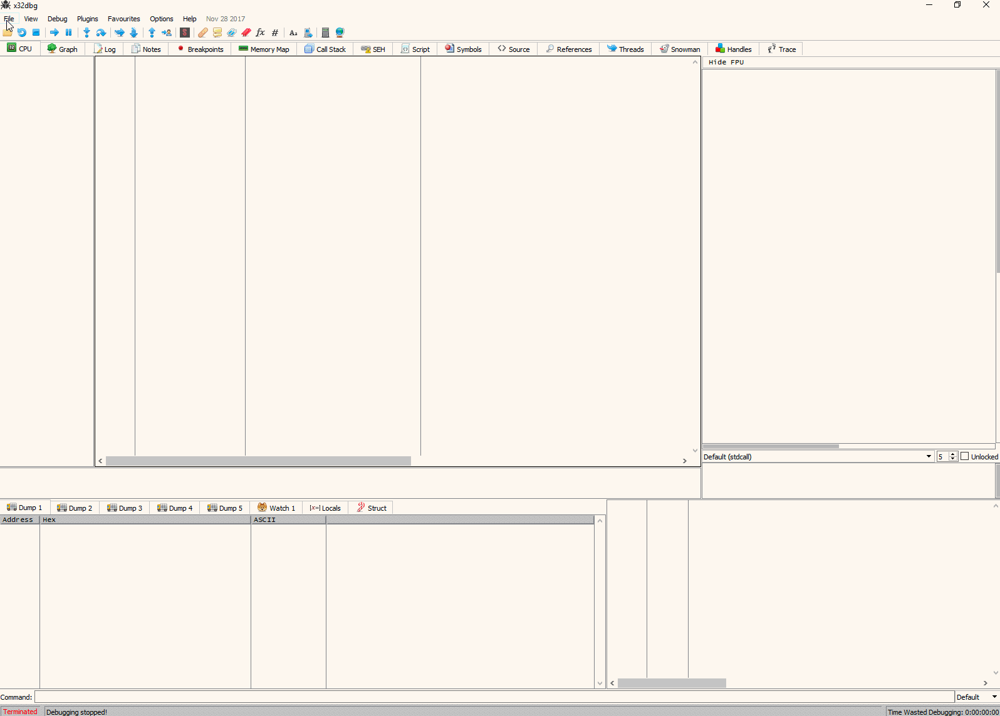

# [翻译] Windows 反调试技术——OpenProcess 权限过滤

本周我有了休息时间，来回顾一下反调试技术。目前，Bug Bounty平台上有大量程序依赖于客户端应用，而且许多安全产品和游戏反作弊引擎都采用了这些反调试技术来阻止你调试核心模块。我想有必要来分享其中一项反调试技术，以及如何绕过它。 

本文所述的技术并不是一个安全漏洞，很明显，如果攻击者拥有了这个级别的系统访问权限，游戏就已经结束了。他们只需要安装一个 rookit 就够了。 

文中我将以 AVG 产品为例。尽管我尽量避免过多地讨论这一款产品，然而其他的反病毒解决方案和安全产品使用了完全相同的技术，所以相同的原则也同样适用这些产品。

## 面临什么问题？

如果你以前尝试过打开 x64dbg，并把它附加到一个 AV（译者注：AntiVirus） 组件中，通常会看到如下界面：（下图是GIF动图1）


调试器基本没有附加成功，并停在了启动页。如果我们在调试器内不采用附加的方式，而是直接启动刚才的进程：（下图是GIF动图2）


还是不行，出现了相同的结果。当进程刚要启动时，调试程序被踢出了。最后，我们试试 WinDBG，得到了下面的错误信息：



为了理解调试器刚才做了什么，同时发现哪里出了问题，我们看一下 x64dbg 的源码（实际上，是 x64dbg 使用的调试引擎
TitanEngine 的源码）。

```cpp
__declspec(dllexport) bool TITCALL AttachDebugger(DWORD ProcessId, bool KillOnExit, LPVOID DebugInfo, LPVOID CallBack)
{
...
if(ProcessId != NULL && dbgProcessInformation.hProcess == NULL)
{
    if(engineEnableDebugPrivilege)
    {
        EngineSetDebugPrivilege(GetCurrentProcess(), true);
        DebugRemoveDebugPrivilege = true;
    }
    if(DebugActiveProcess(ProcessId))
    {
    ...
    }
}
}
```

从代码中发现，x64dbg 使用了一个 KernelBase.dll 提供的 Win32 函数 “DebugActiveProcess”。

## DebugActiveProcess 的工作原理

DebugActiveProcess 函数用于在目标进程上开启一个调试会话。该函数的唯一参数是目标进程的PID。如果在 MSDN
上查阅该函数，可以看到如下的描述：

> “The debugger must have appropriate access to the target process, and it must be able to open the process for PROCESS\_ALL\_ACCESS. 
> DebugActiveProcess can fail if the target process is created with a security descriptor that grants the debugger anything less than full access. 
> If the debugging process has the SE\_DEBUG\_NAME privilege granted and enabled, it can debug any process.” 

这里，我们发现了导致调试会话失败的端倪。

上述的代码片段中，调试器调用了 EngineSetDebugPrivilege 函数。那么，来看看这个函数。

```cpp
DWORD EngineSetDebugPrivilege(HANDLE hProcess, bool bEnablePrivilege)
{
    DWORD dwLastError;
    HANDLE hToken = 0;
    if(!OpenProcessToken(hProcess, TOKEN_ADJUST_PRIVILEGES | TOKEN_QUERY, &hToken))
    {
        ...
    }
        ...
    if(!LookupPrivilegeValue(NULL, SE_DEBUG_NAME, &luid))
    {
        ...
    }
    tokenPrivileges.PrivilegeCount = 1;
    tokenPrivileges.Privileges[0].Luid = luid;
    if(bEnablePrivilege)
        tokenPrivileges.Privileges[0].Attributes = SE_PRIVILEGE_ENABLED;
    else
        tokenPrivileges.Privileges[0].Attributes = 0;
    AdjustTokenPrivileges(hToken, FALSE, &tokenPrivileges, sizeof(TOKEN_PRIVILEGES), NULL, NULL);
    ...
}
```

从上述代码中可以看到，SE\_DEBUG\_NAME 权限已经设置到进程令牌（process token）上。

这意味着，调用 DebugActiveProcess 函数的要求已经满足（译者注：要求指的是MSDN中描述的
SE\_DEBUG\_NAME权限要求）。

接着检查，是否拥有对于目标进程的 PROCESS\_ALL\_ACCESS 权限。

## 深入 DebugActiveProcess 内部

DebugActiveProcess 接受唯一的参数是“进程ID”。在该函数内部，使用进程ID 调用
ProcessIdToHandle，打开目标进程的句柄：



进入 ProcessIdToHandle 函数内部，可以发现该函数仅仅是对 NtOpenProcess 的封装：


NftOpenProcess函数中有一个形参叫做“Desired Access”，即所需的访问权。该参数的实参是 C3Ah。通过微软
[官方文档](https://msdn.microsoft.com/en-us/library/windows/desktop/ms684880\(v=vs.85\).aspx)
发现，这个值是以下值的组合： 

  - PROCESS\_CREATE\_THREAD (译者注：0x0002) 
  - PROCESS\_VM\_OPERATION (0x0008) 
  - PROCESS\_VM\_WRITE (0x0020) 
  - PROCESS\_VM\_READ (0x0010) 
  - PROCESS\_SUSPEND\_RESUME (0x0800) 
  - PROCESS\_QUERY\_INFORMATION (0x0400) 

于是，这次调用具备了调试进程所需要的全部授权。 

到这里，调试器具备了 SE\_DEBUG\_NAME 授权，DebugActiveProcess 调用也给自身赋予了正确的访问目标进程的权限。

那么是什么阻止了附加过程呢？

## ObRegisterCallbacks 简介

我是在一个游戏模组社区（译者注：即游戏mod社区）中第一次知道 ObRegisterCallbacks 函数的。在绕过反作弊和 DRM
驱动时，该函数被用于阻止修改或注入游戏功能。 

按照微软官方说法，ObRegisterCallbacks
是“这样一个函数，它为线程、进程、桌面句柄操作注册了一系列回调函数。”这是在操作系统内核态完成的。主要是给驱动程序开发者提供一种能力，用于在
OpenProcess 函数被调用时和返回时收到通知。 

为什么这个函数能够用于阻止调试器访问 AV 进程呢？阻止 DebugActiveProcess 调用成功的其中一个方法就是，过滤掉
“调用NtOpenProcess“所需要的访问权限（译者注：NtOpenProcess 函数有一个形参
DesiredAccess，这里指的是，该参数对应的实参被过滤后，就不是所需要的值了）。通过移除调试器“请求目标进程的
PROCESS\_ALL\_ACCESS 访问权”的能力，我们就无法调试一个进程。这也解释了刚刚在 WinDBG看到的错误。

怎么确认这就是问题所在呢？我们接着进入内核调试器，观察注册的回调函数是如何在 Ring-0
被处理的。（这里不会详细介绍如何使用内核调试器，如果你需要一些资料，可以阅读我
[之前的博客](https://blog.xpnsec.com/windows-warbird-privesc/)）

## 深入 ObRegisterCallback 内部

当启动内核调试后，从 nt\!ProcessType 开始分析：

```cpp
kd> dt nt!_OBJECT_TYPE poi(nt!PsProcessType)
+0x000 TypeList         : _LIST_ENTRY [ 0xffffcb82`dee6cf20 - 0xffffcb82`dee6cf20 ]
+0x010 Name             : _UNICODE_STRING "Process"
+0x020 DefaultObject    : (null)
+0x028 Index            : 0x7 ''
+0x02c TotalNumberOfObjects : 0x26
+0x030 TotalNumberOfHandles : 0xe8
+0x034 HighWaterNumberOfObjects : 0x26
+0x038 HighWaterNumberOfHandles : 0xea
+0x040 TypeInfo         : _OBJECT_TYPE_INITIALIZER
+0x0b8 TypeLock         : _EX_PUSH_LOCK
+0x0c0 Key              : 0x636f7250
+0x0c8 CallbackList     : _LIST_ENTRY [ 0xffffa002`d31bacd0 - 0xffffa002`d35d2450 ]
```

这个符号包含了一个指向 \_OBJECT\_TYPE 类型对象的指针，该对象定义了 “Process” 类型，并包含了一个CallbackList属性。

这个属性值得我们注意。该属性定义了一个回调函数列表，其中存储了由 ObRegisterCallbacks 注册的函数。

之后，其中的每个函数都会在获取进程句柄时由内核调用。基于这个理解，我们将遍历这个列表，找到阻止成功调用 OpenProcess 函数的回调函数句柄。

CallbackList 是一个 \_LIST\_ENTRY，指向 CALLBACK\_ENTRY\_ITEM
结构体。该结构体在微软的文档中没有说明，然而有
[一篇文章](https://douggemhax.wordpress.com/2015/05/27/obregistercallbacks-and-countermeasures/) “DOUGGEM’S GAME HACKING AND REVERSING NOTES” 给出了结构体的定义：

```cpp
typedef struct _CALLBACK_ENTRY_ITEM {
LIST_ENTRY EntryItemList;
OB_OPERATION Operations;
CALLBACK_ENTRY* CallbackEntry;
POBJECT_TYPE ObjectType;
POB_PRE_OPERATION_CALLBACK PreOperation;
POB_POST_OPERATION_CALLBACK PostOperation;
__int64 unk;
}CALLBACK_ENTRY_ITEM, *PCALLBACK_ENTRY_ITEM;
```

结构体中的 PreOperation 引起了我们的注意。 

通过如下 WinDBG 命令，遍历 CALLBACK\_ENTRY\_ITEM 列表：

```sh
!list -x ".if (poi(@$extret+0x28) != 0) { u poi(@$extret+0x28); }" (poi(nt!PsProcessType)+0xc8)
```


在我的电脑上，有 4 个驱动程序通过 ObRegisterCallbacks 注册了 PreOperation 回调函数。

接着，我们通过 WinDBG 输出驱动程序的名字：

```sh
!list -x ".if (poi(@$extret+0x28) != 0) { lmv a (poi(@$extret+0x28)) }" (poi(nt!PsProcessType)+0xc8)
```


这 4 个驱动程序中，其中一个立刻引起了我们关注，很可能它就是问题的关键：avgSP.sys。


可以判断出：就是 “AVG self protection module”
模块在阻止我们将调试器附加到进程中（更有可能的是，当反病毒引擎阻止恶意软件时，产生了这样的副作用）。接着，我们深入分析下这个驱动程序，找出其影响 OpenProcess 调用的痕迹。

首先，找到 ObRegisterCallbacks 函数，它注册了一个函数句柄：



我们如果检查这个刚注册的函数句柄，可以发现：



在反汇编代码中，出现了一个幻数（Magic Number）A0121410。实际上，它表示以下权限：

  - PROCESS\_VM\_READ (译者注：0x0010)
  - PROCESS\_QUERY\_INFORMATION (0x0400)
  - PROCESS\_QUERY\_LIMITED\_INFORMATION (0x1000)
  - READ\_CONTROL (0x00020000L)
  - SYNCHRONIZE (0x00100000L)

其实，如果只设置这些权限的话，则没有进一步的权限检查操作，OpenProcess
函数继续执行。然而，如果请求上述权限白名单以外的权限，还要执行一系列的检查操作，最终在函数返回前，所需要的权限被过滤掉。



由于本文主要讲解“识别和移除”这种钩子的通用方法，所以我不打算深入驱动程序的细节了。

从上面的分析可知，我们发现有一个驱动程序在拦截和修改 OpenProcess 调用。

现在，已经找到问题根源，接下来就是从内核中拆下这个钩子。

## 移除 OpenProcess 权限过滤

为了移除 OpenProcess 的权限过滤函数，首先需要找到过滤函数所在的 PreOperation 属性的地址。输入 WinDBG 命令：

```cpp
!list -x ".if (poi(@$extret+0x28) != 0) { .echo handler at; ?? @$extret+0x28; u poi(@$extret+0x28); }" (poi(nt!PsProcessType)+0xc8)
```


一旦发现了正确的属性地址，我们使用下面的命令将其置为 NULL，以此来禁止回调句柄：

```cpp
eq 0xffffa002`d31bacf8 0
```

此时，再次将调试器附加到被调试程序，可以得到如下界面：


太棒了！看上去我们已经成功了。

嗯，几乎是……我们稍加操作就可以发现大量错误，问题还没有处理干净。

即使在上述界面，我们也可以看到寄存器的值都是0，并且出现了访问冲突。这一定是漏掉了什么。

## 记住还有线程

我们已经知道 ObRegisterCallbacks 函数可以给 OpenProcess
加上钩子函数，还能做什么呢？再次查看官方文档发现，ObRegisterCallbacks
也可以给 OpenThread 加上钩子。



庆幸的是，很多工作已经完成了，我们只需要找到线程的钩子函数所在的位置即可。这个位置恰好定义在 nt\!PsThreadType 中。

修改一下刚才输入的命令，观察驱动程序（译者注：指的是 avgSP.sys）是否为 OpenThread 函数添加了钩子：

```cpp
!list -x ".if (poi(@$extret+0x28) != 0) { .echo handler at; ?? @$extret+0x28; u poi(@$extret+0x28); }" (poi(nt!PsThreadType)+0xc8)
```



真的有钩子！和刚才的进程钩子类似，我们使用 eq 命令移除钩子：

```cpp
eq 0xffffc581`89df32e8 0
```

再次附加调试器到进程：（下图是GIF动图3）


大功告成！可以开始正常调试了。

希望本文有助于你了解这项反调试技术。如果感兴趣，还有很多 Bug Bounty 程序可供学习，包括 BugCrowd 平台上 AVG
的一个例子（ [点击这里](https://bugcrowd.com/avgtechnologies)）、
[Cylance](https://bugcrowd.com/cylance)、
[Sophos](https://bugcrowd.com/sophos)等等。（尽管我没有把这些作为安全漏洞，但是 DKOM
不在讨论范围）（译者注：DKOM，全称是 Direct kernel object
manipulation）。

## 参考资料

  -
    [TitanEngine](https://www.reversinglabs.com/open-source/titanengine.html)

  -  [DOUGGEM'S GAME HACKING AND REVERSING
    NOTES](https://douggemhax.wordpress.com/2015/05/27/obregistercallbacks-and-countermeasures/)

  -  [AVG Bug Bounty](https://bugcrowd.com/avgtechnologies)
  -  [x64Dbg GitHub](https://github.com/x64dbg/x64dbg)

原文： https://blog.xpnsec.com/anti-debug-openprocess/
本文由 看雪翻译小组 yezhang 编译 




