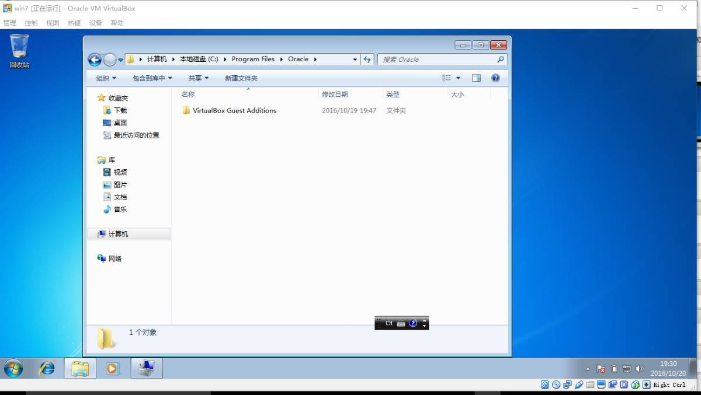
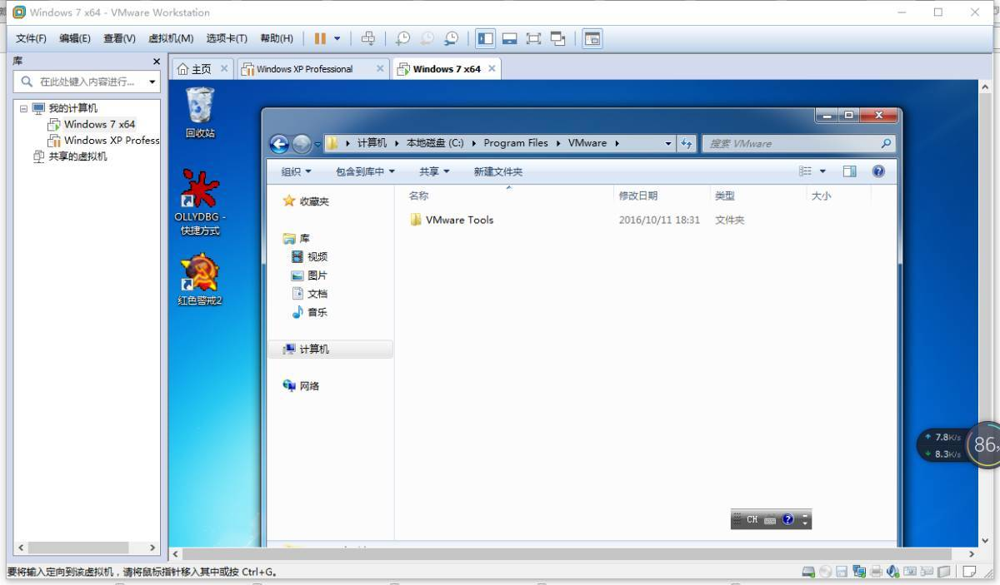
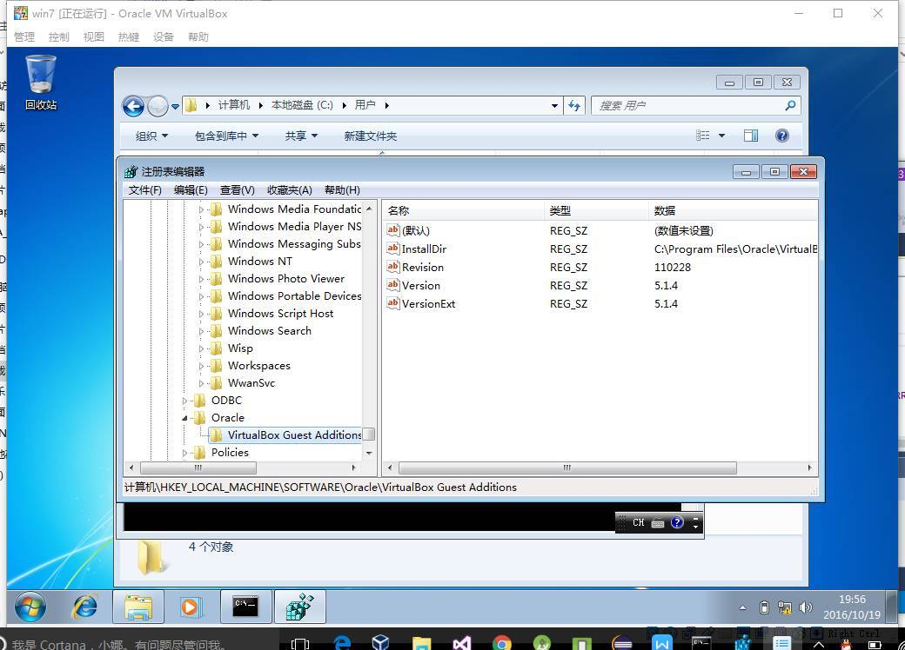
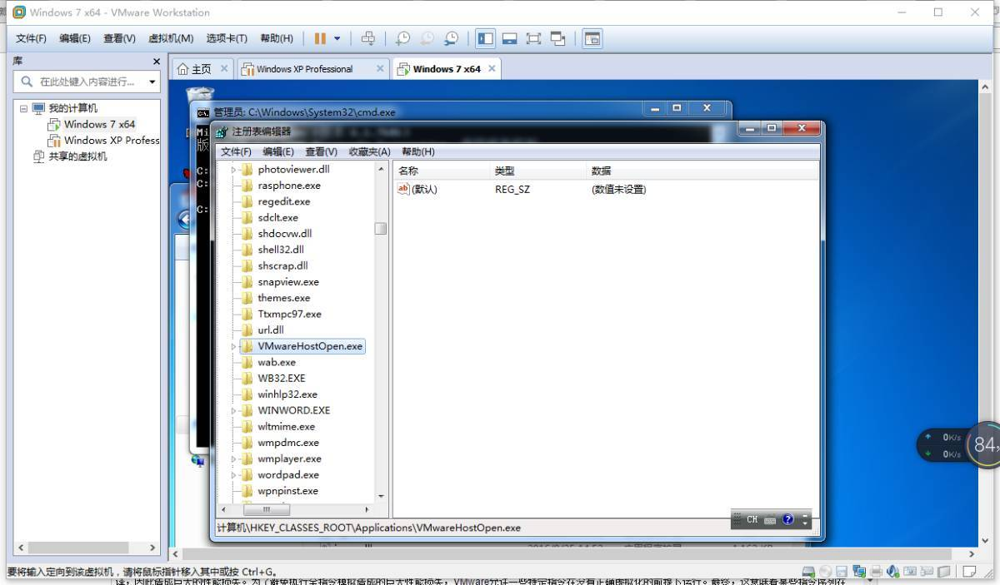
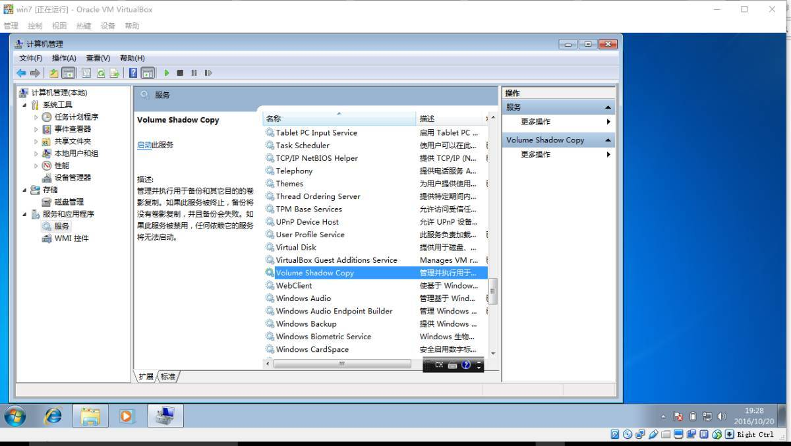
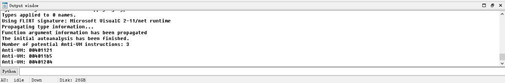
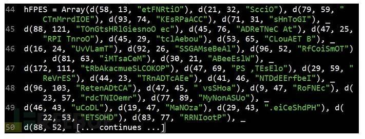

### [调试逆向] 反虚拟机技术总结

  -   [houjingyi](https://bbs.pediy.com/thread-225735.htm)
From: [[调试逆向] 反虚拟机技术总结](https://bbs.pediy.com/thread-225735.htm)
-----

大概是在一年半以前我在自己CSDN博客上写了[详解反虚拟机技术](https://blog.csdn.net/qq_32400847/article/details/52830990)[](https://blog.csdn.net/qq_32400847/article/details/52830990)和[详解反调试技术](https://blog.csdn.net/qq_32400847/article/details/52798050)，没想到看的人还很多，有人甚至给我发私信发邮件，在百度和谷歌搜索“反调试”和“反虚拟机”，第一条结果就是我的文章。我决定在看雪也分享一下。当然我只是做了个整理收集的工作，没有一条技术和一行代码是我原创的，参考链接会附在最后。

恶意代码编写者经常使用反虚拟机技术逃避分析，这种技术可以检测自己是否运行在虚拟机中。如果恶意代码探测到自己在虚拟机中运行，它会执行与其本身行为不同的行为，其中最简单的行为是停止自身运行。近年来，随着虚拟化技术的使用不断增加，采用反虚拟机技术的恶意代码数量逐渐下降。恶意代码编写者已经开始意识到，目标主机是虚拟机，也并不意味着它就没有攻击价值。随着虚拟化技术的不断发展和普通应用，反虚拟机技术可能变得更加少见。这里研究最常见的反虚拟机技术(包括VMware、virtualbox和virtualpc，重点是最常用的VMware)，并且介绍一些如何防御它们的办法。  

## 一、检测虚拟机痕迹

### 1.根据MAC地址

通常，MAC地址的前三个字节标识一个提供商。以00:05:69、00:0c:29和00:50:56开始的MAC地址与VMware相对应；以00:03:ff开始的MAC地址与virtualpc对应；以08:00:27开始的MAC地址与virtualbox对应。

```cpp
BOOL CheckVMWare()  
{  
    string mac;  
    get_3part_mac(mac);  
    if (mac=="00-05-69" || mac=="00-0c-29" || mac=="00-50-56")  
    {  
        return TRUE;  
    }  
    else  
    {  
        return FALSE;  
    }  
}  

BOOL CheckVirtualPC()  
{  
    string mac;  
    get_3part_mac(mac);  
    if (mac=="00-03-ff")  
    {  
        return TRUE;  
    }  
    else  
    {  
        return FALSE;  
    }  
}  

BOOL CheckVirtualBox()  
{  
    string mac;  
    get_3part_mac(mac);  
    if (mac=="08-00-27")  
    {  
        return TRUE;  
    }  
    else  
    {  
        return FALSE;  
    }  
}  

typedef struct _ASTAT_  
{  
    ADAPTER_STATUS adapt;  
    NAME_BUFFER NameBuff[30];  
} ASTAT, *PASTAT;  

void get_3part_mac(string &mac)  
{  
    NCB Ncb;  
    ASTAT Adapter;  
    UCHAR uRetCode;  
    LANA_ENUM lenum;  
    memset(&Ncb, 0, sizeof(Ncb));  
    Ncb.ncb_command = NCBENUM;  
    Ncb.ncb_buffer = (UCHAR *)&lenum;  
    Ncb.ncb_length = sizeof(lenum);  
    uRetCode = Netbios(&Ncb);  
    for (int i = 0; i < lenum.length; i++)  
    {  
        memset(&Ncb, 0, sizeof(Ncb));  
        Ncb.ncb_command = NCBRESET;  
        Ncb.ncb_lana_num = lenum.lana[i];  
        uRetCode = Netbios(&Ncb);  
        memset(&Ncb, 0, sizeof(Ncb));  
        Ncb.ncb_command = NCBASTAT;  
        Ncb.ncb_lana_num = lenum.lana[i];  
        strcpy((char *)Ncb.ncb_callname, "*");  
        Ncb.ncb_buffer = (unsigned char *)&Adapter;  
        Ncb.ncb_length = sizeof(Adapter);  
        uRetCode = Netbios(&Ncb);  
        if (uRetCode == 0)  
        {  
            char tmp[128];  
            sprintf(tmp, "%02x-%02x-%02x",  
                Adapter.adapt.adapter_address[0],  
                Adapter.adapt.adapter_address[1],  
                Adapter.adapt.adapter_address[2]  
            );  
            mac = tmp;  
        }  
    }  
}  
```

### 2.基于主板序列号、主机型号、系统盘所在磁盘名称等其他硬件信息

```cpp
//通过WMI获取主机信息  
BOOL ManageWMIInfo(string &result, string table, wstring wcol)  
{     
    HRESULT hres;  
    char bord[1024];  
    //初始化COM   
    hres = CoInitialize(0);  
    //获得WMI连接COM接口    
    IWbemLocator *pLoc = NULL;  
    hres = CoCreateInstance(  
        CLSID_WbemLocator,   
        0,   
        CLSCTX_INPROC_SERVER,   
        IID_IWbemLocator, (LPVOID *) &pLoc);  
    if (FAILED(hres))  
    {  
        cout << "Failed to create IWbemLocator object."  
            << "Err code = 0x"  
            << hex << hres << endl;  
        CoUninitialize();  
        return false;   
    }  
    //通过连接接口连接WMI的内核对象名ROOT//CIMV2    
    IWbemServices *pSvc = NULL;  
    hres = pLoc->ConnectServer(  
        _bstr_t(L"ROOT\\CIMV2"), // Object path of WMI namespace  
        NULL, // User name. NULL = current user  
        NULL, // User password. NULL = current  
        0, // Locale. NULL indicates current  
        NULL, // Security flags.  
        0, // Authority (e.g. Kerberos)  
        0, // Context object   
        &pSvc // pointer to IWbemServices proxy  
        );  
    if (FAILED(hres))  
    {  
        cout << "Could not connect. Error code = 0x"  
            << hex << hres << endl;  
        pLoc->Release();   
        CoUninitialize();  
        return false;   
    }  
    //设置请求代理的安全级别     
    hres = CoSetProxyBlanket(  
        pSvc, // Indicates the proxy to set  
        RPC_C_AUTHN_WINNT, // RPC_C_AUTHN_xxx  
        RPC_C_AUTHZ_NONE, // RPC_C_AUTHZ_xxx  
        NULL, // Server principal name   
        RPC_C_AUTHN_LEVEL_CALL, // RPC_C_AUTHN_LEVEL_xxx   
        RPC_C_IMP_LEVEL_IMPERSONATE, // RPC_C_IMP_LEVEL_xxx  
        NULL, // client identity  
        EOAC_NONE // proxy capabilities   
        );  
    if (FAILED(hres))  
    {  
        cout << "Could not set proxy blanket. Error code = 0x"  
            << hex << hres << endl;  
        pSvc->Release();  
        pLoc->Release();   
        CoUninitialize();  
        return false;   
    }  
    //通过请求代理来向WMI发送请求  
    IEnumWbemClassObject* pEnumerator = NULL;  
    string select = "SELECT * FROM "+ table;  
    hres = pSvc->ExecQuery(  
        bstr_t("WQL"),    
        bstr_t(select.c_str()),  
        WBEM_FLAG_FORWARD_ONLY | WBEM_FLAG_RETURN_IMMEDIATELY,   
        NULL,  
        &pEnumerator);  
    if (FAILED(hres))  
    {  
        cout << "Query for Network Adapter Configuration failed."  
            << " Error code = 0x”"  
            << hex << hres << endl;  
        pSvc->Release();  
        pLoc->Release();  
        CoUninitialize();  
        return false;   
    }  
    //循环枚举所有的结果对象  
    ULONG uReturn = 0;  
    IWbemClassObject *pclsObj;  
    while (pEnumerator)  
    {  
        HRESULT hr = pEnumerator->Next(WBEM_INFINITE, 1,   
            &pclsObj, &uReturn);  
        if(0 == uReturn)  
        {  
            break;  
        }  
        VARIANT vtProp;  
        VariantInit(&vtProp);  
        hr = pclsObj->Get(wcol.c_str(), 0, &vtProp, 0, 0);  
        if(!FAILED(hr))  
        {  
            CW2A tmpstr1(vtProp.bstrVal);  
            strcpy_s(bord,200,tmpstr1);  
            result = bord;  
        }  
        VariantClear(&vtProp);  
    }  
    //释放资源    
    pSvc->Release();  
    pLoc->Release();  
    pEnumerator->Release();  
    pclsObj->Release();  
    CoUninitialize();  
    return true;   
}  

BOOL CheckVMWare()  
{  
    string table = "Win32_BaseBoard";  
    wstring wcol = L"SerialNumber";  
    string ret;  
    ManageWMIInfo(ret, table, wcol);  
    if (ret == "None")  
    {  
        return TRUE;  
    }  
    else  
    {  
        return FALSE;  
    }  
}  

BOOL CheckVMWare()  
{  
    string table = "Win32_DiskDrive";  
    wstring wcol = L"Caption";  
    string ret;  
    ManageWMIInfo(ret, table, wcol);  
    if (ret.find("VMware") != string::npos)  
    {  
        return TRUE;  
    }  
    else  
    {  
        return FALSE;  
    }  
}  

BOOL CheckVMWare()  
{  
    string table = "Win32_computersystem";  
    wstring wcol = L"Model";  
    string ret;  
    ManageWMIInfo(ret, table, wcol);  
    if (ret.find("VMware") != string::npos)  
    {  
        return TRUE;  
    }  
    else  
    {  
        return FALSE;  
    }  
}

BOOL CheckVirtualBox()  
{     
    string table = "Win32_computersystem";  
    wstring wcol = L"Model";  
    string ret;  
    ManageWMIInfo(ret, table, wcol);  
    if (ret.find("VirtualBox") != string::npos)  
    {  
        return TRUE;  
    }  
    else  
    {  
        return FALSE;  
    }  
}  

BOOL CheckVirtualBox()  
{  
    string table = "Win32_DiskDrive";  
    wstring wcol = L"Caption";  
    string ret;  
    ManageWMIInfo(ret, table, wcol);  
    if (ret.find("VBOX") != string::npos)  
    {  
        return TRUE;  
    }  
    else  
    {  
        return FALSE;  
    }  
}  

BOOL CheckVirtualPC()  
{  
    string table = "Win32_DiskDrive";  
    wstring wcol = L"Caption";  
    string ret;  
    ManageWMIInfo(ret, table, wcol);  
    if (ret.find("Virtual HD") != string::npos)  
    {  
        return TRUE;  
    }  
    else  
    {  
        return FALSE;  
    }  
}  

BOOL CheckVirtualPC()  
{  
    string table = "Win32_computersystem";  
    wstring wcol = L"Model";  
    string ret;  
    ManageWMIInfo(ret, table, wcol);  
    if (ret.find("Virtual Machine") != string::npos)  
    {  
        return TRUE;  
    }  
    else  
    {  
        return FALSE;  
    }  
}  
```

### 3.根据当前进程信息

通过进程快照读取当前进程信息，查找是否存在虚拟机中特有的进程，如VMware中的vmware.exe和VirtualBox中的VBoxService.exe。

```cpp
BOOL CheckVMWare()  
{  
    DWORD ret = 0;  
    PROCESSENTRY32 pe32;  
    pe32.dwSize = sizeof(pe32);   
    HANDLE hProcessSnap = CreateToolhelp32Snapshot(TH32CS_SNAPPROCESS, 0);   
    if(hProcessSnap == INVALID_HANDLE_VALUE)   
    {   
        return FALSE;   
    }  
    BOOL bMore = Process32First(hProcessSnap, &pe32);   
    while(bMore)  
    {  
        if (strcmp(pe32.szExeFile, "vmware.exe")==0)  
        {  
            return TRUE;  
        }  
        bMore = Process32Next(hProcessSnap, &pe32);   
    }  
    CloseHandle(hProcessSnap);   
    return FALSE;  
}  

BOOL CheckVirtualBox()  
{  
    DWORD ret = 0;  
    PROCESSENTRY32 pe32;  
    pe32.dwSize = sizeof(pe32);   
    HANDLE hProcessSnap = CreateToolhelp32Snapshot(TH32CS_SNAPPROCESS, 0);   
    if(hProcessSnap == INVALID_HANDLE_VALUE)   
    {   
        return FALSE;   
    }  
    BOOL bMore = Process32First(hProcessSnap, &pe32);   
    while(bMore)  
    {  
        if (strcmp(pe32.szExeFile, "VBoxService.exe")==0)  
        {  
            return TRUE;  
        }  
        bMore = Process32Next(hProcessSnap, &pe32);   
    }  
    CloseHandle(hProcessSnap);   
    return FALSE;  
}  
```

### 4.根据特定的文件夹或文件信息

通过查找磁盘中是否存在特定的文件夹或文件，判断当前是否在虚拟机中。VMware虚拟机中通常会有路径`C:\Program
Files\VMware\VMware Tools\`;VirtualBox虚拟机中通常会有路径`C:\Program
Files\Oracle\VirtualBox Guest
Additions\`。

  

```cpp
BOOL CheckVMware()  
{  
   if (PathIsDirectory("C:\\Program Files\\VMware\\VMware Tools\\") == 0)  
   {  
       return FALSE;  
   }  
   else  
   {  
       return TRUE;  
   }  
}

BOOL CheckVirtualBox()  
{  
   if (PathIsDirectory("C:\\Program Files\\Oracle\\VirtualBox Guest Additions\\") == 0)  
   {  
       return FALSE;  
   }  
   else  
   {  
       return TRUE;  
   }  
}
```

### 5.根据特定注册表信息

通过读取主机具有虚拟机特性的注册表位置来判断是否处于虚拟机环境中。针对VMware可以判断注册表项`HKEY_CLASSES_ROOT\\Applications\\VMwareHostOpen.exe`；针对VirtualBox可以判断注册表项`HKEY\_LOCAL\_MACHINE\\SOFTWARE\\Oracle\\VirtualBox Guest Additions`。当然，注册表中能被检测出的位置很多，这里只是举个例子。  
  
```cpp
BOOL CheckVMWare()  
{  
   HKEY hkey;  
   if (RegOpenKey(HKEY_CLASSES_ROOT, "\\Applications\\VMwareHostOpen.exe", &hkey) == ERROR_SUCCESS)  
   {  
       return TRUE;  
   }  
   else  
   {  
       return FALSE;  
   }  
}

BOOL CheckVirtualBox()  
{  
   HKEY hkey;  
   if (RegOpenKey(HKEY_LOCAL_MACHINE, "SOFTWARE\\Oracle\\VirtualBox Guest Additions", &hkey) == ERROR_SUCCESS)  
   {  
       return TRUE;  
   }  
   else  
   {  
       return FALSE;  
   }  
}
```

### 6.根据特定服务名

通过获取主机当前具有VMware特性的服务信息，判断当前主机是否为虚拟机。在VMware中通常会存在VMware物理磁盘助手服务和VMware
Tools服务等；在VirtualBox中通常会存在VirtualBox Guest Additions Service服务等。  

  

  

```cpp
BOOL CheckVMWare()  
{  
   int menu = 0;    
   //打开系统服务控制器    
   SC_HANDLE SCMan = OpenSCManager(NULL, NULL, SC_MANAGER_ENUMERATE_SERVICE);   
   if(SCMan == NULL)    
   {  
       cout << GetLastError() << endl;  
       printf("OpenSCManager Eorror/n");    
       return -1;    
   }    
   //保存系统服务的结构  
   LPENUM_SERVICE_STATUSA service_status;     
   DWORD cbBytesNeeded = NULL;     
   DWORD ServicesReturned = NULL;    
   DWORD ResumeHandle = NULL;    
   service_status = (LPENUM_SERVICE_STATUSA)LocalAlloc(LPTR, 1024 * 64);    
   //获取系统服务的简单信息    
   bool ESS = EnumServicesStatusA(SCMan, //系统服务句柄    
       SERVICE_WIN32, //服务的类型    
       SERVICE_STATE_ALL,  //服务的状态    
       (LPENUM_SERVICE_STATUSA)service_status,  //输出参数，系统服务的结构    
       1024 * 64,  //结构的大小    
       &cbBytesNeeded, //输出参数，接收返回所需的服务    
       &ServicesReturned, //输出参数，接收返回服务的数量    
       &ResumeHandle); //输入输出参数，第一次调用必须为0，返回为0代表成功    
   if(ESS == NULL)     
   {    
       printf("EnumServicesStatus Eorror/n");    
       return -1;    
   }    
   for(int i = 0; i < ServicesReturned; i++)    
   {    
       if (strstr(service_status[i].lpDisplayName, "VMware Tools")!=NULL || strstr(service_status[i].lpDisplayName, "VMware 物理磁盘助手服务")!=NULL)  
       {  
           return TRUE;  
       }  
   }    
   //关闭服务管理器的句柄   
   CloseServiceHandle(SCMan);   
   return FALSE;  
}

BOOL CheckVirtualPC()  
{  
   int menu = 0;    
   //打开系统服务控制器    
   SC_HANDLE SCMan = OpenSCManager(NULL, NULL, SC_MANAGER_ENUMERATE_SERVICE);   
   if(SCMan == NULL)    
   {  
       cout << GetLastError() << endl;  
       printf("OpenSCManager Eorror/n");    
       return -1;    
   }    
   //保存系统服务的结构  
   LPENUM_SERVICE_STATUSA service_status;     
   DWORD cbBytesNeeded = NULL;     
   DWORD ServicesReturned = NULL;    
   DWORD ResumeHandle = NULL;    
   service_status = (LPENUM_SERVICE_STATUSA)LocalAlloc(LPTR, 1024 * 64);    
   //获取系统服务的简单信息    
   bool ESS = EnumServicesStatusA(SCMan, //系统服务句柄    
       SERVICE_WIN32, //服务的类型    
       SERVICE_STATE_ALL,  //服务的状态    
       (LPENUM_SERVICE_STATUSA)service_status,  //输出参数，系统服务的结构    
       1024 * 64,  //结构的大小    
       &cbBytesNeeded, //输出参数，接收返回所需的服务    
       &ServicesReturned, //输出参数，接收返回服务的数量    
       &ResumeHandle); //输入输出参数，第一次调用必须为0，返回为0代表成功    
   if(ESS == NULL)     
   {    
       printf("EnumServicesStatus Eorror/n");    
       return -1;    
   }    
   for(int i = 0; i < ServicesReturned; i++)    
   {    
       if (strstr(service_status[i].lpDisplayName, "Virtual Machine")!=NULL)  
       {  
           return TRUE;  
       }  
   }    
   //关闭服务管理器的句柄   
   CloseServiceHandle(SCMan);   
   return FALSE;  
}

BOOL CheckVirtualBox()  
{  
   int menu = 0;    
   //打开系统服务控制器    
   SC_HANDLE SCMan = OpenSCManager(NULL, NULL, SC_MANAGER_ENUMERATE_SERVICE);   
   if(SCMan == NULL)    
   {  
       cout << GetLastError() << endl;  
       printf("OpenSCManager Eorror/n");    
       return -1;    
   }    
   //保存系统服务的结构  
   LPENUM_SERVICE_STATUSA service_status;     
   DWORD cbBytesNeeded = NULL;     
   DWORD ServicesReturned = NULL;    
   DWORD ResumeHandle = NULL;    
   service_status = (LPENUM_SERVICE_STATUSA)LocalAlloc(LPTR, 1024 * 64);    
   //获取系统服务的简单信息    
   bool ESS = EnumServicesStatusA(SCMan, //系统服务句柄    
       SERVICE_WIN32, //服务的类型    
       SERVICE_STATE_ALL,  //服务的状态    
       (LPENUM_SERVICE_STATUSA)service_status,  //输出参数，系统服务的结构    
       1024 * 64,  //结构的大小    
       &cbBytesNeeded, //输出参数，接收返回所需的服务    
       &ServicesReturned, //输出参数，接收返回服务的数量    
       &ResumeHandle); //输入输出参数，第一次调用必须为0，返回为0代表成功    
   if(ESS == NULL)     
   {    
       printf("EnumServicesStatus Eorror/n");    
       return -1;    
   }    
   for(int i = 0; i < ServicesReturned; i++)    
   {    
       if (strstr(service_status[i].lpDisplayName, "VirtualBox Guest")!=NULL)  
       {  
           return TRUE;  
       }  
   }    
   //关闭服务管理器的句柄   
   CloseServiceHandle(SCMan);   
   return FALSE;  
}
```

### 7.根据时间差

由于在虚拟机中，代码的运行速度通常不如真实主机。所以恶意代码通过运行一段特定的代码来比较这段代码在虚拟机和真实主机之中的相对运行时间，以此来判断是否处于虚拟机之中。

```cpp
BOOL CheckVMWare()  
{  
   __asm  
   {  
       rdtsc  
       xchg ebx,eax  
       rdtsc  
       sub eax,ebx  
       cmp eax,0xFF  
       jg detected  
   }  
   return FALSE;  
detected:  
   return TRUE;  
}

BOOL CheckVirtualPC()  
{  
   __asm  
   {  
       rdtsc  
       xchg ebx,eax  
       rdtsc  
       sub eax,ebx  
       cmp eax,0xFF  
       jg detected  
   }  
   return FALSE;  
detected:  
   return TRUE;  
}

BOOL CheckVirtualBox()  
{  
   __asm  
   {  
       rdtsc  
       xchg ebx,eax  
       rdtsc  
       sub eax,ebx  
       cmp eax,0xFF  
       jg detected  
   }  
   return FALSE;  
detected:  
   return TRUE;  
}
```

## 二、查找漏洞指令

虚拟机监视器监视虚拟机的运行，它运行在宿主操作系统，并为客户机操作系统提供一个完整的虚拟平台。与此同时，虚拟机监视器也存在一些可以被恶意代码探测到虚拟化的安全缺陷。

在内核模式下，VMware使用二进制翻译技术进行指令的模拟。运行于内核态的某些特权指令被解释和模拟，所以它们不在物理处理器上运行。
相反，在用户模式下，代码直接在处理器上运行，几乎所有与硬件交互的指令，要么是特权指令，要么会产生内核态陷阱指令或中断指令。

VMware截获所有中断并处理它们，以便虚拟机仍然认为这是一个正常机器。然而在x86体系结构中，一些指令在获取硬件相关的信息时并不产生异常，如sidt、sgdt、sldt、cpuid等等。为了正确虚拟这些指令，VMware需要在所有指令上进行二进制翻译，因此造成巨大的性能损失。

为了避免执行全指令模拟造成的巨大性能损失，VMware允许一些特定指令在没有正确虚拟化的前提下运行。最终，这意味着某些指令序列在VMware虚拟机而不是在物理机中运行时返回不同的结果。处理器使用某些关键的结构与表，它们会被加载与真实系统不同的偏移量，而这正是未进行全虚拟化的副作用。

中断描述表(IDT)是CPU内部的一个数据结构，操作系统使用它来确保正确响应中断和异常。在x86体系结构下，所有的内存获取，或是通过全局描述表(GDT)获得，或是通过本地描述表(LDT)获得。这些表中包含段描述符，它们提供每一个段的详细存取信息，其中包含段基地址类型、长度，以及存取权限等等。

IDT、GDT和LDT是CPU内部的寄存器，它们分别存放着各自表的基地址和大小。有三条敏感指令(sidt、sgdt和sldt)可以读取这些表的位置，并且将相应的寄存器存入内存地址。因为这些指令可以随时被用户态代码调用，且不会产生陷阱，也未被VMware正确虚拟化，所以这些异常都可能被用来探测VMware的存在。  

### 1.使用Red Pill反虚拟机技术

Red Pill通过运行sidt指令获取IDTR寄存器的值。虚拟机监视器必须重新定位Guest系统的IDTR，来避免与Host系统的IDTR冲突。因为在虚拟机中运行sidt指令时，虚拟机监视器不会得到通知，所以会返回虚拟机的IDTR。

Red Pill通过测试这种差异来探测Vmware的使用。这种方法存在一个缺陷，由于IDT的值只针对处于正在运行的处理器而言，在单CPU中它是个常量，但当它处于多CPU时就可能会受到影响了，因为每个CPU都有其自己的IDT，这样问题就自然而然的产生了。

针对此问题，Offensive Computing组织成员提出了两种应对方法，其中一种方法就是利用Red
Pill反复地在系统上循环执行任务，以此构造出一张当前系统的IDT值变化统计图，但这会增加CPU负担；

另一种方法就是windows API函数SetThreadAffinityMask()将线程限制在单处理器上执行，当执行此测试时只能准确地将线程执行环境限制在本地处理器，而对于将线程限制在VM处理器上就可能行不通了，因为VM是计划在各处理器上运行的，VM线程在不同的处理器上执行时，IDT值将会发生变化，因此此方法也很少被使用。  

### 2.使用No Pill反虚拟机技术

sgdt和sldt指令探测VMware的技术通常被称为No Pill。

```cpp
BOOL CheckVMWare()  
{  
   ULONG xdt = 0 ;  
   ULONG InVM = 0;  
   __asm  
   {  
       push edx  
       sidt [esp-2]  
       pop edx  
       nop  
       mov xdt , edx  
   }  
   if (xdt > 0xd0000000)  
   {  
   
       InVM = 1;  
   }  
   else  
   {  
       InVM = 0;  
   }  
   __asm  
   {  
       push edx  
       sgdt [esp-2]  
       pop edx  
       nop  
       mov xdt , edx  
   }  
   if (xdt > 0xd0000000)  
   {  
       InVM += 1;  
   }  
   if (InVM == 0)  
   {  
       return FALSE;  
   }  
   else  
   {  
       return TRUE;  
   }  
}
```

通过禁用VMware加速可以防止No Pill技术的探测。  

### 3.查询I/O端口

VMware使用虚拟化的I/O端口完成宿主系统与虚拟机之间的通信，以便支持诸如复制和粘贴功能。这个端口可以被查询，然后与一个magic数比较，以确定VMware的使用。 

这种技术成功的关键在于x86体系结构中的in指令，它从一个源操作数指定的端口复制数据到目的操作数指定的内存地址。VMware会监视in指令的执行，并捕获目的通信端口为0x5668(VX)的I/O。VMware会检查第二个操作数是否是VX，在这种情况发生时，EAX寄存器载入的值是0x564D5868(VMXh)，ECX寄存器必须被载入你希望在端口上执行相应操作的值，值0xA表示get
VMware version type，0x14代表get the memory
size。它们都可以被用来探测VMware，但0xA更受欢迎，因为它能确定VMware的版本。如代码所示setz指令在magic数与VMXh匹配时设置返回值rc为1，如果在真实的机器上运行会触发EXCEPTION\_EXECUTE\_HANDLER异常，在异常处理中设置返回值rc为0。

```cpp
BOOL CheckVMWare()  
{  
    bool rc = true;  
    __try  
    {  
        __asm  
        {  
            push   edx  
            push   ecx  
            push   ebx    
            mov    eax, 'VMXh'  
            mov    ebx, 0    
            mov    ecx, 10   
            mov    edx, 'VX'  
            in     eax, dx   
            cmp    ebx, 'VMXh'   
            setz   [rc]   
            pop    ebx  
            pop    ecx  
            pop    edx  
        }  
    }  
    __except(EXCEPTION_EXECUTE_HANDLER)    
    {  
        rc = false;  
    }  
    return rc;  
}  
```

对付这种反虚拟化技术的最简单方法是使用NOP指令替换in指令，或修补条件跳转，使得它不论比较结果如何，都执行到未探测到虚拟机的程序分支。

### 4.使用str指令

在保护模式下运行的所有程序在切换任务时，对于当前任务中指向TSS的段选择器将会被存储在任务寄存器中，TSS中包含有当前任务的可执行环境状态，包括通用寄存器状态，段寄存器状态，标志寄存器状态，EIP寄存器状态等等，当此项任务再次被执行时，处理器就会其原先保存的任务状态。每项任务均有其自己的TSS，而我们可以通过STR指令来获取指向当前任务中TSS的段选择器。这里STR指令是用于将任务寄存器(TR)中的段选择器存储到目标操作数，目标操作数可以是通用寄存器或内存位置，使用此指令存储的段选择器指向当前正在运行的任务的任务状态段(TSS)。在虚拟机和真实主机之中，通过STR读取的地址是不同的，当地址等于0x0040xxxx时，说明处于虚拟机中，否则为真实主机。

```cpp
BOOL CheckVMWare()  
{  
    unsigned char mem[4] = {0};  
    __asm str mem;  
    if ((mem[0] == 0x00) && (mem[1] == 0x40))  
    {  
        return TRUE;  
    }  
    else  
    {  
        return FALSE;  
    }  
}  
```

在IDA PRO中，可以使用下面的脚本查找我们前面提到的指令。

```cpp
from idautils import *  
from idc import *  
   
heads = Heads(SegStart(ScreenEA()), SegEnd(ScreenEA()))  
antiVM = []  
for i in heads:  
    if (GetMnem(i) == "sidt" or GetMnem(i) == "sgdt" or GetMnem(i) == "sldt" or GetMnem(i) == "smsw" or GetMnem(i) == "str" or GetMnem(i) == "in" or GetMnem(i) == "cpuid"):  
        antiVM.append(i)  
   
print "Number of potential Anti-VM instructions: %d" % (len(antiVM))  
   
for i in antiVM:  
    SetColor(i, CIC_ITEM, 0x0000ff)  
    Message("Anti-VM: %08x\n" % i)  
```

要在IDA PRO中运行脚本，选择File-\>Script File，可以看到下面的输出。

  

这个输出表明脚本检测到了三条漏洞指令类型。滚动到IDA PRO的反汇编窗口，我们看到三条红色高亮显示的指令sidt、str和sldt。  

### 5.使用无效的操作码

每台机器都有一组定义的指令，通常称为指令集架构(Instruction Set
Architecture)。当遇到无效指令(不存在于ISA中)时，机器引发无效操作码异常。软件可以处理异常(使用通常的try/catch机制)，也可以让操作系统处理异常，或者在最坏的情况下崩溃机器。VirtualPC使用一堆无效指令来允许虚拟机和VirtualPC之间连接。当VirtualPC的虚拟机想要与VirtualPC通信时，程序设置异常处理程序(try/catch块)，在调用VM软件之前设置所需的参数，发出特殊的无效操作码指令。VM软件将识别此无效操作码并相应地操作，如果VirtualPC存在则不引起异常，并且如果VirtualPC不存在则产生异常。最后，程序的catch块将处理异常并检查返回的VM软件的参数。总之，VirtualPC使用无效的操作码机制作为后门。

```cpp
DWORD IslnsideVPC_exceptionFilter(LPEXCEPTION_POINTERS ep)  
{  
    PCONTEXT ctx=ep->ContextRecord;  
    ctx->Ebx = -1; //未运行在VPC中  
    ctx->Eip += 4; //跳过”call VPC”操作  
    return EXCEPTION_CONTINUE_EXECUTION;  
}  

BOOL CheckVirtualPC()  
{  
    bool rc = TRUE;  
    __try  
    {  
        __asm  
        {  
            push ebx  
            mov ebx, 0  
            mov eax, 1  
            __emit 0fh  
            __emit 3fh  
            __emit 07h  
            __emit 0bh  
            test ebx, ebx  
            setz[rc]  
            pop ebx  
        }  
    }  
    __except(IslnsideVPC_exceptionFilter(GetExceptionInformation()))  
    {  
        rc = FALSE;  
    }  
    return rc;  
}  
```

## 三、基于社会工程学的技巧

### 1.检测电脑中常用软件的使用情况

名为Intelligent Software Solutions
Inc.doc的恶意软件样本文件使用了下面的反虚拟机技巧，SHA256值为048fc07fb94a74990d2d2b8e92c099f3f986af185c32d74c857b07f7fcce7f8e。  

  

RecentFiles对象表示系统最近打开过的历史文档。通常，安装了word程序的用户可能会打开超过2个或更多数量的文档。然而，当该恶意软件植入到新创建的虚拟机和word环境中后，总是状况不断，不能正常运行。每次测试时手动打开一两次，总是出现程序异常。即使是保存了虚拟机镜像状态，重启调试分析后，恶意程序仍然不能正常执行。从DKTxHE函数功能可以看出，恶意软件以RecentFiles数量来判断是否身处VM环境中，如果在VM环境中，它将不会执行任何恶意行为。之后，随意创建了3个不同名称的word文档，逐一打开并关闭，让历史文档数量为3，最终成功运行并检测到了恶意软件。  

### 2.探测杀毒软件公司相关的IP地址

同样是上面的恶意软件，它在另一个子程序中使用了下面的反虚拟机技巧。首先，它通过向远程地址https://www.maxmind.com/geoip/v2.1/city/me发出某种认证请求，之后设置请求信息中的HTTP
Refer属性和User-Agent值，访问链接https://www.maxmind.com/en/locate-my-ip-address以此获取宿主系统的地址信息。获取信息封装于JSON格式文件中，包含国家、城市、或者与IP相关的组织机构等信息。IP信息的organization字段显示为美国Comcast宽带网络供应商。恶意软件发出访问请求后，获取到宿主系统的相关信息将存储于某个数组中。如果获取到的组织机构名称与JSON文件中的任何机构字符串匹配，恶意软件将发生异常并停止运行。当然，列表中的机构名称在代码中是经过混淆的。



四、虚拟机逃逸  
VMware等软件中或多或少都存在一些安全漏洞，可以利用这些漏洞使宿主操作系统崩溃或者是在宿主操作系统中运行代码。当主机系统被感染后，一些公开可用的工具可以用来对VMware等软件进行攻击。  

## 五、总结

当遇到的恶意代码似乎不能运行时，在使用调试或反汇编恶意代码搜索其反虚拟机探测代码之前，应该考虑使用一个卸载了VMware
Tools的虚拟机。VMware中有一些未文档化的功能可以帮助减轻反虚拟机技术的探测。将下面的代码放到VMware的.vmx文件中，以减轻虚拟机被探测的可能。

```cpp
isolation.tools.getPtrLocation.disable = "TRUE" 
isolation.tools.setPtrLocation.disable = "TRUE" 
isolation.tools.setVersion.disable = "TRUE" 
isolation.tools.getVersion.disable = "TRUE" 
monitor_control.disable_directexec = "TRUE" 
monitor_control.disable_chksimd = "TRUE" 
monitor_control.disable_ntreloc = "TRUE" 
monitor_control.disable_selfmod = "TRUE" 
monitor_control.disable_reloc = "TRUE" 
monitor_control.disable_btinout = "TRUE" 
monitor_control.disable_btmemspace = "TRUE" 
monitor_control.disable_btpriv = "TRUE" 
monitor_control.disable_btseg = "TRUE" 
```

参数directexec可以使用户模式下的代码被模拟执行而不是直接在硬件上运行，因此它可以挫败一些反虚拟机技术。前四条设置被VMware后门命令使用，它们的作用是使得运行在Guest系统中的VMware
Tools不能获取宿主系统的信息。这些设置会禁用VMware
Tools的一些有用功能，并可能对虚拟机性能有严重负面影响。所以，仅当其他技术无效时再添加这些选项。当然，也可以将恶意代码在其他虚拟环境或者物理主机上运行。同反调试技术一样，要想发现恶意代码中的反虚拟机技术需要在长期调试过程中积累更多经验。例如，看到一个代码在一个条件跳转处过早终止，这可能就是反虚拟机技术造成的结果。一如既往地警惕这种类型的问题，然后查看其之前的代码，来确定它到底执行了什么操作。和反调试技术一样，通过修改条件跳转指令或者使用NOP指令覆盖来绕过相关探测。最后让我们总结一下提到的内容。腾讯2016游戏安全技术竞赛有一道题，大概意思就是给一个exe，要求编写一个Tencent2016C.dll，并导出多个接口函数CheckVirtualPCX、CheckVMWareX、CheckVirtualBoxX。X为1-100之间的数字。函数功能是检测自己是否处于相应的虚拟机中，是返回TRUE，否则返回FALSE。函数的原型都是typedef
BOOL (WINAPI\*
Type\_CheckXXXXXX)();。编译好dll之后，放在Tencent2016C.exe的同目录，运行Tencent2016C.exe，点击检测按钮，在物理机中运行时函数接口输出为0，在VMware虚拟机、VirtualBox虚拟机和VirtualPC虚拟机中运行时，相关的接口输出1。我们把提到的知识综合一下完成这道题目。

解题的参考代码和题目相关信息：https://github.com/houjingyi233/test-virtual-machine/

参考资料：

1.《恶意代码分析实战》第17章反虚拟机技术(本文的主体框架)

2\.[这个恶意软件“奇葩”的反虚拟机技巧](http://www.freebuf.com/articles/system/115556.html)

3\.[天枢战队官方博客](http://www.buptdubhe.com)(本文大部分代码的来源)

4\.[虚拟机检测技术剖析](https://bbs.pediy.com/thread-119969.htm)

5\.[Detect if your program is running inside a Virtual
Machine](https://www.codeproject.com/Articles/9823/Detect-if-your-program-is-running-inside-a-Virtual)  