# 如何在CTF中少走弯路（基础篇）

From : [Yokeen](http://www.freebuf.com/articles/rookie/166925.html)

**自己并不是专业的赛棍也没有打过很多比赛，这篇文章是自己在CTF中对于杂项这块知识学习的小结，希望可以对初入CTF的同学有所帮助，在CTF中少走弯路从而更快的提升自己。** 

文中所使用的题目请见底部网盘链接。

## **一、流量分析篇**

****

通常比赛中会提供一个包含流量数据的 PCAP 文件，有时候也会需要选手们先进行修复或重构传输文件后，再进行分析。

PCAP 这一块作为重点考察方向，复杂的地方在于数据包里充满着大量无关的流量信息，因此如何分类和过滤数据是参赛者需要完成的工作。

**概括来讲在比赛中的流量分析有以下三个方向：**

> 1、流量包修复
>
> 2、协议分析
>
> 3、数据提取

**我们首先用一个合天的实验来对流量分析进行初探（[wireshark之文件还原](http://www.hetianlab.com/pages/search.html?wk=wireshark%E4%B9%8B%E6%96%87%E4%BB%B6%E8%BF%98%E5%8E%9F)）**

### **场景：**

黑客通过ARP欺骗，使用wireshark获取了整个局域网内的流量信息，无意之中发现有人在某个网站上上传了一份文件，但是他不知道怎么用wireshark去还原这份文件，所以将监听的数据报保存了一份wireshark监听记录，我们需要对流量包进行分析并还原出目标所上传的图片。

### **操作流程：**

打开数据包发现数据共有148条（算很少了）

[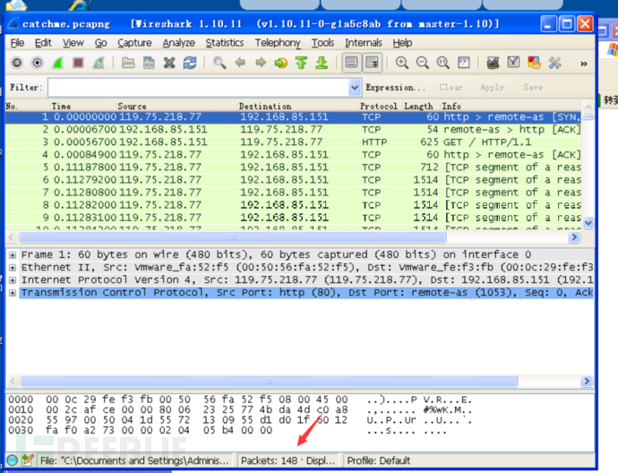](assets/ruhezaiCTFzhongshaozouwanlu（jichupian）/20180328/15222399622955.png)

但是手动一条一条去审计也很费精力。利用wireshark的显示过滤功能，因为从题目中我们确定，上传时候访问的是网站，所以在filter中输入http，显示所有的http协议数据包，还剩下32个

[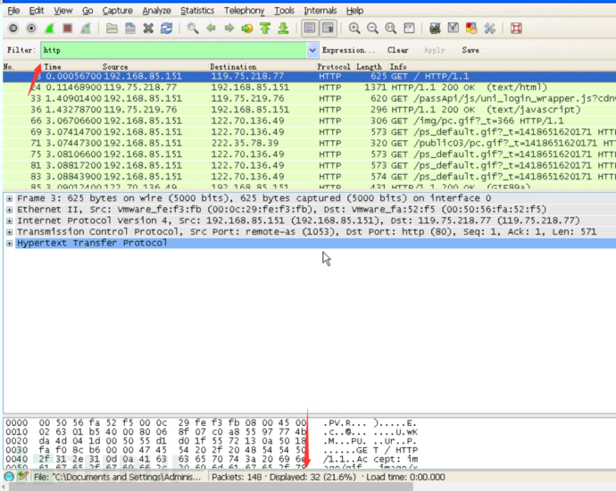](assets/ruhezaiCTFzhongshaozouwanlu（jichupian）/20180328/15222400015172.png)

通过分析我们发现在末尾第143条数据中看到upload关键词的post数据包，从而怀疑这条就是涉及到上传的数据包。

[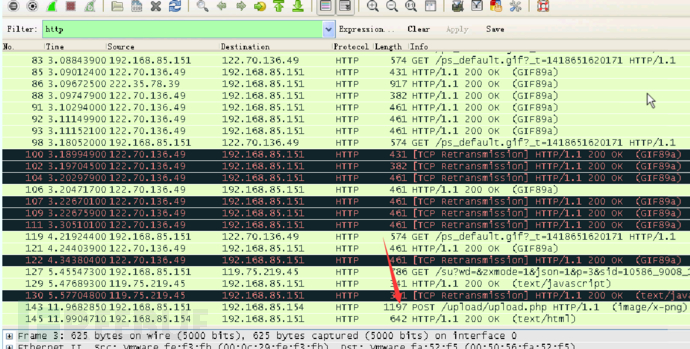](assets/ruhezaiCTFzhongshaozouwanlu（jichupian）/20180328/15222400559906.png)

### **知识补充**

> 以前的POST方式是不支持传送文件的，对于普通的post来说，他的Content-type是application/x-www-from-urlencode，也就意味着消息的内容会被url编码，但是后来支持传送文件，将Content-type扩展为multipart/form-data，来向server发送二进制数据，并且还要用一个内容分隔符来分割数据，boundry.
>
> 同时chrome和ie的策略也有所不同，IE是传送完整的路径，而Chrome只传送文件名。

如果拥有编写网站的经验，就会知道上传文件提交可以使用一个post表单的形式，所以也可以使用显示过滤器选出所有POST方法提交的数据包（http.request.method==”POST”）

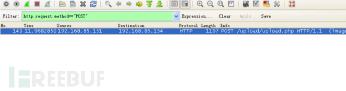
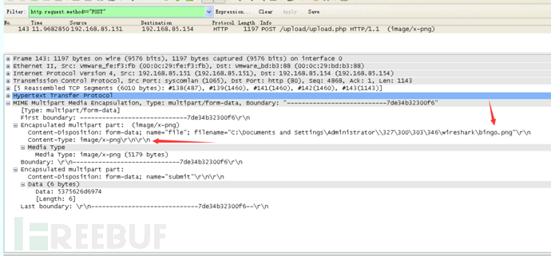

通过对这个数据包进行分析，得到确实上传了一张图片，文件名为bingo.png，同时由于文件较大，TCP协议对其进行了切片，一共切了5个片，点击各个Frame可以看到每个包中的内容。

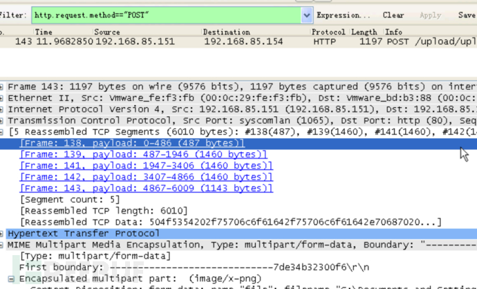

其实在这一步我们就可以直接将其中图片的十六进制数据进行复制，用一些十六进制编辑器（例如Winhex）写入其中保存为bingo.png就可以了（注意去掉不该有的数据。）

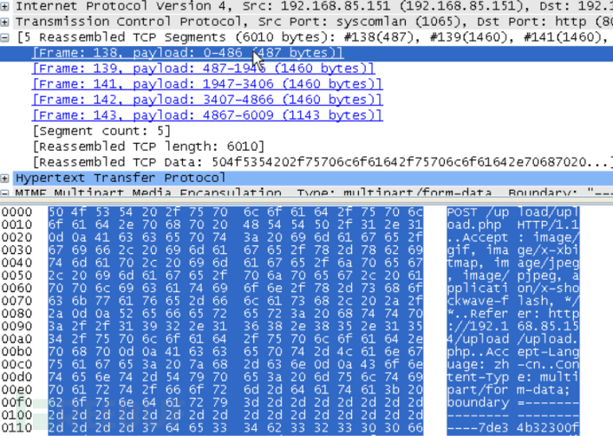

这里我们利用TCP流跟踪，对这个会话进行完整分析。

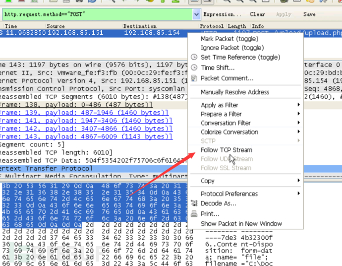

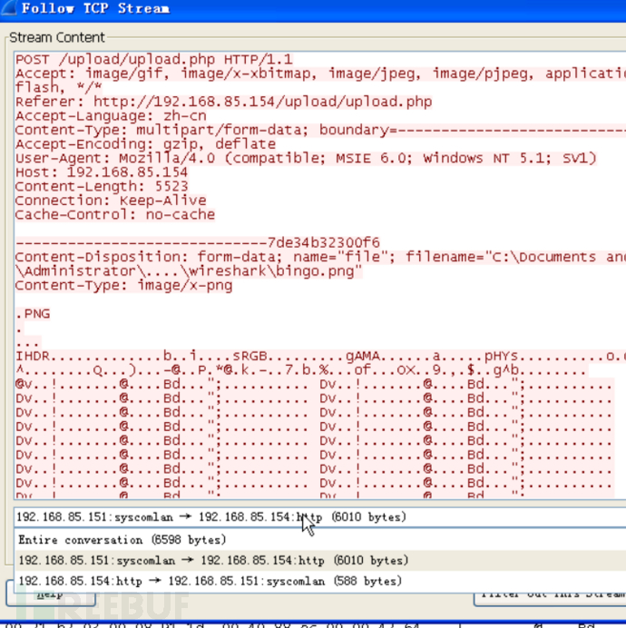

有两个数据包，一个是请求的包，一个是响应的包，我们选择较大的请求包（因为里边包含原始图片信息），选择原始类型将其进行保存。

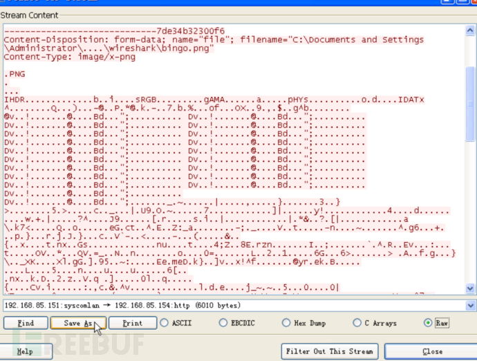

然后利用winhex将其打开，发现其囊括了整个HTTP请求（包括请求所用的头部以及所POST的数据包括boundary）

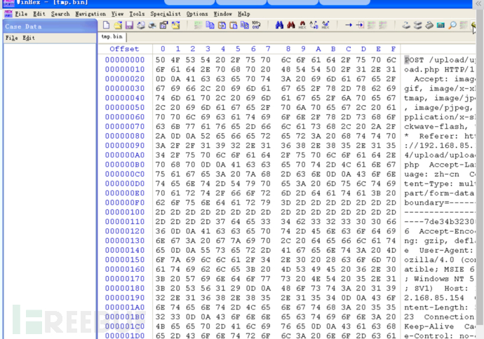

这里就不用原实验中的方法了因为较为麻烦，我们知道PNG图片的文件头为89 50 4E
47，所以直接在winhex中搜索十六进制数据，删除其前边的所有数据。

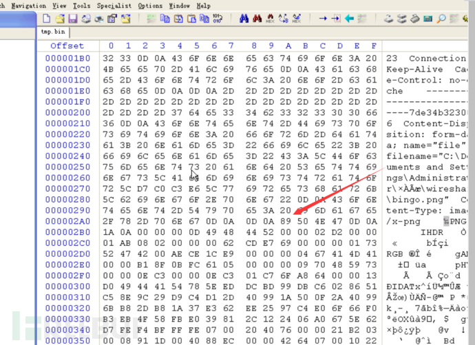

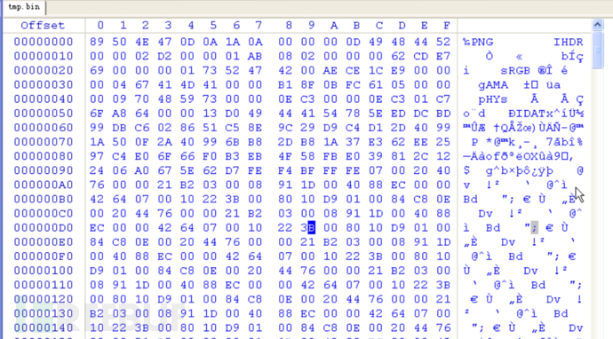

图片传送完毕还有其相关的尾部信息（可在刚才的wireshark流中查看），也对其进行删除操作

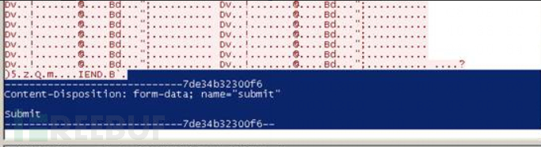

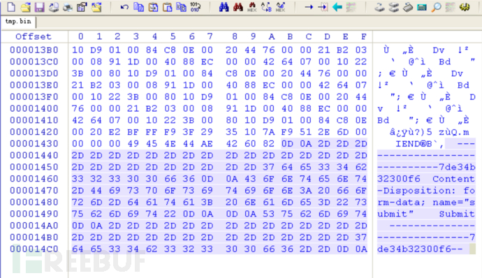

最后将其命名为bingo.png，打开图片得到key。

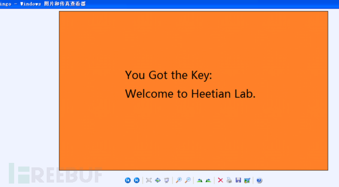

**现在我们来对在比赛中的三个方向进行分析**

### 1、流量包修复

比如一个流量包它的文件头也是对的，里边也没有包含其他的文件等等等等，但是就是打开出现一些未知的错误，这时候就要考虑对流量包进行修复。
这类题目考察较少，通常都借助现成的工具例如PCAPFIX直接修复。

> **Tools:**
>
> PcapFix Online  <https://f00l.de/hacking/pcapfix.php>
>
> PcapFix    <https://github.com/Rup0rt/pcapfix/tree/devel>

下边介绍流量包几个常见的块，详细介绍可以看：
<http://www.tcpdump.org/pcap/pcap.html>

**一般文件结构**

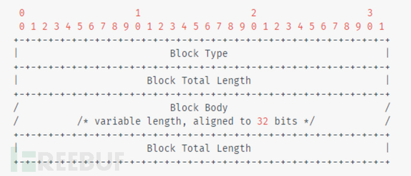

**常见块**

**Section Header
Block（必须存在）**

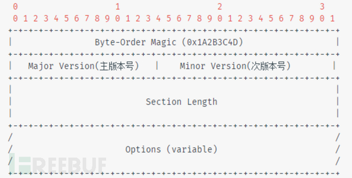

**Interface Description
Block（接口描述，必须存在，描述接口特性）**

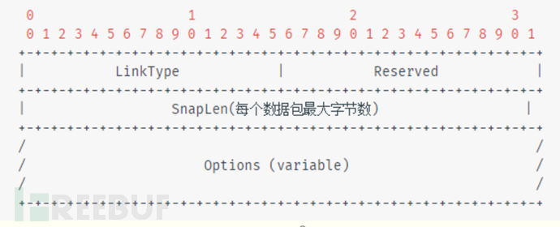

**Packet
Block（数据块）**

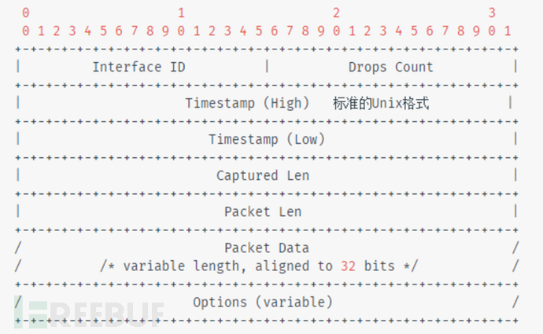

### 2、协议分析

此类方向需要对分析流量包工具所用的语法有一定的掌握，这里以wireshark为例，须掌握wireshark过滤器（捕捉过滤器与显示过滤器）的基础语法，从而更快更精准的获取指定的信息

捕捉过滤器：用于决定将什么样的信息记录在捕捉结果中，需要在开始捕捉前设置。

显示过滤器：用于在捕获结果中进行详细查找，可以在得到捕捉结果后进行更改

**捕捉过滤器基础语法**

    Protocol   Direction   Host(s)    Value   LogicalOperations    other expression
    tcp           dst           10.1.1.1     80      and     tcp dst 10.2.2.2    3128

**Protocol**

可能的值: ether, fddi, ip, arp, rarp, decnet,lat, sca, moprc, mopdl, tcp and
udp，如果没有特别指明是什么协议，则默认使用所有支持的协议。 

**Direction**

可能的值: src, dst, src and dst, src or dst，如果没有特别指明来源或目的地，则默认使用 “src or
dst” 作为关键字。

**Host(s)**

可能的值： net, port,host, portrange，如果没有指定此值，则默认使用”host”关键字。

例如，”src 10.1.1.1″与”src host 10.1.1.1″相同。

**Logical Operations**

可能的值：not, and, or

否(“not”)具有最高的优先级，或(“or”)和与(“and”)具有相同的优先级

“not tcp port 3128 and tcp port23″与”(not tcp port 3128) and tcp
port23″相同。

**举例分析：**

> **tcp dst port 3128         //**目的TCP端口为3128的封包。
>
> **ip src host 10.1.1.1**     //来源IP地址为10.1.1.1的封包。
>
> **host 10.1.2.3**                //目的或来源IP地址为10.1.2.3的封包。

**src portrange 2000-2500**

//来源为UDP或TCP，并且端口号在2000至2500范围内的封包

**not icmp**
    //除了icmp以外的所有封包。

**显示过滤器基础语法**

    Protocol    String1 String2     ComparisonOperator    Value   Logical Operations     other expression

**Protocol**

可以使用大量位于OSI模型第2至7层的协议。在Expression中可以看到，例如，IP，TCP，DNS，SSH

**String1，String2**

可选择显示过滤器右侧表达式，点击父类的+号，然后查看其子类

**Comparison Oerators**

可以使用六种比较运算符

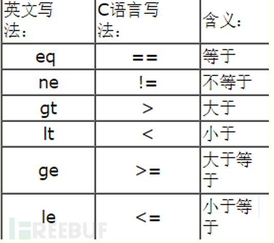

**Logical Expressions**

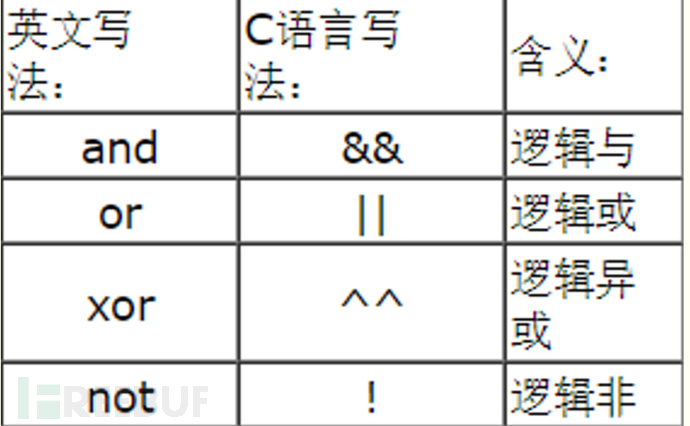

**举例**

> **snmp || dns || icmp**        //显示SNMP或DNS或ICMP封包
>
> **ip.addr == 10.1.1.1**              //显示源或目的IP为10.1.1.1的封包
>
> **ip.src \!= 10.1.2.3 and ip.dst\!=10.4.5.6** //显示源不为10.1.2.3并且目的不为10.4.5.6的封包
>
> **tcp.port == 25**         //显示来源或目的TCP端口号为25的封包
>
> **tcp.dport == 25**       //显示目的TCP端口号为25的封包

**如果过滤器语法是正确的，表达式背景为绿色，否则为红色**

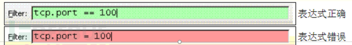

前文中的wireshark文件还原就可以说是一个很基础的数据包流量分析。

### 3、数据提取

这一块是流量包中另一个重点，通过对协议分析，找到题目的关键点，从而对所需要的数据进行提取。

可以学习一下tshark的使用。

tshark作为wireshark的命令行版，高效快捷是它的优点，配合其余命令行工具(awk,grep)等灵活使用，可以快速定位，提取数据从而省去了繁杂的脚本编写

**常用方法**：tshark –r \*\*.pcap –Y \*\* -T fields –e \*\* | \*\*\* \> data

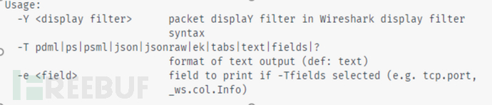

## **流量包例题分析**

### **题目1、MISC.rar**

key为文本格式，你找得到吗？

这道题非常基础，一般也是我拿到流量包首先会看的，既然要找的文本格式，那我就直接查看

用wireshark打开数据包，在文件 -\> 导出对象中，选择HTTP

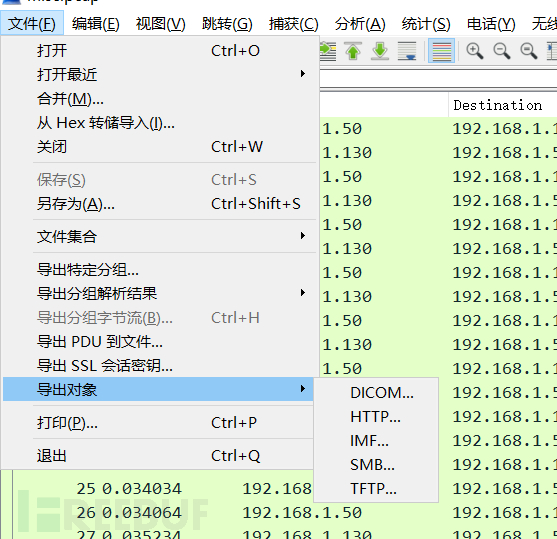

拉到最下方，发现有一份txt文件，选中并save，打开文件后得到key

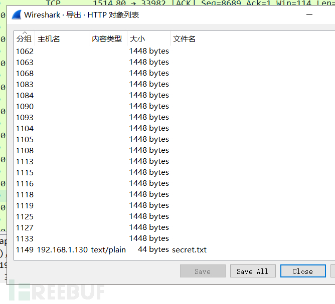
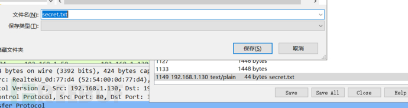
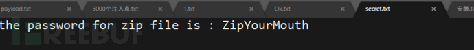

### **题目2：ISCC Misc 就在其中**

打开数据包，简单分析一下，arp寻找到目的ip的MAC地址进行通信，TCP三次握手，然后利用FTP进行文件下载，我们来追踪TCP流

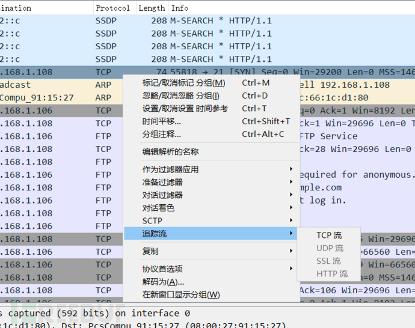

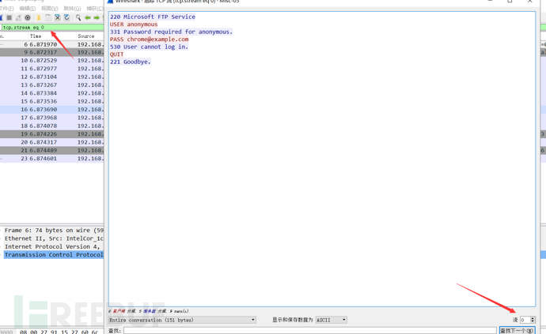

eq是等于的意思，后边的序号是一次完整的TCP连接，依次更改直到我们想要的内容

看到有个pub.key还有其他一些文件，看到这些信息需要敏感一点，从这个公钥自然联想到私钥，私钥可以干嘛？这里边的文件和私钥有什么关系？难道是被加密的文件要用私钥来进行解密？

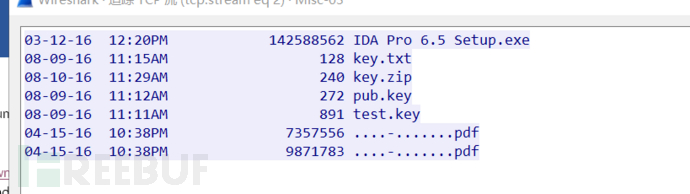

再翻一翻发现一枚私钥，应该确定是需要使用密钥来对文件进行解密。

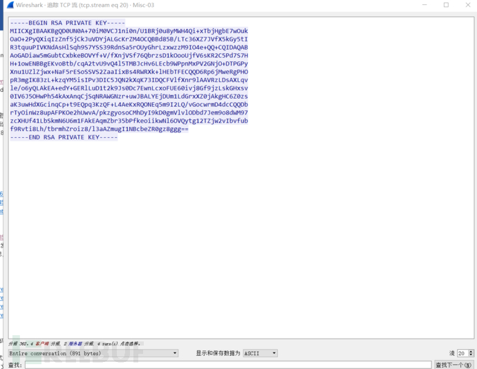

把私钥复制出去，存为private.key，数据包里边还有很多文件，我们用binwalk查看一下看有没有是否可以提取

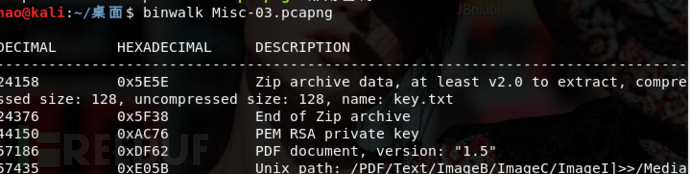

发现一个压缩包，里边有一个key.txt，我们使用foremost对其进行提取，并解压出这个key.txt，但是打印发现里边的数据是乱码，大可能是被加密了？

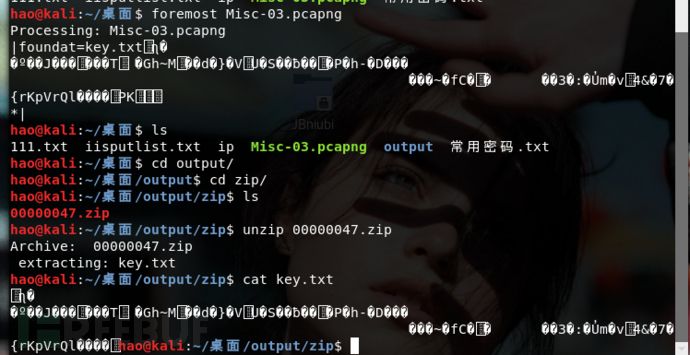

然后使用openssl对其进行解密

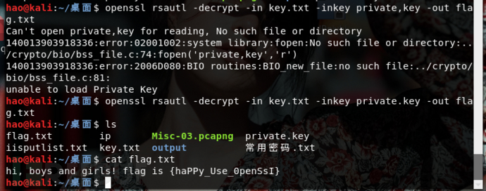

成功得到flag。

**openssl 的使用**

openssl是一个功能强大的工具包，它集成了众多密码算法及实用工具。我们即可以利用它提供的命令台工具生成密钥、证书来加密解密文件，也可以在利用其提供的API接口在代码中对传输信息进行加密。Openssl的简单使用：

**1、生成一个密钥**

    openssl genrsa -out test.key 1024 

这里-out指定生成文件的。需要注意的是这个文件包含了
**公钥和密钥两部分**，也就是说这个文件即可用来加密也可以用来解密。后面的1024是生成密钥的长度。

**2、提取文件中的公钥**

    openssl rsa -in test.key -pubout -outtest_pub.key

\-in指定输入文件，-out指定提取生成公钥的文件名。至此，我们手上就有了一个公钥，一个私钥（包含公钥）。现在可以将用公钥来加密文件了。

**3、在目录中创建一个hello的文本文件，然后用此前生成的公钥加密文件**

    openssl rsautl -encrypt -in hello -inkeytest_pub.key -pubin -out hello.en

\-in指定要加密的文件，-inkey指定密钥，-pubin表明是用纯公钥文件加密，-out为加密后的文件

**4、解密文件**

    openssl rsautl -decrypt -in hello.en -inkeytest.key -out hello.de

\-in指定要加密的文件，-inkey指定密钥，-pubin表明是用纯公钥文件加密，-out为加密后的文件。

### **题目3：Google-CTF-2016：a-cute-stegosaurus-100**

<https://github.com/ctfs/write-ups-2016/tree/master/google-ctf-2016/forensics/a-cute-stegosaurus-100>

当时做出这道题的并不多，全球只有26支队伍，给我我也不会做，拿过来咱看看

**在tcp报文段中有6Bit的状态控制码，分别如下**

> **URG：** 紧急比特（urgent）,当URG＝1时，表明紧急指针字段有效,代表该封包为紧急封包。它告诉系统此报文段中有紧急数据，应尽快传送(相当于高优先级的数据)
>
> **ACK：** 确认比特（Acknowledge）。只有当ACK＝1时确认号字段才有效,代表这个封包为确认封包。当ACK＝0时，确认号无效。
>
> **PSH：** （Push function）若为1时，代表要求对方立即传送缓冲区内的其他对应封包，而无需等缓冲满了才送。
>
> **RST:** 复位比特(Reset)
> ,当RST＝1时，表明TCP连接中出现严重差错（如由于主机崩溃或其他原因），必须释放连接，然后再重新建立运输连接。
>
> **SYN：** 同步比特(Synchronous)，SYN置为1，就表示这是一个连接请求或连接接受报文,通常带有 SYN
> 标志的封包表示『主动』要连接到对方的意思。。
>
> **FIN：** 终止比特(Final)，用来释放一个连接。当FIN＝1时，表明此报文段的发送端的数据已发送完毕，并要求释放运输连接。

而本题中的tcp.urg却为

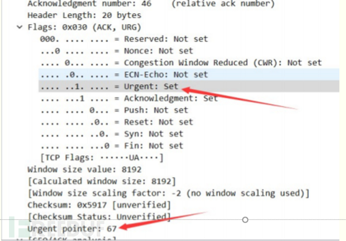

通过tshark提取 tcp.urg 然后取出0的字段，换行符转，直接转换成python的列表，转ascii即可得到flag

tshark -r Stego-200\_urg.pcap -T fields -etcp.urgent\_pointer|egrep -vi
“^0$”|tr ‘\\n’ ‘,’

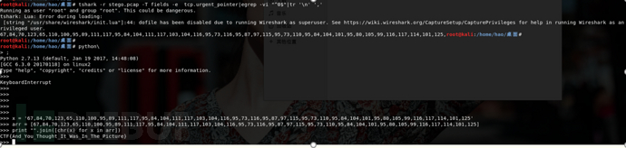

## 二、文件头篇

判断文件头，根据头部信息修改相关格式这应该是基础中的基础，同时也需要收集一份常见文件头标志大全（附件有一份）方便做题时候使用。

### **题目：ISCC Misc 眼见非实**

题目解压后为一个word格式，打开后发现出现问题

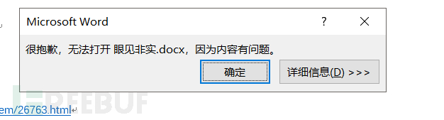

查看一下文件的文件头为ZIP格式，对其进行修改

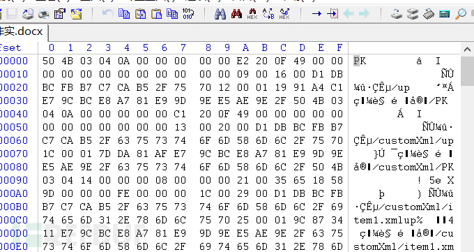

修改为相应的压缩包格式后，发现是一个文件夹里边包含很多文件，利用notepad++或其他工具对所有文件进行搜索，关键词为flag，从而get\_flag

## **三、压缩包篇**

CTF中的压缩包隐写一般有这样几个套路

### **1、通过编码转换隐藏信息（common）**

比如给出一堆字符或数字，仔细观察为某种进制，将其解码为十六进制，观察其文件头是压缩包或者是其他格式，修改后缀名后解压得到flag

### **2、在文件中隐藏压缩包（图种）**

在CTF压缩包隐写中最为常见，多用于在一个文件中隐藏一个压缩包

原理：以jpg格式为例，完整的JPG由FF D8开头，FF D9结束，图片浏览器会忽略FF
D9之后的内容，因此可以在JPG文件之后加入其他的文件。

利用foremost，dd或者直接将其修改为压缩包后缀进行提取。

推荐使用foremost，因为foremost还可以分离其他隐藏的文件。

修改为ZIP文件虽然方法简单，但是如果隐写了多个文件时可能会失败。

以前不知道foremost的时候一直是用dd分离的，后边知道了foremost就一直用的foremost。

### **3、伪加密**

原理：ZIP伪加密是在文件头的加密标志位进行修改，进而再次打开文件时被识别为加密压缩包。

ZIP文件主要由三个部分组成：压缩源文件数据区 + 核心目录 + 目录结束标志

**压缩源文件数据区**

    local file header + file data + data descriptor

> **local file header：**文件头用于标识该文件的开始，记录了该压缩文件的信息，这里的文件头标识由固定值 50 4B 03
> 04 开头，也是 ZIP 的文件头的重要标志。
>
> **file data：**文件数据记录了相应压缩文件的数据。
>
> **data descriptor：**数据描述符用于标识该文件压缩结束，该结构只有在相应的 local file header
> 中通用标记字段的第 3 bit设为 1 时才会出现，紧接在压缩文件源数据后。
>
> 50 4B 03 04：这是头文件标记（0x04034b50） 
>
> 14 00：解压文件所需 pkware 版本 
>
> 00 00：全局方式位标记（有无加密） 
>
> 08 00：压缩方式 
>
> 5A 7E：最后修改文件时间 
>
> F7 46：最后修改文件日期 
>
> 16 B5 80 14：CRC-32校验（1480B516） 
>
> 19 00 00 00：压缩后尺寸（25） 
>
> 17 00 00 00：未压缩尺寸（23） 
>
> 07 00：文件名长度 
>
> 00 00：扩展记录长度 

6B65792E7478740BCECC750E71ABCE48CDC9C95728CECC2DC849AD284DAD0500
（直到核心目录文件头标识）

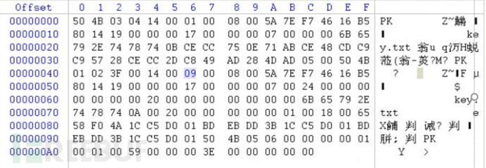

**核心目录**

记录了压缩文件的目录信息，在这个数据区中每一条纪录对应在压缩源文件数据区中的一条数据。

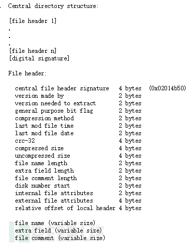

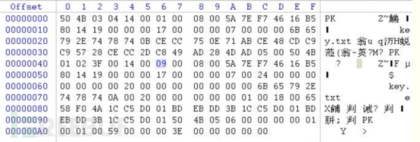

> 50 4B 01 02：目录中文件文件头标记(0x02014b50) 
> 3F 00：压缩使用的 pkware 版本 
> 14 00：解压文件所需 pkware 版本 
> 00 00：全局方式位标记（有无加密，这个更改这里进行伪加密，改为09 00打开就会提示有密码了） 
> 08 00：压缩方式 
> 5A 7E：最后修改文件时间 
> F7 46：最后修改文件日期 
>
> 16 B5 80 14：CRC-32校验（1480B516） 
> 19 00 00 00：压缩后尺寸（25） 
> 17 00 00 00：未压缩尺寸（23） 
> 07 00：文件名长度 
> 24 00：扩展字段长度 
> 00 00：文件注释长度 
> 00 00：磁盘开始号 
> 00 00：内部文件属性 
> 20 00 00 00：外部文件属性 
> 00 00 00
> 00：局部头部偏移量 
> 6B65792E7478740A00200000000000010018006558F04A1CC5D001BDEBDD3B1CC5D001BDEBDD3B1CC5D001
> (直到目录结束标识头）

**目录结束标识（End of Central Directory Record)**

存在于整个归档包的结尾，用于标记压缩的目录数据的结束。每个压缩文件必须有且只有一个结束标识。

> 50 4B 05 06：目录结束标记 
> 00 00：当前磁盘编号 
> 00 00：目录区开始磁盘编号 
> 01 00：本磁盘上纪录总数 
> 01 00：目录区中纪录总数 
> 59 00 00 00：目录区尺寸大小 
> 3E 00 00 00：目录区对第一张磁盘的偏移量 
> 00 00：ZIP
文件注释长度

**伪加密修改的几种方法**

> 1、在Mac
OS以及部分linux（Kali）系统中，可以直接打开伪加密的ZIP压缩包。
>
> 2、使用检测伪加密的工具ZipCenOp.jar，解密后如果能成功打开ZIP包，则是伪加密，否则说明思路错误。
>
> 3、使用16进制编辑器更改加密标志位。

**题目：flag6.zip**

打开压缩包之后发现需要解压密码

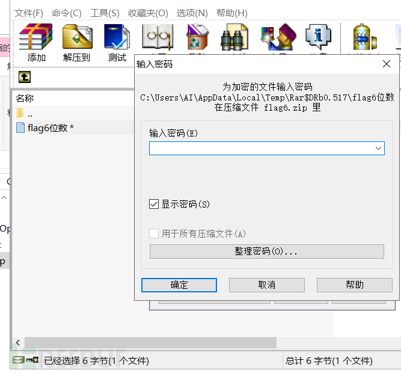

既然已经知道是伪加密那就直接尝试伪加密，利用伪加密判断工具ZipCenOp

    java -jar ZipCenOp.jar r xxx.zip

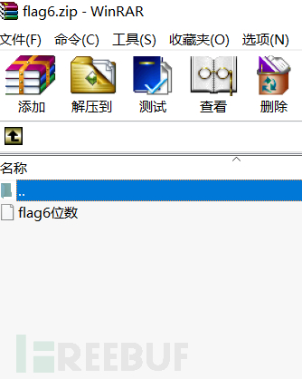

可以解压得到key

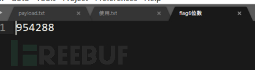

### **4、爆破/字典/掩码攻击**

> 爆破：顾名思义，逐个尝试选定集合中可以组成的所有密码，直到遇到正确密码
>
> 字典：字典攻击的效率比爆破稍高，因为字典中存储了常用的密码，因此就避免了爆破时把时间浪费在脸滚键盘类的密码上。
>
> 掩码攻击：如果已知密码的某几位，如已知6位密码的第3位是a，那么可以构造 ??a???
> 进行掩码攻击，掩码攻击的原理相当于构造了第3位为a的字典，因此掩码攻击的效率也比爆破高出不少

**推荐工具：ARCHPR**

需熟悉ARCHPR的使用

爆破和字典就不说了，看字面意思就会用工具了

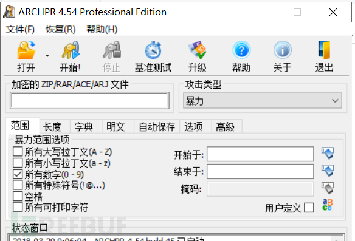

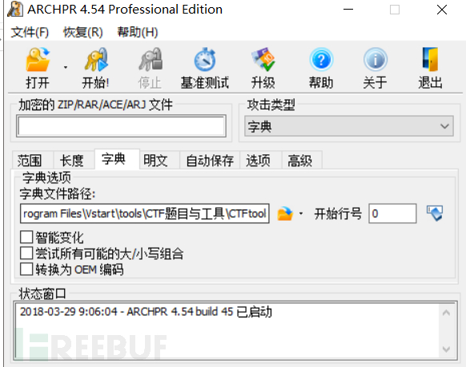

**看一个题说一下掩码：ISCC 2017
Misc-06**

题目给出一个图片，利用binwalk查看里边有一个压缩包，将其提取发现需要密码

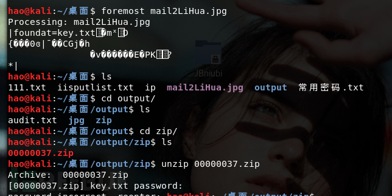

根据题目提示：

假如你是李华（LiHua），收到乔帮主一封密信，没有任何特殊字符，请输入密码，不少于1000个字，同学记得署名哦~

记得署名，而且题目提示LiHua，构造????Lihua，进行爆破

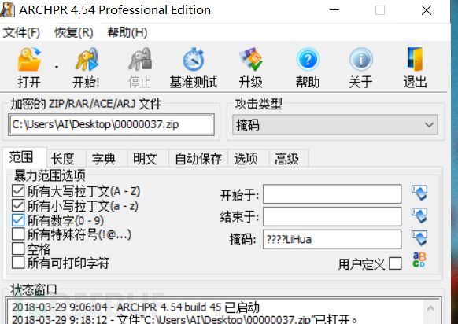

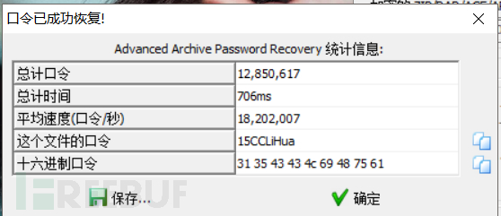

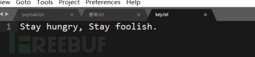

### **5、明文攻击**

明文攻击是一种较为高效的攻击手段，大致原理是当你不知道一个zip的密码，但是你有zip中的一个已知文件（文件大小要大于12Byte）时，因为同一个zip压缩包里的所有文件都是使用同一个加密密钥来加密的，所以可以用已知文件来找加密密钥，利用密钥来解锁其他加密文件。

**题目：是FBCTF中的一个题 蒙古\_攻击**

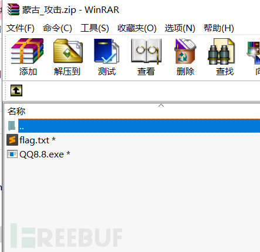

打开后发现文件加密并且有QQ8.8.exe，找个QQ8.8打包

完成后解出flag

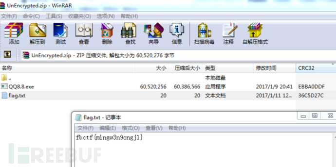

### **6、CRC32碰撞**

CRC（冗余校验码），CRC32表示会产生一个32bit的校验值。

在产生CRC32时，源数据块的每一位都参与了运算，因此即使数据块中只有一位发生改变也会得到不同的CRC32值，利用这个原理我们可以直接爆破出加密文件的内容。

**\*\*由于CPU能力，CRC碰撞只能用于压缩文件较小的情况\*\***

**例题：flag6.zip**

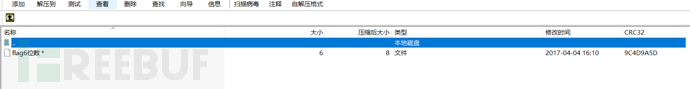

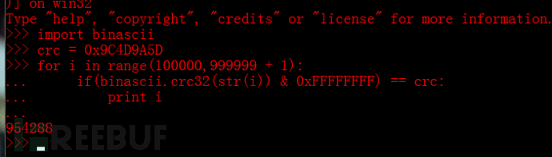

因为题目提示文件中flag的数值为6位数，所以所爆破的范围也选择6位数。最后计算出flag的值。

为什么要&
0xffffffff，由官方文档得知

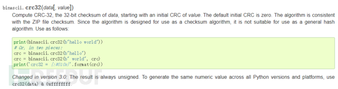

在3.x版本结果总是无符号的，为了在python所有的版本产生出相同类型的数值，还是推荐使用将数据\&ffffffff。

### **7、修改格式**

最常见的缺少文件头或者文件尾。

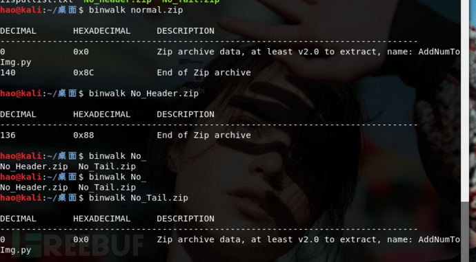

正常的压缩包文件都有开始部分和结束部分，而有一些题目修改了压缩包格式，去掉头或去掉尾，导致解压出现问题。

打开缺少头部的ZIP文件

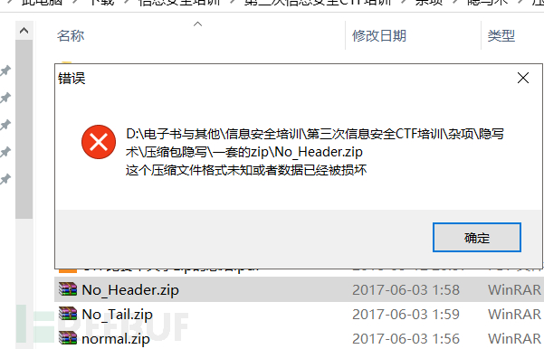

打开缺少尾部的ZIP文件

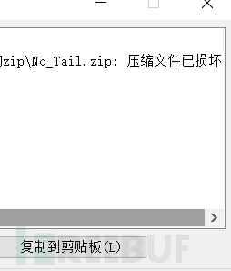

填充其缺少的部分

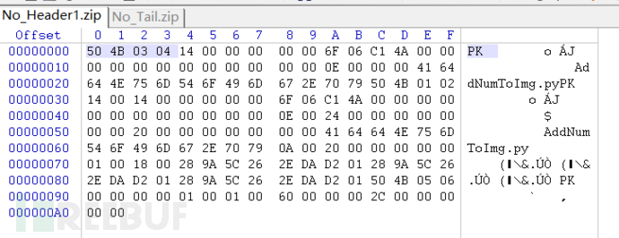

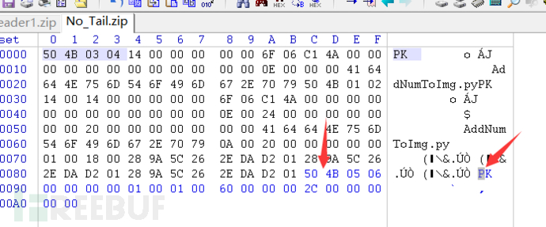

修复完成后便可解压成功，其实也可以不用手动，直接用winrar里边有个压缩包修复进行修复也可以的。

上边说的基本都ZIP格式的，现在来看一下RAR格式的

**RAR**

文件格式

RAR 文件主要由标记块，压缩文件头块，文件头块，结尾块组成。

其每一块大致分为以下几个字段：

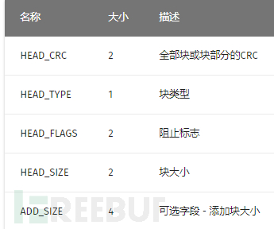

RAR压缩包的文件头为：52 61 72 21 1A 07 00

其后是标记块（MARK\_HEAD），还有文件头（FILE\_HEAD）。

更多信息见： <http://www.forensicswiki.org/wiki/RAR>

**主要攻击方式**

1、爆破

利用linux下的rarcrack（ <http://rarcrack.sourceforge.net/>）

2、伪加密

RAR 文件的伪加密在文件头中的位标记字段上，用 010 Editor
可以很清楚的看见这一位，修改这一位可以造成伪加密。

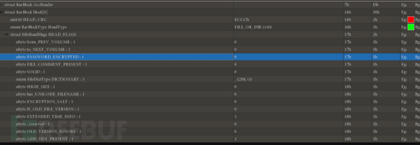

3、其他如明文攻击等方法与ZIP相同。

## **四、图片隐写篇**

太常见太常见，图像文件有多种复杂的格式，可以用于各种涉及到元数据、信息丢失和无损压缩、校验、隐写或可视化数据编码的分析解密，都是 Misc
中的一个很重要的出题方向。

**图片隐写术的基础知识——元数据隐写**

元数据（Metadata），又称中介数据、中继数据，为描述数据的数据（Data about
data），主要是描述数据属性（property）的信息，用来支持如指示存储位置、历史数据、资源查找、文件记录等功能。

元数据中隐藏信息在比赛中是最基本的一种手法，通常用来隐藏一些关键的 Hint 信息或者一些重要的比如password 等信息。

**这类元数据可以 右键 -\> 属性
查看**

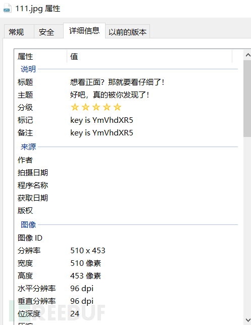

**介绍两个命令**

strings：打印可打印的字符，通常可以发现隐藏在压缩包中的注释内容或者是解压需要的密码等。

inentify：用于获取一个或多个图像文件的格式和特征，用来提取一些特定的数据。

**PNG图片**

**文件格式**：对于PNG文件来说，其文件头总是由固定的字节来描述的，剩余的部分由3个以上的PNG数据块（Chunk）按照特定的顺序组成。

**文件头：**89 50 4E 47 0D 0A 1A 0A + 数据块 + 数据块 + 数据块…..

**数据块（Chunk）**

PNG 定义了两种类型的数据块，一种是称为关键数据块（critical
chunk），这是标准的数据块，另一种叫做辅助数据块（ancillarychunks），这是可选的数据块。关键数据块定义了
4 个标准数据块，每个 PNG 文件都必须包含它们，PNG
读写软件也都必须要支持这些数据块。

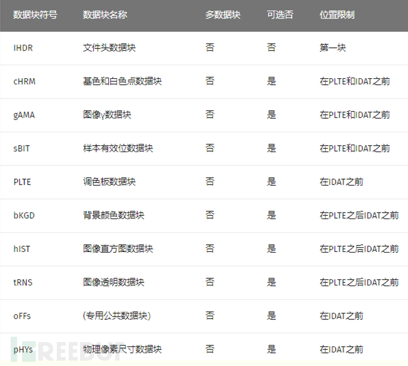
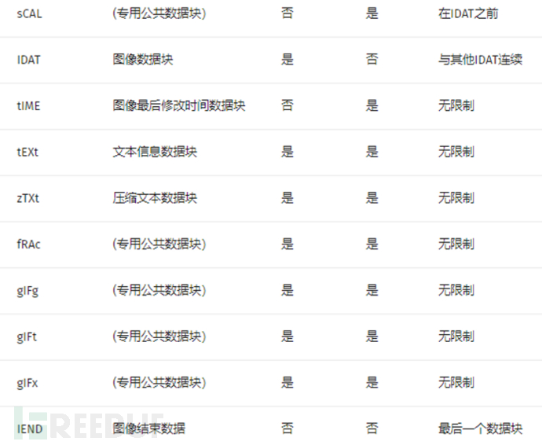

对于每个数据块都有着统一的数据结构，每个数据块由 4
个部分组成

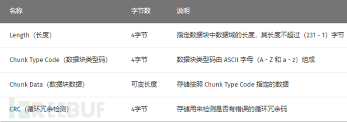

**IHDR（文件头数据块）**

文件头数据块 IHDR（HeaderChunk）：它包含有 PNG 文件中存储的图像数据的基本信息，由 13
字节组成，并要作为第一个数据块出现在 PNG 数据流中，而且一个 PNG
数据流中只能有一个文件头数据块，其中我们只关注前8字节的内容

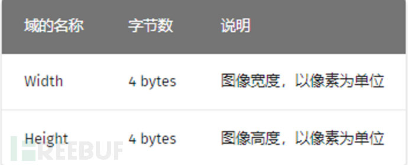

经常会去更改一张图片的高度或者宽度使得一张图片显示不完整从而达到隐藏信息的目的。

Kali中不可以打开，提示文件头错误，而Windows自带的图片查看器可以打开，就提醒了我们IHDR被人篡改过。

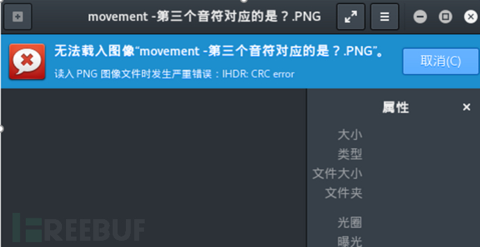

**说到这里我们来看一个题：蓝盾的一个题（Bluedon.zip）**

伪加密解密后解压出一张图片

用winhex打开看一下，注意这个位置

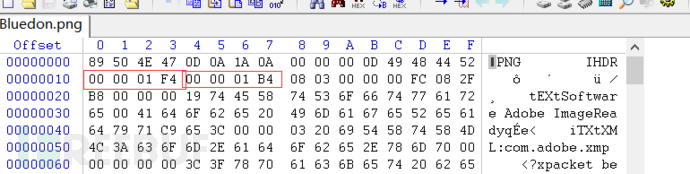

发现宽是500像素，但是高是436像素，将其进行修改，修改高同为500像素

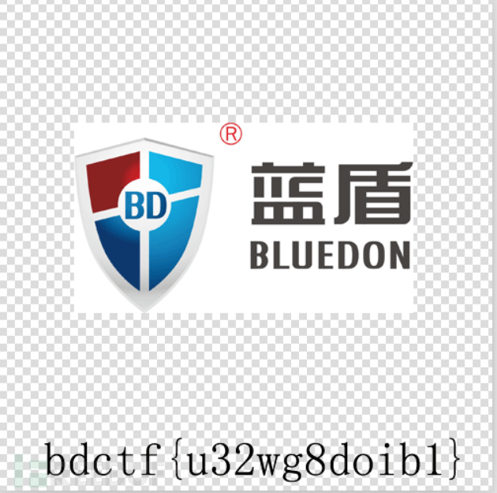

得出flag。

**IDAT（图像数据块）**

IDAT：存储实际的数据，在数据流中可包含多个连续顺序的图像数据块。

  - 储存图像像数数据。
  - 在数据流中可包含多个连续顺序的图像数据块。
  - 采用 LZ77 算法的派生算法进行压缩。
  - 可以用 zlib 解压缩。

**\* IDAT块只有当上一个块充满时，才会继续下一个新块。\***

也可以使用Stegsolve -\> Format
Analysis有详细介绍

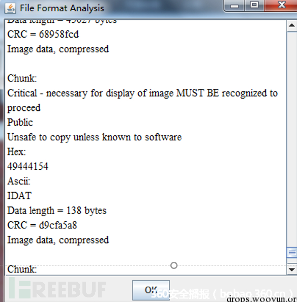

**看一个题：sctf-misc400（sctf.png）**

用pngcheck去查看此png图片

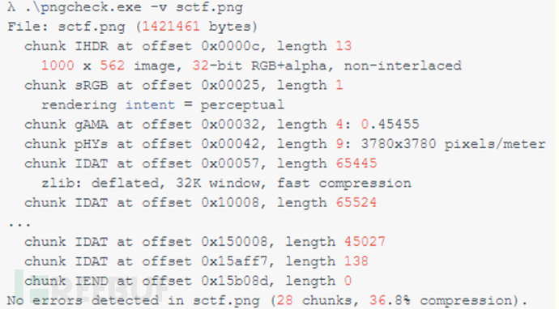

正常的块的 length 是在 65524 的时候就满了，而倒数第二个 IDAT 块长度是 45027，最后一个长度是 138，很明显最后一个
IDAT
块是有问题的，因为它本应该并如倒数第二个块

这是倒数第二个块的开始部分（可以从上图中得知其开始数据）

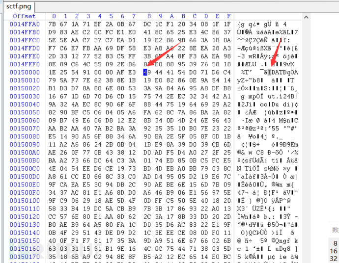

这是最后一个块

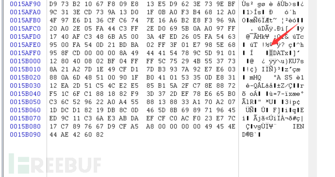

最后一个块没有并入倒数第二个块，那应该是最后一个块有问题

49 44 41 54为数据块头部开始信息，D9 CF A5 A8为crc32校验位，前边得知IDATA采用 LZ77
算法的派生算法进行压缩并可以用 zlib
解压缩。利用python zlib解压多余的IDATA内容块，
**需注意要剔除开始头部信息、数据块类型以及末尾的CRC校验值**，所以最后所得的数据为：

789C5D91011280400802BF04FFFF5C75294B5537738A21A27D1E49CFD17DB3937A92E7E603880A6D485100901FB0410153350DE83112EA2D51C54CE2E585B15A2FC78E8872F51C6FC1881882F93D372DEF78E665B0C36C529622A0A45588138833A170A2071DDCD18219DB8C0D465D8B6989719645ED9C11C36AE3ABDAEFCFC0ACF023E77C17C7897667

    import zlib
    import binascii
    IDAT = "789...667".decode('hex')
    result = binascii.hexlify(zlib.decompress(IDAT))
    print result

    31313131313131303030313030303031313031313131313131313030303030313031313130303130313130313030303030313130313131303130313030303030303030303130313131303131303131313031303031303030303030303031303131313031313031313130313031313130313130313030313031313130313130303030303130313031303131303131303130303030303131313131313131303130313031303130313031313131313131303030303030303031303131313031313130303030303030303131303130303131303030303031303130303131313031313031313131303130313031303031303030303131313030303030303030303030313031303030303030303031303031303031313031303030313030313131303031313131303131313030313131313030303031313130313131313130303031313030313031303030313130303131313030303031303130313030303131303130303031313131303130313130303030303130313030303130313130303030303131303131313031313030313030303031313130303131313030313030303031303131313131313130313030303030303030313130313031303031303030313131313031313131313131303131313030303031313031303131303131313030303030313030303031313030313130303031313131303130313131303130303031313031303031313131313030303031303131313031303131303030313131303130303131313030313031313130313030313030313131303131303131303030313130303030303130313130303031313031303030313130303031313131313131303131303130313130313131303131303131

30 和 31是hex 的 0和
    1的编码，再解一次hex得到一串01字符串

    1111111000100001101111111100000101110010110100000110111010100000000010111011011101001000000001011101101110101110110100101110110000010101011011010000011111111010101010101111111000000001011101110000000011010011000001010011101101111010101001000011100000000000101000000001001001101000100111001111011100111100001110111110001100101000110011100001010100011010001111010110000010100010110000011011101100100001110011100100001011111110100000000110101001000111101111111011100001101011011100000100001100110001111010111010001101001111100001011101011000111010011100101110100100111011011000110000010110001101000110001111111011010110111011011

长度为625，7和8都无法整除，也就是说没法直接转换为ASCII码。

**ASCII 知识补充**

计算机内部，所有信息最终都表示为一个二进制的字符串，每一个二进制位有0和1两种状态，因此8个二进制位有256种状态，被称为一个字节（byte）。

一个字节一共可以用来表示256种不同的状态，每一个状态对应一个符号，也就是256个符号，从00000000到11111111。ASCII一共规定了128个字符的编码，比如空格“Space”是32（00100000）。这128个符号（包括32个不可打印的控制符号），只占用了一个字节的后7位，最前面一位统一规定为0.

这也就可以理解为什么从7和8判断不可以转成ASCII码。

625 = 25\*25，是正方形的形状，利用python的PIL库将画图

    #!/usr/bin/env python
    import Image
    MAX = 25
    pic = Image.new("RGB",(MAX, MAX))
    str = "1111111000100001101111111100000101110010110100000110111010100000000010111011011101001000000001011101101110101110110100101110110000010101011011010000011111111010101010101111111000000001011101110000000011010011000001010011101101111010101001000011100000000000101000000001001001101000100111001111011100111100001110111110001100101000110011100001010100011010001111010110000010100010110000011011101100100001110011100100001011111110100000000110101001000111101111111011100001101011011100000100001100110001111010111010001101001111100001011101011000111010011100101110100100111011011000110000010110001101000110001111111011010110111011011"
    i=0
    for y in range (0,MAX):
        for x in range (0,MAX):
            if(str[i] == '1'):
                pic.putpixel([x,y],(0, 0, 0))
            else:
                pic.putpixel([x,y],(255,255,255))
            i = i+1
    pic.show()
    pic.save("flag.png")

发现是个二维码，画出来后0代表白色，1代表黑色，需要旋转或者反色才可以扫描出来，然后得到flag.

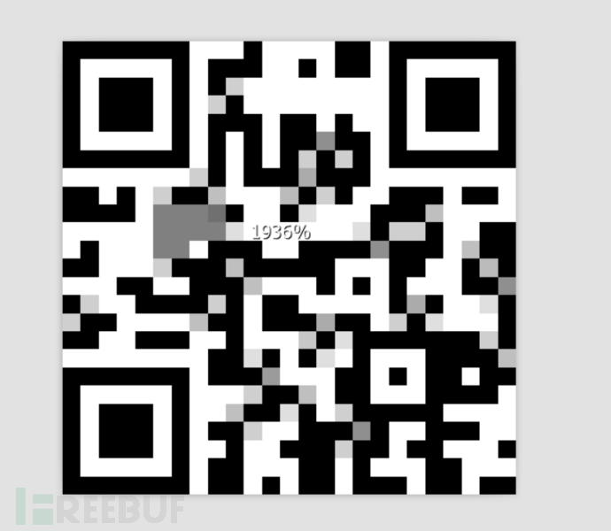

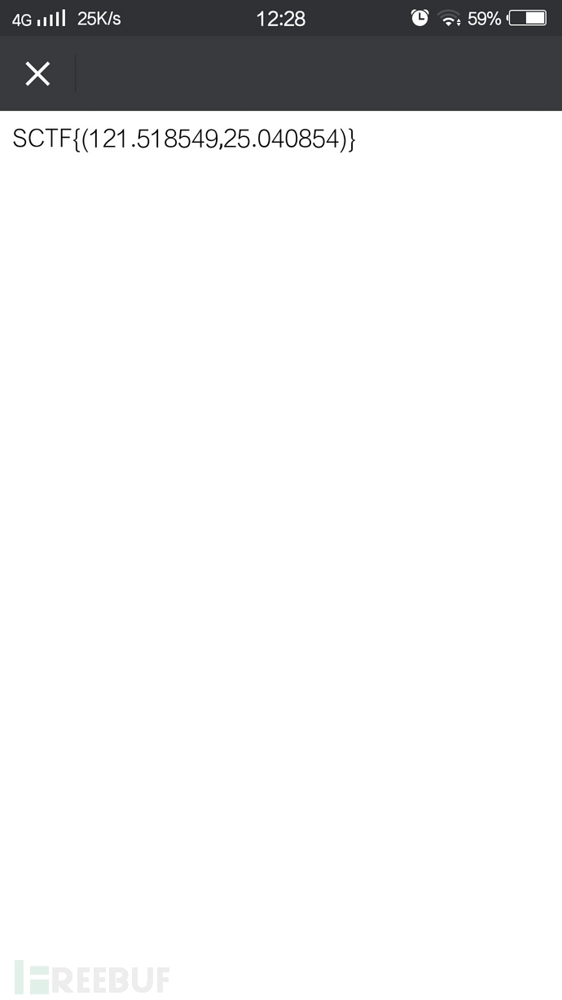

另一种方法：

binwalk查看

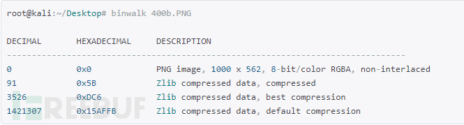

后面是Zlib压缩的数据，写个脚本解压一下：

    from PIL import Image
    from zlib import *
     
    data = open('400b.PNG','rb').read()[0x15AFFB:]
    data = decompress(data)
     
    img = Image.new('1', (25,25))
    d = img.load()
     
    for n,i in enumerate(data):
    d[(n%25,n/25)] = int(i)*255
     
    f = open('2.png','wb')
    img.save(f)

得到一个二维码，但是不能访问：

PS变相之后就可以了 微信扫一扫，SCTF{(121.518549,25.040854)}

**IEND**

图像结束数据 IEND（image trailer chunk）：它用来标记 PNG 文件或者数据流已经结束，并且必须要放在文件的尾部。

    00 00 00 00 49 45 4E 44 AE 42 60 82

END 数据块的长度总是 00 00 00 00 ，数据标识总是 IEND 49 45 4E 44，因此，CRC 码也总是 AE 42 60 82。

**其余的辅助数据块：**

> 背景颜色数据块 bKGD（background color）
>
> 基色和白色度数据块 cHRM（primary chromaticities and white point），所谓白色度是指当 
> `R＝G＝B＝最大值` 时在显示器上产生的白色度
>
> 图像 γ 数据块 gAMA（image gamma）
>
> 图像直方图数据块 hIST（image histogram）
>
> 物理像素尺寸数据块 pHYs（physical pixel dimensions）
>
> 样本有效位数据块 sBIT（significant bits）
>
> 文本信息数据块 tEXt（textual data）
>
> 图像最后修改时间数据块 tIME （image last-modification time）
>
> 图像透明数据块 tRNS （transparency）
>
> 压缩文本数据块 zTXt （compressed textual data）

**利用LSB来进行隐写**

**LSB全称LeastSignificant Bit，也就是最低有效位。**

PNG文件中的图像像数一般是由RGB三原色组成，每一种颜色占用8位，取值范围为0×00~0xFF，即256种颜色，一共包含了256的三次方的颜色，即16777216（1千677W）种颜色。人类的眼睛可以区分约1000万种不同的颜色，这就意味着人类的眼睛无法区分余下的颜色大约有6777216（677W）种。

LSB隐写就是修改RGB颜色分量的最低二进制位（LSB），每个颜色都会有8bit，LSB隐写就是修改了像数中的最低的1Bit，而人类的眼睛不会注意到这前后的区别，每个像数可以携带3Bit的信息，这样就把信息隐藏起来了。

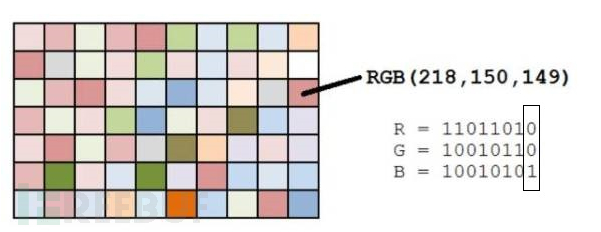

譬如把’A’隐藏起来，如下图，可以把A转成十六进制的0×61，再转成二进制的01100001，再修改红色通道的最低位为这些二进制串。

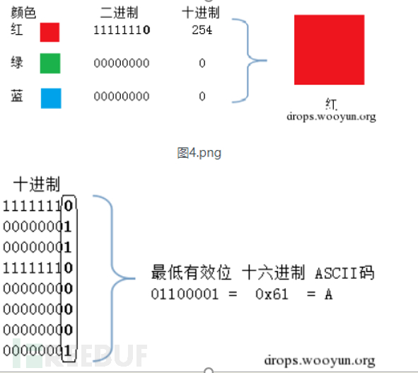

如果是要寻找这种 LSB 隐藏痕迹的话，可以使用工具 Stegsolve来辅助我们进行分析。

通过下方的按钮可以观察每个通道的信息，例如查看 R 通道的最低位第 8
位平面的信息。

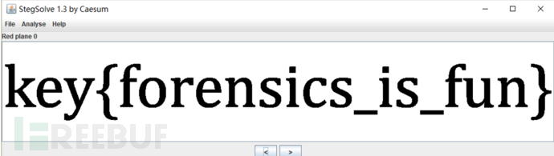

**例题：lsb.png**

打开为普通图片一张

使用stegsolve浏览通道获得二维码

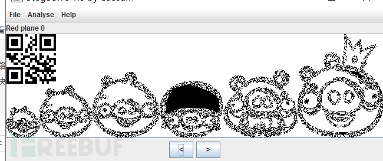

扫描得到flag

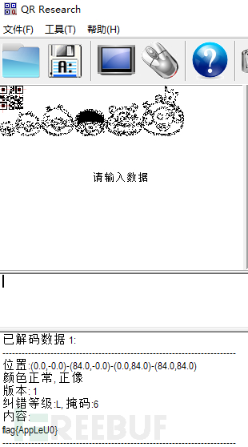

如果隐写使用了ascii的时候，可以使用Stegsolve—Analyse—DataExtrack来查看ascii码。

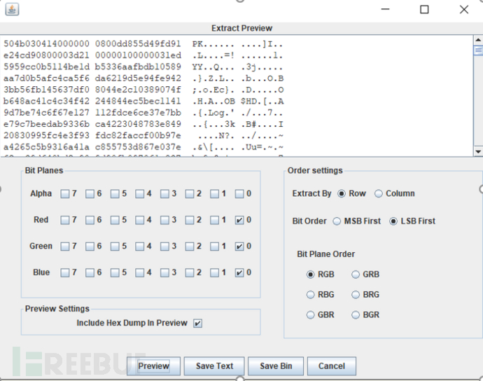

**例题：HCTF 2016
MISC（flag.php）**

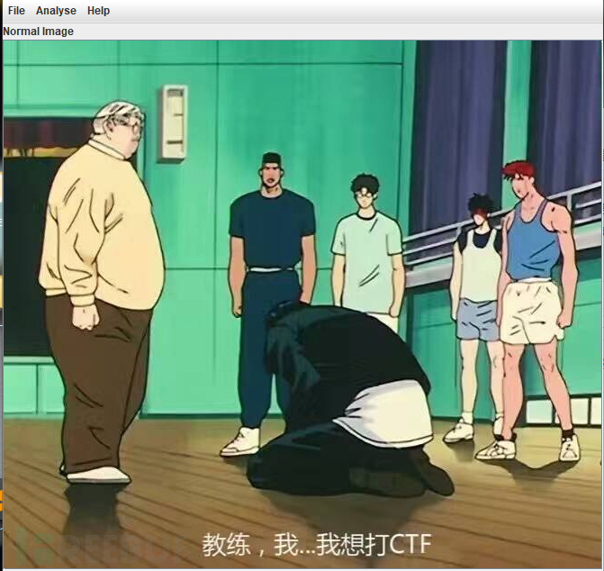

Analyse -\> Data
Extract，发现是zip格式的

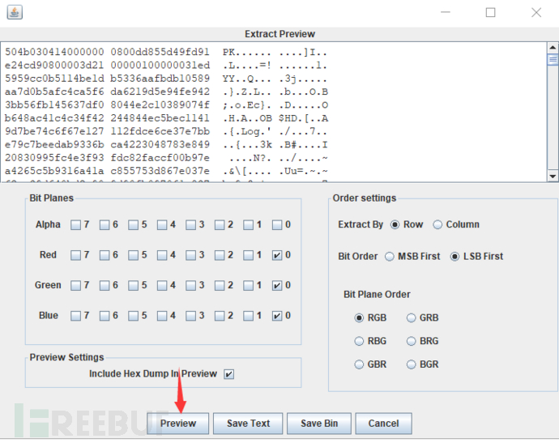

提取之后保存为ZIP格式，但是打不开

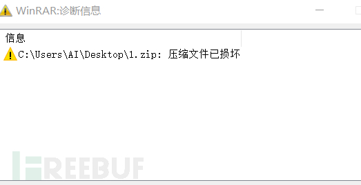

利用winrar的修复功能进行修复

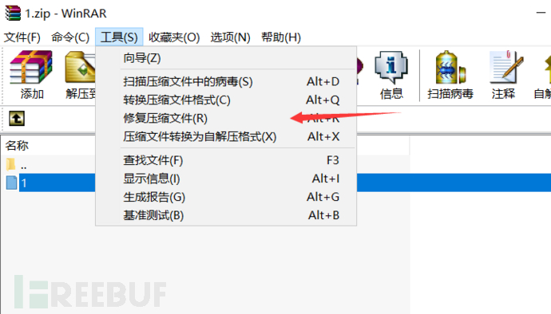

解压后提取是一个1，使用file查看为ELF文件

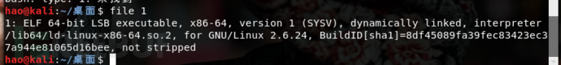

给他一个X，运行后得到flag

**JPG图片**

**文件结构**

JPEG 是有损压缩格式，将像素信息用JPEG 保存成文件再读取出来，其中某些像素值会有少许变化。在保存时有个质量参数可在 0 至 100 之间选择，参数越大图片就越保真，但图片的体积也就越大。一般情况下选择 70 或 80 就足够了。

JPG 基本数据结构为两大类型：「段」和经过压缩编码的图像数据。

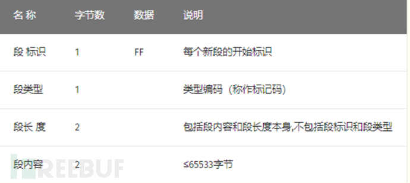

有些段没有长度描述也没有内容，只有段标识和段类型。文件头和文件尾均属于这种段。

段与段之间无论有多少FF都是合法的，这些FF被称为\[填充字节\]，必须被忽略掉。

0xFFD8和0xFFD9为JPG文件的开始结束的标志。

**隐写软件**

**Stegdetect**（ <https://github.com/redNixon/stegdetect>）

通过统计分析技术评估 JPEG 文件的DCT 频率系数的隐写工具, 可以检测到通过 JSteg、JPHide、OutGuess、InvisibleSecrets、F5、appendX 和 Camouflage 等这些隐写工具隐藏的信息，并且还具有基于字典暴力破解密码方法提取通过 Jphide、outguess 和jsteg-shell 方式嵌入的隐藏信息。

**JPHS**（ <http://linux01.gwdg.de/~alatham/stego.html>）

JPEG 图像的信息隐藏软件 JPHS，它是由 Allan Latham 开发设计实现在 Windows 和 Linux 系统平台针对有损压缩 JPEG 文件进行信息加密隐藏和探测提取的工具。软件里面主要包含了两个程序 JPHIDE和 JPSEEK。JPHIDE程序主要是实现将信息文件加密隐藏到 JPEG 图像功能，而JPSEEK 程序主要实现从用 JPHIDE 程序加密隐藏得到的 JPEG 图像探测提取信息文件，Windows 版本的 JPHS 里的 JPHSWIN 程序具有图形化操作界面且具备 JPHIDE 和 JPSEEK 的功能。

**GIF图片**

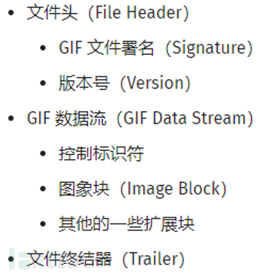

**空间轴**

由于GIF的动态特性，由一帧帧的图片构成，所以每一帧的图片，多帧图片间的结合，都成了隐藏信息的一种载体。

对于要分离的GIF文件，可以使用convert命令将其每一帧分割开来，也可以使用GIF分离工具。

**时间轴**

GIF文件每一帧间的时间间隔也可以作为信息隐藏的载体。

Stegsolve也可以一帧一帧的观察图片（Stegsolve -\> Analyse -\> Frame Brower）

**来看个题：FBCTF （安哥拉\_一步一步）**

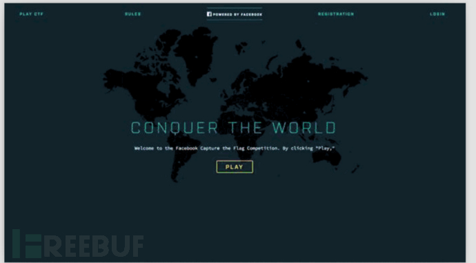

打开后是一个gif图片，用分帧工具分开后没啥信息，用PS打开后拖动时间轴看到flag

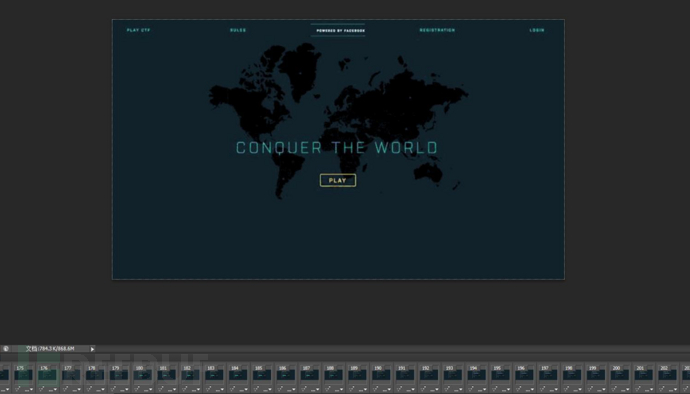

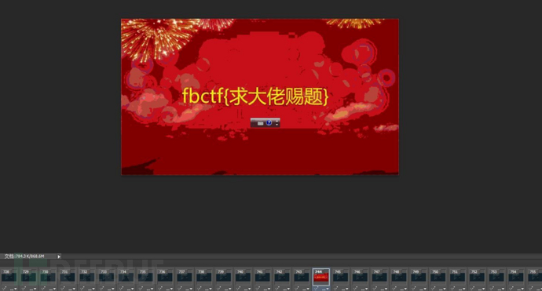

**图种**

**概念**：在普通图片中存储了别的文件（如压缩包信息等等），比较典型的不就是图马吗？

copy /b xxx.jpg + xx.zip
output.jpg

直接用十六进制编辑器打开查看查看相关字符串，或者用binwalk查看是否有其他文件的存在。

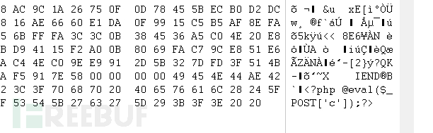

**双图**

**例题：ISG2014-MISC（final.png）**

使用binwalk查看是否有压缩包等其他文件

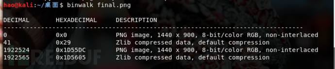

使用foremost将里边包含的信息分离出来，分离出两张和原图看似一样的图片，使用diff查看两张文件不同，使用compare将不同的地方进行输出

分别保存为1.png，2.png

利用python的image包对其进行元素点对比，并8bit一组提取

    from PIL import Image
    import random
     
    img1 = Image.open('1.png')
    im1 = img1.load()
     
    img2 = Image.open('2.png')
    im2 = img2.load()
     
    a = 0
    i = 0
    s = ''
     
    for x in range(img1.size[0]):
           fory in range(img1.size[1]):
                  if(im1[x,y]!= im2[x,y]):
                         printim1[x,y],im2[x,y]
                         ifi==8:
                                s= s + chr(a)
                                a= 0
                                i= 0
                         a= im2[x,y][0] + a*2
                         i= i + 1
    s = s + '}'
    print s

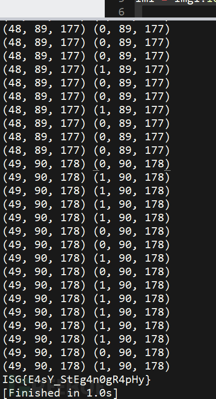

## **五、音频隐写篇**

与音频相关的 CTF 题目主要使用了隐写的策略，主要分为 MP3 隐写，波形隐写，频谱隐写，LSB隐写等等。

**常见手段**

通过 binwalk 以及 strings 可以发现的信息不再详述。

**MP3隐写**

MP3隐写主要是使用 
[Mp3Stego](http://www.petitcolas.net/steganography/mp3stego/) 工具进行隐写，其基本介绍及使用方法如下：

MP3Stego willhide information in MP3 files during the compression process. The data is firstcompressed, encrypted and then hidden in the MP3 bit stream.

**encode –E hidden\_text.txt –P pass svega.wav svega\_stego.mp3**

**decode –X –P pass svega\_stego.mp3**

这里所使用的源文件需要使用RIFF文件

**RIFF文件**

> RIFF全称为资源互换文件格式（ResourcesInterchange
> FileFormat），RIFF文件是windows环境下大部分多媒体文件遵循的一种文件结构,RIFF文件所包含的数据类型由该文件的扩展名来标识，能以RIFF文件存储的数据包括如下：
> 音频视频交错格式数据（.AVI) 
> 波形格式数据（.WAV) 
> 位图格式数据（.RDI) 
> MIDI格式数据（.RMI)
> 调色板格式（.PAL)
> 多媒体电影（.RMN)
> 动画光标（.ANI)
> 其它RIFF文件（.BND)

**例题：1.mp3**

利用mp3stego进行解密，发现需要密码

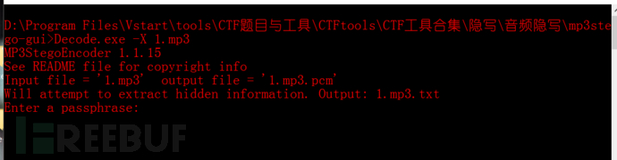

记得前边说过的吗？使用strings可以发现一些隐藏的密码、文件等，

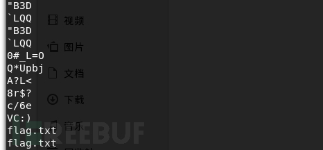

发现里边有flag.txt，好吧，没有明显的密码，但是放到kali下，mp3的图标变成了一张图片

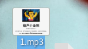

emmmmmmm..用foremost对其进行分离

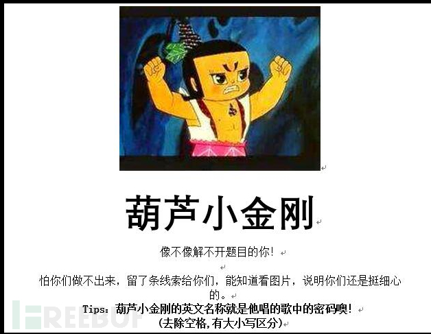

葫芦小金刚 英文为：GourdSmallDiamond

    decode -X -P GourdSmallDiamond 1.mp3

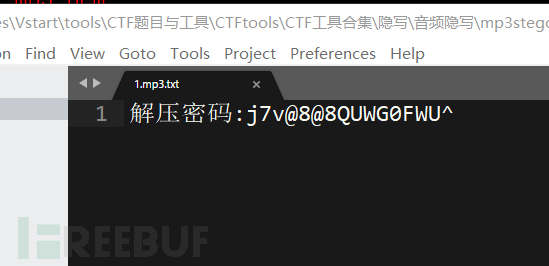

刚才foremost提取出来的还有一个压缩包，用密码进行解压得到flag

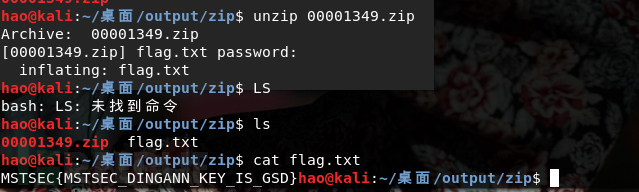

**波形隐写**

原理：通常来说，波形方向的题，在观察到异常后，使用相关软件（Audacity, Adobe Audition 等）观察波形规律，将波形进一步转化为01 字符串等，从而提取转化出最终的flag。

**看题：ISCC Misc 普通DISCO**

解压出个wav文件，使用audacity打开后，放大音频波形拉到最开始部分

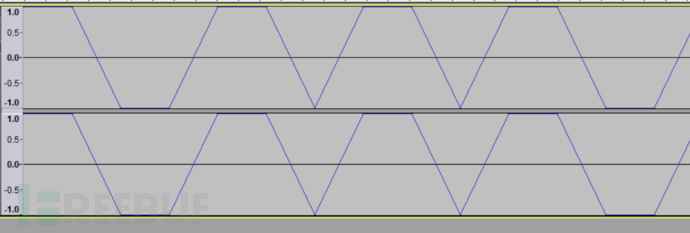

以高的为1，低的为0得到flag的二进制

    110011011011001100001110011111110111010111011000010101110101010110011011101011101110110111011110011111101

长度为105位，可以除以7但是不能除以8，根据前边ASCII码的知识，在每7位前边补0

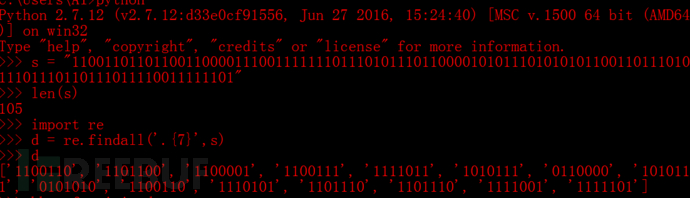

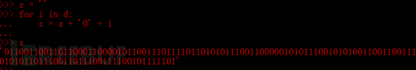

    011001100110110001100001011001110111101101010111001100000101011100101010011001100111010101101110011011100111100101111101

将其转换为16进制后，在将十六进制转换为字符串得出flag

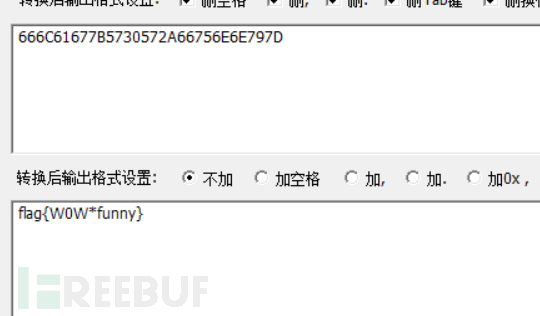

**例题2：musci111.zip**

解压后出现两个文件：pic.jpg和musci.zip，压缩包有密码

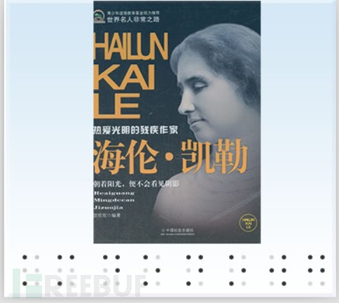

图片的密文格式为盲文，解密为kmdonowg，解压后使用audacity分析

长短用-.表示，然后用摩丝解码工具进行解码即可得到flag.

**频谱隐写**

音频中的频谱隐写是将字符串隐藏在频谱中，此类音频通常会有一个较明显的特征，听起来是一段杂音或者比较刺耳。

**例题：FBCTF 巴基斯坦\_听音乐**

用audacity打开后，将其更改为频谱图

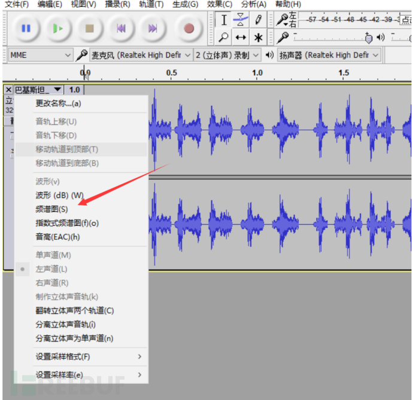

得到flag

**LSB音频隐写**

类似于图片隐写中的 LSB 隐写，音频中也有对应的 LSB 隐写。主要可以使用Slienteye，其介绍如下：

> SilentEye是跨平台的应用程序，便于使用隐写术，在这种情况下将消息隐藏到图片或声音中。
> SilentEye的界面简洁，并且通过使用插件系统，可以轻松集成新的隐写算法和加密过程。

**例题：小苹果**

使用工具silenteye打开后，点击decode即可

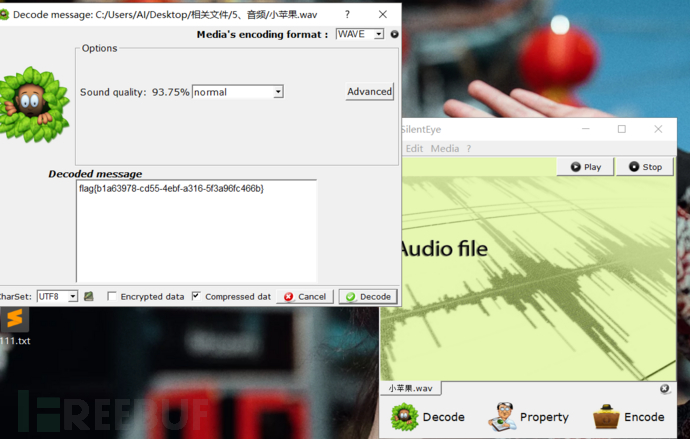

**直接听..**

直接听就是直接听..

**看例题，全国大学生信息安全赛（永不消逝的电波）**

慢慢听就是了，注意点信号（.）是滴，长信号（-）是哒

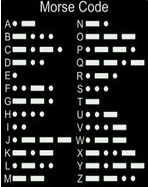

**…. .-.. . .. -.-. .. -.-. – … – .– — — -.-. ..-. . — -.-. -. .—-**

解密得到：HLEICICTSTWOOCFEMCN1

根据里边字符判断应该有hello
welcome

栅栏密码解密

Flag{HIWELCOMETOCISCNCTF1}

## **六、视频隐写**

这个见的倒是略少，准备一份工具到时候如果简单看或者听或其他已经会的方法还分析不出来就直接丢工具把

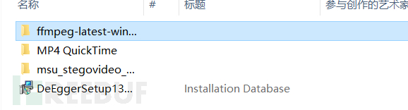

\ \</p\>

工具见下方网盘。

## **七、取证**

大部分的 CTF
比赛中，取证及隐写两者密不可分，两者所需要的知识也相辅相成，所以这里也将对两者一起介绍。

任何要求检查一个静态数据文件从而获取隐藏信息的都可以被认为是隐写取证题（除非单纯地是密码学的知识），一些低分的隐写取证又常常与古典密码学结合在一起，而高分的题目则通常用与一些较为复杂的现代密码学知识结合在一起，很好地体现了
Misc 题的特点。

### **前置技能**

> 1、了解常见的编码
>
> 2、能够对文件中出现的一些编码进行解码，并且对一些特殊的编码（Base64、十六进制、二进制等）有一定的敏感度，对其进行转换并得到最终的
> flag。
>
> 3、能够利用脚本语言（Python 等）去操作二进制数据
>
> 4、熟知常见文件的文件格式，尤其是各类 
> [文件头](https://en.wikipedia.org/wiki/List_of_file_signatures)、协议、结构等
>
> 5、灵活运用常见的工具

### **常用工具**

> 1、EasyRecovery
>
> 2、MedAnalyze
>
> 3、FTK
>
> 4、 [Elcomsoft Forensic Disk
> Decryptor](https://ctf-wiki.github.io/ctf-tools/misc/)
>
> 5、Volatility （  <http://www.freebuf.com/articles/system/26763.html> ）

### **磁盘**

常见的磁盘分区格式有以下几种：

> 1、Windows：FAT12 -\> FAT16 -\> FAT32 -\> NTFS
>
> 2、linux：EXT2 -\> EXT3 -\> EXT4

### **VMDK**

VMDK 文件本质上是物理硬盘的虚拟版，也会存在跟物理硬盘的分区和扇区中类似的填充区域，我们可以利用这些填充区域来把我们需要隐藏的数据隐藏到里面去，这样可以避免隐藏的文件增加了 VMDK 文件的大小（如直接附加到文件后端），也可以避免由于 VMDK 文件大小的改变所带来的可能导致的虚拟机错误。而且 VMDK 文件一般比较大，适合用于隐藏大文件。

### **内存**

> 1、解析析Windows / linux / Mac OS X内存结构
>
> 2、分析进程，内存数据
>
> 3、根据题目提示寻找线索和思路，提取分析指定进程的特定内存数据。

**例题：**

> <http://www.freebuf.com/column/152545.html>
>
> <http://www.freebuf.com/articles/rookie/145262.html>

我的取证水平目前处于菜鸟级选手，还是看看别人家的分析吧~~

## **八、Other**

**说一个比较经典有趣的 
hundouluo**

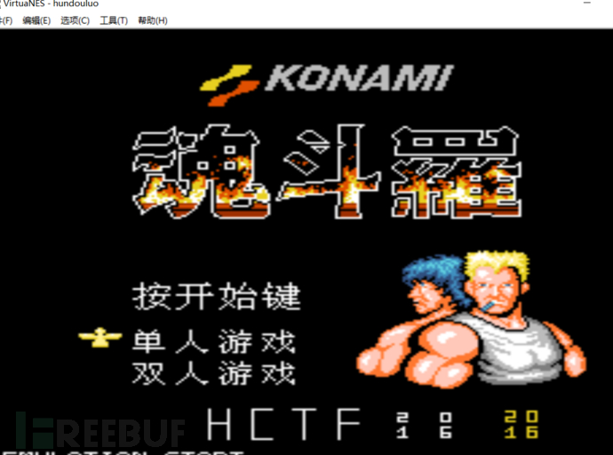

通关后即可得到flag

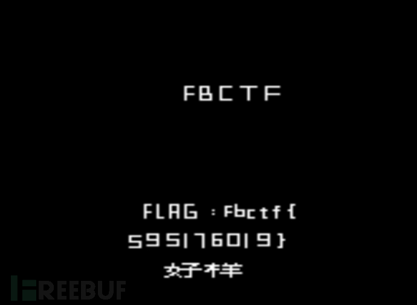

比赛的时候真的3条命打通关？？

输入金手指：

> 直接通关  00AA-01-03
>
> 金身：00B0-01-FF
>
> 无限命：0032-01-20

附上一条： [FC
NES修改教程](https://wenku.baidu.com/view/17fb9833ccbff121dd368371.html)

**题目二：蓝盾2017移动安全赛
    （就在眼前）**

打开后发现一个word文件，里边有一堆十六进制字符

    flag=E5=80=BC=E5=B0=B1=E5=9C=A8=E6=AD=A4=E6=96=87=E6=A1=A3=E4=B8=AD=EF=BC=8C=E5=B9=B6=E4=B8=94=E4=BD=BF=E7=94=A8=E4=BA=86=E6=96=87=E6=9C=AC=E9=9A=90=E8=97=8F=E6=8A=8A=E8=87=AA=E5=B7=B1=E9=9A=90=E8=97=8F=E8=B5=B7=E6=9D=A5=E4=BA=86=E3=80=82=0A=E6=98=BE=E7=A4=BA=E5=87=BA=E9=9A=90=E8=97=8F=E6=96=87=E6=9C=AC=E5=8D=B3=E5=8F=AF

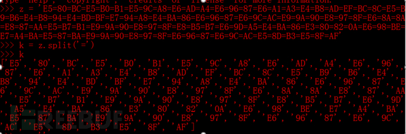

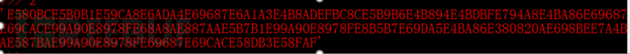

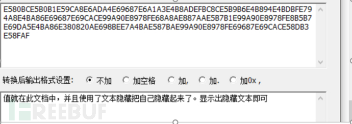

在选项中去掉隐藏文字

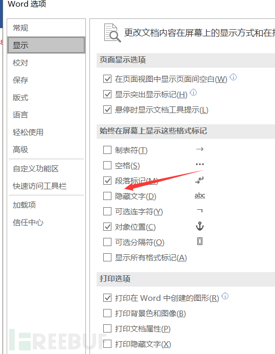

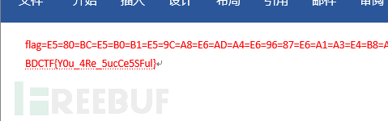

得到flag，这种题以前做过了，直接进行选项的修改。还有一种是把所有的文字换个颜色也就出来了。所以知道套路之后也就不用再一步一步去解码了。

> 文章差不多就到这了，里边还有好多东西没有补充完全，CTF中杂项的知识点以及各种奇怪的脑洞远不是一篇文章可以说的完的，也还是在不断补充姿势不断学习的过程中充实自己提升自己。
>
> 以前我也是个小白（其实现在也不咋滴..）在准备CTF的时候遇到相关的问题也曾多次看这些前辈所发表的文章来学习知识。虽然说常见的基础套路翻过来翻过去也就那么多，但是对于初入门CTF的同学还是带着很多盲目。
>
> 所以今天发表这篇文章，以自己在学习路途中所发现的和所学习到的知识。希望能够对初入CTF的同学有所帮助，在学习路途中尽量少走弯路，从而可以更快的提升自己，也可以在比赛中更加从容，更加自信。
>

**最后祝大家学业有成，工作顺利。**

**链接： <https://pan.baidu.com/s/1NkW0i-wbT7s1XmUAT5IuKw> 密码：2obq**

## **参考文章：**

> <http://bobao.360.cn/learning/detail/243.html>
>
> <https://www.anquanke.com/post/id/86211>
>
> <https://ctf-wiki.github.io>
>
> <http://blog.sina.com.cn/s/blog_9cd8465f0102v6ok.html>
>
> <https://wenku.baidu.com/view/17fb9833ccbff121dd368371.html>

**\*本文作者：Yokeen，转载请注明来自 FreeBuf.COM**
