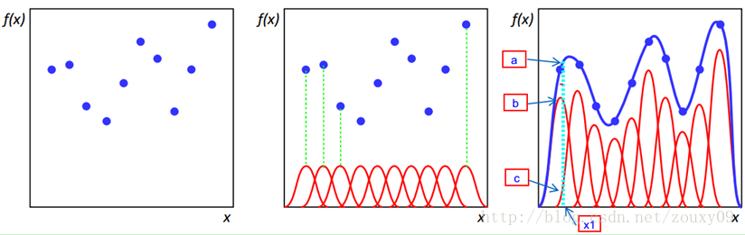
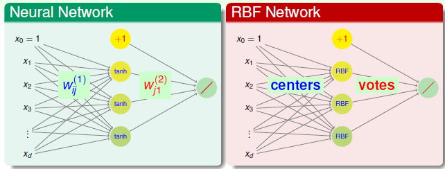
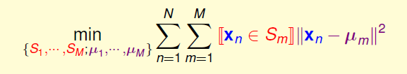
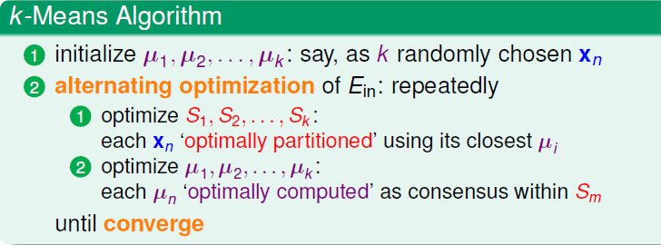
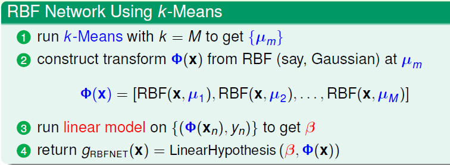

# 机器学习技法笔记(6)-RBF Network(径向基函数网络)

**文章目录**

1. [Radial Basis Function 介绍](#radial-basis-function-介绍)
2. [RBF Network](#rbf-network)
3. [几种形式](#几种形式)
    1.  [Full RBF Network](#full-rbf-network)
    2.  [K Nearest Neighbor(KNN)](#k-nearest-neighborknn)
    3.  [空间转换](#空间转换)
4.  [K-Means](#k-means)
5.  [RBF Net With K-Means](#rbf-net-with-k-means)
6.  [实现](#实现)
    1.  [数据](#数据)
    2.  [K-Means](#k-means-1)
    3.  [RBFNet](#rbfnet)
    4.  [结果](#结果)

> 2017.3.3更新: TensorFlow版本KMeans与RBFNet

> 2017.2.28更新：Python实现RBFNet

> 这一节利用上节SVM中的高斯核(RBF Kernel)来介绍一个新的模型，RBF Network，属于神经网络(Neural
> Network)的一种，可以以任意精度来逼近任意的连续函数。

## Radial Basis Function 介绍

在SVM中，我们只是提到了RBF(径向基函数)可以作为Kernel
Function，并且实现了数据到无穷维度的转化，十分Powerful。这里介绍一下RBF的原本含义，这里参考
[**径向基网络（RBF
network）之BP监督训练**](http://blog.csdn.net/zouxy09/article/details/13297881)
中的对RBF的说明，写的十分清楚，这里直接引用:

> 径向基函数（Radical Basis
> Function，RBF）方法是Powell在1985年提出的。所谓径向基函数，其实就是某种沿径向对称的标量函数。通常定义为空间中任一点x到某一中心c之间欧氏距离的单调函数，可记作k(||x-c||)，其作用往往是局部的，即当x远离c时函数取值很小。例如高斯径向基函数：
>
> \(RBF(x,c) = exp\left( {- \frac{(x - c)^{2}}{r^{2}}} \right)\)>
>
> 当年径向基函数的诞生主要是为了解决多变量插值的问题。可以看下面的图。具体的话是先在每个样本上面放一个基函数，图中每个蓝色的点是一个样本，然后中间那个图中绿色虚线对应的，就表示的是每个训练样本对应一个高斯函数（高斯函数中心就是样本点）。然后假设真实的拟合这些训练数据的曲线是蓝色的那根（最右边的图），如果我们有一个新的数据x1，我们想知道它对应的f(x1)是多少，也就是a点的纵坐标是多少。那么由图可以看到，a点的纵坐标等于b点的纵坐标加上c点的纵坐标。而b的纵坐标是第一个样本点的高斯函数的值乘以一个大点权值得到的，c的纵坐标是第二个样本点的高斯函数的值乘以另一个小点的权值得到。而其他样本点的权值全是0，因为我们要插值的点x1在第一和第二个样本点之间，远离其他的样本点，那么插值影响最大的就是离得近的点，离的远的就没什么贡献了。所以x1点的函数值由附近的b和c两个点就可以确定了。拓展到任意的新的x，这些红色的高斯函数乘以一个权值后再在对应的x地方加起来，就可以完美的拟合真实的函数曲线了。



一句话总结就是，RBF(径向基函数)根据某种距离来描述点与某个center点的的相似度。

## RBF Network

有了上述RBF的概念，以及插值问题的介绍，下面直接引入RBF
Network:

\[h(\mathbf{x}) = Output\left( {\sum\limits_{m = 1}^{M}\beta_{m}RBF(\mathbf{x},\mu_{m})} \right)\]

其中     \(\mu_{m}\hspace{0pt}\)是第     \(m\hspace{0pt}\)个center，就是上图中的红色图像的峰值对应的     \(x\hspace{0pt}\),     \(\beta_{m}\hspace{0pt}\)则是对应的权重，最外层的     \(Output()\hspace{0pt}\)则是根据目的选择不同的函数，比如想分类的话，那就可以使用一个softmax或者sign等函数，如果打算做回归，或者做函数逼近，这时候就可以不需要用Output函数了，RBF
Network可以逼近任意连续的函数。

RBF Network与普通神经网络有什么联系区别呢？如下:



首先网络结构很类似，都是输入层, 隐藏层，输出层构成，此外最后一层的输出层基本类似类似，均是对隐层的输出线性组合(权重控制)然后得到求和的结果。

不过一般情况RBF
Network只有三层，其中从输入层到隐层之间并没有权重连接，而是直接将用隐层的RBF计算与不同的中心(隐层神经元)的距离或者相似度，距离越远，相似度越低，神经元的激活程度就越小，作用也就越不明显，此外这个过程也可以以Kernel
SVM的角度理解: 把原始低维的数据进行转换到高维空间中(高斯核对应无穷维)的特征转换。因而RBF
Network的隐层激活函数可以说就是径向基函数，而一般Neural
Network的激活函数则是一些如sigmod, tanh等非线性函数。当然很明显，RBF
Network由于只有隐层到输出层的权重连接，因而训练速度会大大加快。

这里多说一点，假设输入数据的维度为     \((d,1)\),隐藏层神经元个数为     \(h_{n}\), BP神经网络的隐藏层的每一个神经元对应的维度与输入层的每一个神经元维度相同，都是1维，即就是一个数，那么整个隐藏层的维度就是
\(\lbrack h_{n},1\rbrack\)。而RBFNet 虽然整个隐层维度也是     \((h_{n},1)\)，但是实现不同，RBF的输入层同BP一样，都是一个数据点的所有维度，而隐藏层的每一个神经元则是，整个输入数据与当前隐层神经元也就是那个中心计算RBF函数的结果，代表了相似度，计算完相似度之后，再结合隐含层到输出层的权重，得到最后的结果。

> 计算两个点的距离，除了用高斯距离之外，还有一些其他的选择，只要包含     \(||x - c||^{2}\)>
> 项即可。

## 几种形式

RBF的隐层神经元也就是center的选择是个很关键的问题，因为只有中心确定了之后，RBF函数才能够确定。下面基于不同的中心介绍两种类型的RBF。

### Full RBF Network

Full RBF
Network，顾名思义便是所有的数据节点都作为中心。

\[h(\mathbf{x}) = Output\left( {\sum\limits_{m = 1}^{M}\beta_{m}RBF(\mathbf{x},\mu_{m})} \right)\]


即     \(M = N,\mu_{m} = \mathbf{x}_{m}\), 这样的话，预测新的数据点，需要计算该点与所有训练数据点的距离，也就是相似度，然后结合权重     \(\beta\)进行线性组合，此过程就是将所有的训练数据点对预测点的影响聚集到一起，距离越近，影响越大，这样得到最终的结果。比如用均匀影响做分类的话，即
\(\beta_{m} = 1 \cdot y_{m}\),即:

\[g(\mathbf{x}) = sign\left( {\sum\limits_{m = 1}^{N}y_{m}\exp\left( {- \gamma||\mathbf{x} - \mathbf{x}_{m}||^{2}} \right)} \right)\]


就相当于每个训练数据给新数据投票，通过RBF，可以使得距离远的票数大，近的票数小，同时，     \(y_{m}\)可以控制投票的类别，这样通过aggregate所有点的opinion，就可以得到新数据的类别了。

但是很显然， 这种Full RBF
Network是一种偷懒的方式，因为直接将所有的点作为了center，因此如果样本量很大的话，那么计算量就太大了，在实际中，很少使用。

### K Nearest Neighbor(KNN)

将上面的方法稍微改变一下，就可以得到另外一种很常见的机器学习方法-KNN(K近邻)。在Full
RBF中，我们计算所有的训练数据与新数据的距离，距离最小的与新数据的相似度最高，而且高斯函数衰减很快，距离新数据远的点对它的影响很小，因此我们可以忽略那些，只需要找到几个最靠近新数据的点，然后只计算它们的贡献即可，假设我们找最近的K个点的话，
那就是K近邻算法。这种类型的算法在训练的时候，不用花力气，但是再做测试或者预测的时候，需要对比全部的数据，然后找到几个最近的，计算这几个的贡献得到最后结果，这个过程跟上面的Full
RBF 一样，计算量很大。
因此这种方式经常在样本数据较少的时候使用。

### 空间转换

再看回归问题:

\[h(\mathbf{x}) = \sum\limits_{m = 1}^{M}\beta_{m}RBF(\mathbf{x},\mathbf{x}_{m})\]


如果我们令:

\[\mathbf{z}_{n} = \lbrack RBF(\mathbf{x}_{n},\mu_{1}),RBF(\mu_{n},\mathbf{x}_{2}),\cdots,RBF(\mathbf{x}_{n},\mu_{M})\rbrack\]


将相当于前面所说的将     \(x_{n}\)利用RBF转换到     \(\mathbf{z}\)空间，每一项都是两个点的相似度，将所有的数据这样我们的问题，就是简单的Linear Regression了:

\[h(\mathbf{z}) = \sum\beta_{m}\mathbf{z}_{m}\]

然后直接得到最优解
\(\beta = (\mathbf{Z}^{T}\mathbf{Z})^{- 1}\mathbf{Z}^{T}\mathbf{y}\)，当然这里使用的是伪逆矩阵。如果其中矩阵     \(\mathbf{Z}\)是由所有的     \(\mathbf{z}_{\mathbf{n}},\ n = 1,\cdots,N\)组成，维度为:     \((N,M)\)。

还有一种特殊情况，比如所有的训练数据作为中心的话，那么     \(N = M\)，此时     \(\mathbf{Z}\)矩阵为对称矩阵 再加上如下一个定理:

> 如果所有的     \(\mathbf{x}_{n}\)>
> 互不相同，那么Gaussian RBF形成的     \(\mathbf{Z}\)>
> 矩阵一定是可逆的

这样，如果满足条件的话，     \(\mathbf{Z}\)可逆并且对称的话，那么经过对     \(\beta\)的化简，最优的     \(\beta = \mathbf{Z}^{- 1}\mathbf{y}\),计算量大大减少。(此处暂时省略Regularized Full RBF Netework)

## K-Means

上述的几种形式基本都属于偷懒的方式，因为我们没有花费力气去找一些好的中心，都是使用所有的数据作为RBF的center,
一旦样本量变大，一则计算量变大，二则更容易过拟合，降低泛化性能，因此我们很有必要花点力气去找一些更加靠谱数量更少的center。其实回想RBF
Kernel
SVM:

\[g_{svm}(\mathbf{x}) = sign\left( {\sum\limits_{SV}\alpha_{n}y_{n}\exp( - \gamma||\mathbf{x} - \mathbf{x}_{n}||^{2})} \right)\]


中心点其实就是那些Support
Vectors，而非所有的数据。如何去选择中心点，实际就是要将训练点分为几簇，给每一簇要找一个代表，并且簇与簇之间不能有交集，类似与离散数学中的划分的概念，假设所有的数据划分为
    \(M\)个簇:     \(S_{1},S_{2},\cdots,S_{M}\),其中     \(\mu_{m}\)为     \(S_{m}\)的中心(prototype)，那么我们就希望：

​


\[\mathbf{x}_{1},\mathbf{x}_{2} \in S_{m}\Leftrightarrow\mu_{m} \approx \mathbf{x}_{1} \approx \mathbf{x}_{2}\]


也就是在同一簇中的点，都应该是最相似的。这样我们的问题成为找到这样的簇，以及簇的中心，一个很典型的聚类(Cluster)问题，同时也是无监督的，利用相似度，很容易写出损失函数:



其中     \(S_{1},\cdots,S_{m}\)是训练数据集合     \(\{\mathbf{x}_{n}\}\)的的一个划分。

除了离散项之外，还需要对     \(S,\mu\)两个变量同时优化，因此原式很难直接求最优解。下面使用一种 **alternating
optimization**(交替优化)的方法求解，原理就是先固定某一个变量，然后更新优化另一个，然后反过来，继续交替更新，直到收敛。

首先固定中心点，即     \(\mu_{1},\cdots,\mu_{M}\)确定，更新     \(S_{1},\cdots,S_{M}\)的元素，我们需要对每个     \(x_{n}\)找到它最应该划分到哪个     \(S\)内，很简单，我们需要找到距离     \(\mathbf{x}_{n}\)最近的那个中心     \(\mu_{m}\)即可，这样     \(\mathbf{x}_{n}\)划到     \(S_{m}\)内，即:

\[\arg\min\limits_{m}||\mathbf{x}_{n} - \mu_{m}||^{2}\]

然后固定簇，即     \(S_{1},S_{2},...,S_{M}\)确定，更新簇的中心:     \(\mu_{1},\mu_{2}...\mu_{M}\)。一旦簇确定了，那么     \(\mathbf{x}_{n} \in S_{m}\)这一项已经确定，要么1要么0，单独考虑其中一项     \(\mu_{m}\),问题就简化如下:

\[E_{in} = \min\limits_{u_{m}}\sum\limits_{\mathbf{x}_{n} \in S_{m}}||\mathbf{x}_{n} - \mu_{m}||^{2}\]


很显然，这是一个无约束的单变量优化问题，直接求一阶微分:

\[\begin{matrix}
\frac{\partial E_{in}}{\partial\mu_{m}} & {= - 2\left( {\sum\limits_{\mathbf{x}_{n} \in S_{m}}\mathbf{x}_{n} - \mu_{m}} \right)} \\
 & {= - 2\left( {\left( {\sum\limits_{\mathbf{x}_{n} \in S_{m}}\mathbf{x}_{n}} \right) - |S_{m}|\mu_{m}} \right) = 0} \\
\mu_{m} & {= \frac{\sum\limits_{\mathbf{x}_{n} \in S_{M}}\mathbf{x}_{n}}{|S_{m}|}} \\
\end{matrix}\]

也就是说,     \(S_{m}\)的中心等于簇内所有点的平均值。

交替更新完一轮     \(S,\mu\)之后，重复这个过程直到收敛，整个聚类的算法就是著名的 **K-Means**，下面给出基本流程:



注:

  - K的选择，一般需要一些先验知识，影响很大
  - \(\mu\)    初始化很关键，对整个收敛速度与质量影响很大，需要多测试
  - 收敛性，K-Means可以一定收敛，因为交替更新的两个过程都是在使得     \(E_{in}\)    下降。不过由于     \(E_{in}\)    并不是凸函数，因此我们得到可能不是全局最优解。
  - K-Means属于无监督的特征转换过程，类似与AutoEncoder。

## RBF Net With K-Means

有了K-Means来聚类，那我们就可以用确定RBFNet的中心了，下面重新给出使用K-Means的RBF Net用来做预测回归的流程:



这个过程与上面唯一不同的地方就是，开始先使用K-Means得到了中心，然后再计算特征转换的     \(Z\)矩阵，其余步骤完全相同。

RBF Net的超参数只有三种:     \(M\)(中心个数)，RBF函数中的，比如高斯里面的     \(\gamma\)，以及权重。因此RBFNet是一种简单，快速的逼近算法，可以用于回归，分类，其中做函数逼近更多一些，下一节重点介绍训练以及实现。

## 实现

借助上述的理论，使用Python实现了简单的基于K-Means的RBFNet，以及用tensorflow实现了GPU版本的K-Means以及RBFNet，速度明显提升。

### 数据

手动生成数据，目的是做函数逼近，提供了两种类型的数据: y = 2x 与 y=sum(x)，生成的数据量以及数据维度都是设定。

``` python
def getData(n=100, d=5, method='sum'):
    '''
    生成数据
    '''
    X = np.random.uniform(1., 3.0,(n,d))
    if method == 'sum':
        y = np.sum(X, axis=1)
    else:
        y = 2*X
    return X,y
```


### K-Means

核心就是两步交替更新，首先更新簇元素，再更新簇内中心。

### RBFNet

模型如下:

\[\begin{matrix}
{h(\mathbf{x})} & {= \sum\limits_{m = 1}^{M}\beta_{m}RBF(\mathbf{x},\mu_{m})} \\
 & {= \sum\limits_{m = 1}^{M}\beta_{m} \ast \exp( - \gamma_{m} \ast ||\mathbf{x} - \mathbf{c}||^{2})} \\
\end{matrix}\]

首先有三个参数需要确定:权重参数     \(\beta\)， 高斯函数扩展参数     \(\gamma\), 另外就是隐层的神经元个数，即K-Means的k。首先看     \(\gamma\), 不同的神经元对应的扩展参数理论上可以不一样，可以用下面的方式计算:

  - 计算出每个簇内的发散平均程度，即距离中心的平均距离:
    \(\sigma = \frac{1}{m}\sum||\mathbf{x} - \mu_{m}||\)  -     \(\gamma_{m} = \frac{1}{2\sigma^{2}}\)上述方式是一种比较合理的方式计算     \(\gamma\),不过也可以直接将所有的     \(\gamma\)设定为同一个固定值，效果也类似，一般是一个比较小的值，如0.1。

再看隐层神经元个数，在某个层面上说，RBFNet的核心在于将原始数据经过特征转化，因此一般神经元个数要高于原始数据的维度，从而达到升高维度的目的。

最后权重参数     \(\beta\)。在实验中，函数逼近属于回归问题，这里提供两种求解方式，

  - 使用Linear Regression就可以直接解出     \(\beta\)    :
    \(\beta = ({\mathbf{Z}^{\mathbf{T}}\mathbf{Z}})^{- 1}\mathbf{Z}^{T}\mathbf{y}\)    ，其中     \(\mathbf{Z}\)    是所有训练数据的rbf的结果，     \(\mathbf{y}\)    是所有训练数据的y。
  - 按照梯度下降的方式来训练参数(只在TensorFlow版本实现)

### 结果

CPU版本：

1.  使用     \(y = sum(x)\)    的3000条数据，逼近结果如下:

```python
$ python run.py
X: [ 2.76801352  2.09847071  1.26193386  1.24845461  1.40333726]
real      : 8.78020996497
prediction: 8.71215929411
******************************
X: [ 1.00621598  1.81564319  1.59844746  2.52523288  1.27452441]
real      : 8.22006392064
prediction: 8.24858828932
******************************
X: [ 2.90835704  2.22760245  1.80146849  1.37866698  1.21111461]
real      : 9.52720958234
prediction: 9.40142232908
******************************
X: [ 1.93636418  2.54609154  1.80642139  2.33747451  1.25772174]
real      : 9.88407335723
prediction: 10.1683670115
******************************
X: [ 2.80741503  1.35740491  2.26844426  2.62627921  1.73952771]
real      : 10.7990711232
prediction: 10.8892856428
******************************
python run.py  9.02s user 0.50s system 106% cpu 8.947 total 
```

2.  使用     \(y = 2x\)    的3000条数据，逼近效果如下:

``` python
$ python run.py 
X: [ 2.64225429  1.16385274  2.69488719  2.58292883  2.31537922]
real      : [ 5.28450858  2.32770548  5.38977438  5.16585766  4.63075843]
prediction: [ 5.11075705  2.36091391  5.29326006  5.02440494  4.63639069]
******************************
X: [ 2.79241969  2.69607337  2.07437327  2.73446838  1.19582012]
real      : [ 5.58483938  5.39214674  4.14874654  5.46893677  2.39164025]
prediction: [ 5.21027141  5.08792887  4.06967137  5.14665798  2.53483961]
******************************
X: [ 2.60551718  2.97657156  2.80778824  2.47291552  2.84918172]
real      : [ 5.21103436  5.95314312  5.61557648  4.94583105  5.69836345]
prediction: [ 4.84442944  5.35447225  5.0674437   4.57218657  5.18815626]
******************************
X: [ 2.44505957  1.70038561  1.99612367  1.1245514   1.18954801]
real      : [ 4.89011913  3.40077121  3.99224733  2.2491028   2.37909603]
prediction: [ 4.8029322   3.39746125  3.94098729  2.30900805  2.52864718]
******************************
X: [ 1.85397812  2.83347041  1.31929703  1.35131915  2.29165357]
real      : [ 3.70795624  5.66694081  2.63859405  2.7026383   4.58330715]
prediction: [ 3.66509186  5.63858479  2.65371075  2.73222885  4.53157419]
******************************
python run.py  6.84s user 0.58s system 114% cpu 4.751 total
```

GPU版本结果:

1.  使用     \(y = sum(x)\)    的3000数据:

``` python
X: [ 1.62451696  1.02659273  2.81655526  1.12427032  2.43579245]
real      : [ 9.02772713]
prediction: [ 8.7921114]
******************************
X: [ 2.53124356  1.34387374  1.38431156  1.20624399  2.59180689]
real      : [ 9.05747986]
prediction: [ 8.99416161]
******************************
X: [ 1.70616233  2.51688766  1.07848394  1.27796292  1.98958588]
real      : [ 8.56908321]
prediction: [ 8.56313705]
******************************
X: [ 2.03224301  2.65368748  1.41390944  2.04034257  1.04631364]
real      : [ 9.18649578]
prediction: [ 9.23960781]
******************************
X: [ 2.16495895  1.28095651  1.34778249  2.75269151  1.90516138]
real      : [ 9.45155144]
prediction: [ 9.43926144]
******************************
python tf_run.py  3.53s user 0.85s system 166% cpu 2.630 total
```

​

2.  使用     \(y = 2x\)    的3000条训练数据:

``` python
X: [ 1.06009257  1.647856    1.8015914   1.13952839  2.74504972]
real      : [ 2.12018514  3.29571199  3.60318279  2.27905679  5.49009943]
prediction: [ 2.36333179  3.43519783  3.55674648  2.42750287  5.14753294]
******************************
X: [ 2.94805002  1.19944155  1.2205795   2.25700951  2.18170953]
real      : [ 5.89610004  2.3988831   2.44115901  4.51401901  4.36341906]
prediction: [ 5.56341791  2.54713631  2.6267767   4.27490234  4.30334949]
******************************
X: [ 1.93198025  1.48437035  2.22421408  1.9887476   2.1166265 ]
real      : [ 3.8639605   2.9687407   4.44842815  3.97749519  4.233253  ]
prediction: [ 4.06275845  2.60474968  4.85847521  4.15260172  4.46441317]
******************************
X: [ 1.86214089  2.13927388  2.89492273  2.43535662  1.00828433]
real      : [ 3.72428179  4.27854776  5.78984547  4.87071323  2.01656866]
prediction: [ 3.73180866  4.23187256  5.57253933  4.6572423   2.15151691]
******************************
X: [ 1.35404587  2.86987972  2.46327639  2.51390696  1.88503158]
real      : [ 2.70809174  5.73975945  4.92655277  5.02781391  3.77006316]
prediction: [ 2.71249247  5.52877426  4.94359541  4.8839283   3.81015444]
******************************
python tf_run.py  4.70s user 0.86s system 165% cpu 3.363 total
```

首先是时间，tensorflow版的RBFNet要少很多，尤其是在聚类阶段，如果数据量变大， 优势会更加明显。

此外二者在sum数据上拟合效果很好，误差较小。在y=2x上，误差略大，不过这也跟训练数据有关系，通过调整参数，效果还可以提升很多。

此外，又对TensorFlow版的两种实现方式做了对比，数据集采用的是sum的形式:

1.  Linear Regression方式:

``` python
X: [ 2.71186709  1.1967051   1.31952727  2.1717248   2.57859206]
real      : [ 9.97841644]
prediction: [ 9.96531868]
******************************
X: [ 2.73147416  1.85858846  1.61863422  2.991575    2.25436425]
real      : [ 11.45463562]
prediction: [ 11.45114994]
******************************
X: [ 1.70037389  1.58699119  1.53201306  2.21282601  1.39819622]
real      : [ 8.43039989]
prediction: [ 8.39311886]
******************************
X: [ 2.01777792  1.22136164  1.52503204  2.9318645   1.15536594]
real      : [ 8.85140228]
prediction: [ 8.84553528]
******************************
X: [ 2.70246601  2.19741511  1.7523278   2.72755265  1.09670925]
real      : [ 10.47647095]
prediction: [ 10.4424572]
******************************
```

2.  梯度下降训练方式:

```python
X: [ 2.3670311   2.37218928  1.41229916  2.26609325  1.49073756]
real      : [ 9.90835094]
prediction: [ 10.1823082]
******************************
X: [ 2.30584574  1.68435013  1.76450276  2.61775756  2.94909477]
real      : [ 11.32155132]
prediction: [ 11.11611843]
******************************
X: [ 2.48293662  1.83565235  1.58969617  1.05468404  2.01141191]
real      : [ 8.97438145]
prediction: [ 9.28915977]
******************************
X: [ 2.92746592  1.39118993  2.33665395  1.11171508  2.27592731]
real      : [ 10.04295254]
prediction: [ 9.89380741]
******************************
X: [ 1.08498883  1.48899996  1.32145357  2.53989029  2.54879212]
real      : [ 8.98412514]
prediction: [ 9.06929016]
```

从结果可以看出，梯度下降方式误差相对大一些，这个也符合原理，LinearRegression直接使用所有数据解线性方程，得到的结果应该是很准确的。而梯度下降方式则跟训练数据大小，学习率等关系很大，如果调整不好，自然误差就会变大。

Numpy版KMeans+RBFNet 与 TensorFlow版KMeans+RBFNet的完整代码: [RBFNet With
K-Means](https://github.com/ShomyLiu/stat-learn/tree/master/RBFNet)

本文标题: 机器学习技法笔记(6)-RBF Network(径向基函数网络)

发布时间: 2017-02-26, 22:18:37

最后更新: 2017-07-31, 10:42:34

本文链接:
[http://shomy.top/2017/02/26/rbf-network/](/2017/02/26/rbf-network/)

非商业转载请注明作者及出处。商业转载请联系 [作者](mailto:shomyliu@gmail.com)本人。